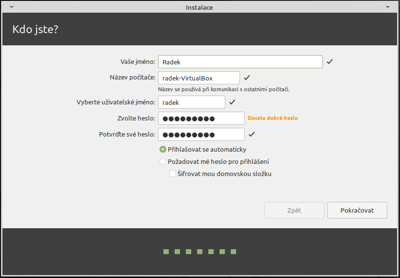
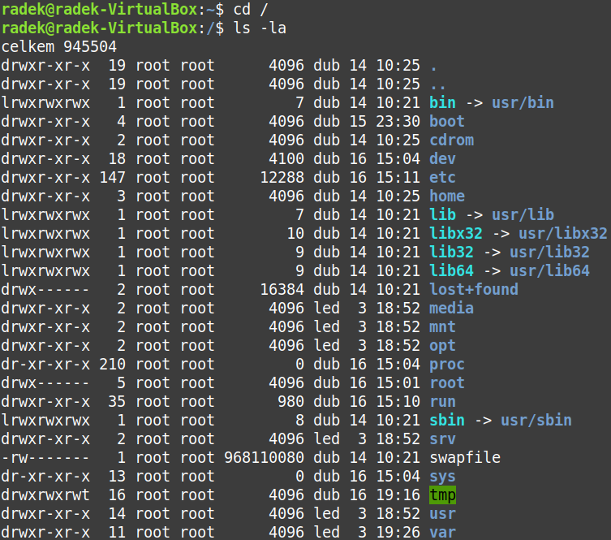
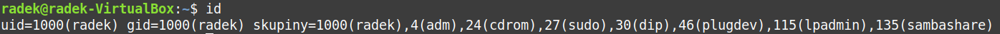

# HW 03 – Síťový operační systém – Linux

## Linux

* Open-source unix-like operační systém založený na linuxovém jádře (Linus Torvalds)
* Linux je typicky zabalen v linuxové distribuci

## Výběr distribuce

* Platforma:
  * Desktop – Mint, Ubuntu, Fedora, Arch
  * Server – Red Hat, CentOS, Ubuntu Server, SUSE
  * Smartphone – Android
  * Embedded systems (IoT, routery)
  * Superpočítače
* Základní distribuce – Slackware, Debian, Red Hat, ...

### Distribuce

* Všechny distribuce mají stejné základní jádro, liší se v:
  * Doplňující software
  * Package manager
  * GUI – grafická nadstavba
    * GNOME
    * KDE Plasma
    * Cinnamon
    * MATE
    * Xfce
    * LXDE

## Instalace a systém

### ISO soubor

* Obsahuje Live CD + instalátor
* Jedná se o obraz CD/DVD
* Rufus – vytvoření bootovatelného flash disku

### Instalátor

* Jazyk
* Rozložení klávesnice
* Typ instalace – vymazat disk a nainstalovat nebo vytvářet a upravovat oddíly, zvolit si souborový systém
* Časové pásmo
* Vytvoření uživatele

* Prvním krokem po instalaci by měli být aktualizace
* Linux lze také spustit ve Windows pomocí WSL (Windows Subsystem for Linux)
* Přístup k systému přes terminál
* V systému běží několik virtuálních terminálů
  * Přistupuje se k nim `Ctrl` + `Alt` + funkční klávesa
  * Např. na Mint běží GUI na virtuálním terminálu `Ctrl` + `Alt` + `F7`

## Soubory

* Souborové systémy ext4, btrfs, ...
  * Windows je nativně nepodporuje (Linux naopak dokáže číst NTFS a exFAT)
* Program _parted_ pro správu oddílů na disku

### Adresářová struktura

* FHS – Filesystem Hierarchy Standard
* `/` – Kořenový adresář (root)
  * Vše se nachází v tomto adresáři
  * Může připomínat `C:\`, Linux ale nepřiřazuje jednotkám písmena
* `/bin` – Binaries – Základní uživatelské binární soubory, nezbytné, zaručující chod systému
* `/boot` – Bootloader – Soubory potřebné ke spuštění systému (kernel, zavaděč, počáteční nastavení RAM) (bootloader GRUB)
* `/dev` – Devices – Hardwarová zařízení reprezentovaná jako soubory
* `/etc` – Konfigurační soubory systému i služeb, čitelná forma
  * `/etc/passwd` – Informace o uživatelích
* `/home` – Domovský adresář uživatelů
  * Domovské adresáře všech uživatelů systému
  * Podobné `C:\Users`
  * Domovský adresář aktuálního uživatele v terminálu označen jako `~`
* `/lib` – Libraries – Důležité sdílené knihovny potřebné pro chod binárních souborů v `/bin` a `/sbin`
* `/media` a `/mnt` – Media a Mount – Obvyklé místo pro připojení externího úložiště (USB, CD, SD)
* `/opt` – Optional – SW třetích stran, využití pro celý systém
* `/proc` – Processes – Informace o běžících procesech
* `/root` – Domácí adresář administrátora
* `/run` – Soubory potřebné k nabootování
* `/sbin` – Superuser binaries – Binární soubory pro správu systému, "rootovy binární soubory"
* `/tmp` – Temporary – Dočasná data
* `/usr` – User binaries – Aplikace a soubory používané běžnymi uživateli
* `/var` – Variable files – Proměnné soubory sloužící službám a systému
  * `/var/log` – Logy systému a služeb

### Druhy souborů

Znak | CZ | EN | Popis
:-: | :-: | :-: | :--
__`-`__ | __normální soubor__ | _regular file_ | Přípona není povinná, mohou ji vyžadovat některé aplikace
__`d`__ | __adresář__ | _directory_ | Obsahuje seznam souborů
__`l`__ | __symbolický odkaz__ | _symbolic link_ | Ve výpisu lze vidět, kam odkazuje. Neukazuje na konkrétní data, ale na název/cestu (přejmenování odkaz zneplatní)
__`-`__ | __pevný odkaz__ | _hardlink_ | Jiné jméno pro soubor, který je na disku fyzicky pouze jednou. Funguje pouze v rámci jednoho oddílu
__`c`__ | __znakové zařízení__ | _character device_ | Souborová reperezentace zařízení, které komunikují po jednotlivých znacích (terminál/klávesnice/tískárna). Např. `/dev/null`, `/dev/full`, `/dev/zero`, `/dev/random`
__`b`__ | __blokové zařízení__ | _block device_ | Souborová reperezentace zařízení, které komunikují po blocích (pevný disk). Pro zápis/čtení jediného bitu je potřeba přenést celý 2048byte blok, vyžaduje použití bufferu. (`/dev`, `lsblk`)
__`p`__ | __pojmenovaná roura__ | _named pipe_ | Umožňuje komunikaci mezi dvěma procesy, jeden do ní zapisuje a druhý z ní čte
__`s`__ | __soket__ | _socket_ | Umožňuje komunikaci mezi procesy (i po síti mezi vzdálenými stroji). Oproti rouře podporuje obousměrnou komunikaci

### Oprávnění

* Oprávnění na soubory a adresáře
* Svatá trojice:
  * Oprávnění pro – vlastník, vlastnická skupina, ostatní uživatelé
  * Každé oprávnění se skládá ze tří práv:
    Právo: | Read | Write | eXecute
    :-: | :-: | :-: | :-:
    __Soubor:__ | čtení obsahu souboru | zápis do souboru | spuštění (program, skript)
    __Adresář:__ | výpis obsahu adresáře | zápis do adresáře | vstup do adresáře
  * Speciální oprávnění – SUID, SGID, Sticky bit
* V terminálu je předepsáno: `<název uživatele>@<název stroje>:<aktuální složka><$ nebo #>`
  * `$` – Normální uživatel
  * `#` – Administrátor (root)
* `ls -l` – Výpis souborů + oprávnění ad.
* `ls -laF` – Výpis souborů + oprávnění ad. + skryté soubory (začínající tečkou) (zkráceně `ll`)

* První znak označuje druh souboru
* Následujících 9 znaků značí oprávnění
* Číslo po právech značí počet pevných odkazů na danou položku
* `root root` je název vlastníka a název vlastnické skupiny
* Nakonec velikost v bytech, poslední datum změny a název položky

### Speciální oprávnění

* Umožňují procesům propůjčit jiná oprávnění, než jsou ty standardní
* Tato oprávnění sama o sobě neposkytují zabezpečení proti zneužití, to musí být implementováno do programů (možné riziko)

__SUID bit__:

* U souborů proces se SUID bitem běží s právy majitele souboru, nikoliv s právy toho, kdo ho spustil
* Většinou se používá pro poskytnutí větších oprávnění, než by měl uživatel standardně
* U adresářů nemá SUID bit žádný význam
* `-rwsr-xr-x` – třetí znak `s` v první trojici značí SUID bit
  * Velké `S` znamená, že je nastaven SUID bit, ale není nastaven executable bit `x` z první trojice

__SGID bit__:

* U souborů podobné jako SUID, namísto majitele se ale řídí právy vlastnické skupiny
* U adresářů se SGID bit chová jinak:
  * Vytvoří-li se v takovémto adresáři soubor/adresář, jeho vlastnická skupina není skupina aktuálního uživatele, ale skupina vlastnící nadřazený adresář s SGID bitem
  * Na skupiny aktuálního uživatele se nebere ohled
  * Nově vytvořeným podadresářům je též nastaven SGID bit
* `drwxrws---` – třetí znak `s` v druhé trojici značí SGID bit
  * Velké `S` znamená, že je nastaven SGID bit, ale není nastaven executable bit `x` z druhé trojice

__Sticky bit__:

* V současnosti nemá Sticky bit na souborech význam
* V adresáři se Sticky bitem:
  * Uživatel může vytvářet soubory/podadresáře
  * Mazat a editovat může pouze své soubory/podadresáře
* `drwxrwxrwt` – poslední znak `t` značí Sticky bit
  * Velké `T` znamená, že je nastaven Sticky bit, ale není nastaven executable bit `x` z třetí trojice

### Nastavení oprávnění

* `touch soubor` – vytvoří soubor s názvem _soubor_
* `touch --help` nebo `man touch` zobrazí nápovědu pro příkaz
* `chmod <čísliceOprávnění> soubor` mění oprávnění u _souboru_
  * `-R` – rekurze (pro složky)
  * Např. `chmod 750 soubor` – `-rwxr-x---`
    * 7 – 111 – rwx
    * 5 – 101 – r-x
    * 0 – 000 – ---
    * Pomůcka 421
    * Před tyto tři číslice lze ještě napsat číslici speciálních oprávnění `<SUID><SGID><Sticky>` (421)
      * `chmod 4750 soubor` – `-rwsr-x---`
      * `chmod 7666 soubor` – `-rwSrwSrwT`
* `chown <novýVlastník> soubor` – změna vlastníka _souboru_

### Databáze uživatelů a hesel

* `passwd <uživatel>` – změnit heslo, root může změnit heslo bez znalosti aktuálního hesla
* Soubor `/etc/passwd` obsahuje informace o uživatelích
* Hesla jsou zašifrována v `/etc/shadow`

* Příkaz `id` ukazuje UID uživatele, GID primární skupiny a GID skupin, v nichž je uživatel členem

### Další příkazy

* `pwd` – Print Working Directory – Zobrazí absolutní cestu k aktuální složce
* `cd <cesta>` – Change Directory – Procházení adresářů
  * Relativní cesta nebo absolutní začínající lomítkem
  * `cd` – Domovská složka
  * `cd ..` – O složku nahoru
  * `cd -` – Předchozí složka
* `cat` – Concatenate (zřetězit) – Práce s výstupy souborů
  * `cat s1 s2 > s3` – Spojí výstupy ze souborů s1 a s2 a zapíše je do souboru s3
* `cp <soubor> <cesta>` – Zkopírovat soubor
* `mv <soubor> <cesta>` – Vyjmout soubor
  * Použivá se i pro přejmenování souborů (`mv <starýNázev> <novýNázev>`)
* `mkdir <název>` – Vytvoří složku
* `rm -r <složka>` – Smaže složku a její celý obsah (no undo)
* `grep <výraz> <soubor>` – Ze _souboru_ vypíše řádky, kde se nachází _výraz_
* `sudo` – Umožňuje provádět administrátorské úkony
* `head -n <početŘádků> <soubor>`
* `tail -n <početŘádků> <soubor>`
