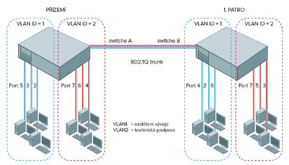

# HW 05 – VLAN, návrh podnikové sítě

## VLAN – Virtual Local Area Network

* VLAN je izolovaná broadcastová doména
  * Část sítě, kde se na linkové vrstvě může každé zařízení pomocí broadcastu dostat k jinému zařízení. Broadcastová doména končí směrovačem nebo bránou.
* VLAN je virtuální, jedná se o softwarovou záležitost, logiku na fyzických zařízeních
* Slouží k logickému rozdělení sítě nezávisle na fyzickém uspořádání
* Pomocí VLAN lze na jednom nebo více propojených přepínačích vytvořit více oddělených sítí, které spolu nemohou komunikovat



### Výhody

* Méně broadcastů – více menších broadcastových domén – menší provoz (traffic), lepší výkon
* K přesunu zařízení do jiné sítě stačí překonfigurovat zařazení do VLAN, není třeba nic fyzicky přepojovat
* Pro oddělení do broadcastových domén stačí méně zařízení

### Zařazení do VLAN

* Ve výchozím nastavení jsou všechny porty zařazeny do VLAN 1, která nejde smazat ani vypnout

1. __Podle portu__
    * Na portu přepínače je ručně a napevno nastavená určitá VLAN
    * Veškerá komunikace na portu patří jedné VLAN, pokud do tohoto portu připojíme další přepínač, všechny jeho porty budou v této VLAN
    * Nejpoužívanější, nejrychlejší, definice je lokální na každém přepínači
2. __Podle MAC adresy__
    * Tabulka se seznamem MAC adres a odpovídající VLAN
    * Dynamické – zařízení přepojené do jiného portu se zařadí do správné VLAN
    1. Buď se podle MAC adresy prvního rámce nastaví zařazení portu do VLAN a toto nastavení zůstane, dokud se port nevypne
    2. Nebo je kontrolována MAC adresa každého rámce a podle toho je rámec řazen do odpovídající VLAN – velmi náročné na výkon
3. __Podle informace z třetí vrstvy__
    * Řazení do VLAN podle IP adresy nebo podle protokolu (např. oddělení IP a AppleTalk)
    * Nepříliš rozšířené, přepínač se musí dívat do třetí vrstvy – zpomalení
4. __Podle autentifikace__
    * Ověření pomocí protokolu IEEE 802.1X a zařazení do VLAN podle získaných informací

### VLAN na jednom přepínači

* Jednotlivé porty jsou zařazeny do jedné VLAN staticky (1) nebo dynamicky (2,3,4)
* Těmto portům Cisco říká access port

### VLAN mezi více přepínači

1. Cisco ISL – Inter-Switch Link – funguje pouze na Cisco zařízeních
2. Propojení access portů na obou přepínačích pro každou VLAN – nepraktické
3. IEEE 802.1Q

### IEEE 802.1Q – "Dot1q"

* Umožňuje, aby se informace o zařazení do VLAN neztratila při přechodu na jiný přepínač
  * Stejné VLAN v celé síti nehledě na to, v jakém přepínači jsou zařízení připojena
* Pokud přeposíláme komunikaci na jiný přepínač, tak ji otagujeme
* Trunk port přenáší více VLAN a taguje rámce, aby rozlišil jejich příslušnost k VLAN
  * Za zdrojovou adresu se v rámci přidá 4bajtový tag přiřazující rámec do správné VLAN, je také potřeba přepočítat kontrolní součet na konci rámce
* Spojení dvou trunk portů se nazývá _trunk_

### Native VLAN

* Nastavuje se na trunk portu, u Cisca musí být shodně nastavená na obou stranách trunku
* Provoz určený nativní VLAN se při přenosu netaguje
* A pokud na trunk port přijde neotagovaný rámec, je zařazen do nativní VLAN
* (Pokud do trunk portu připojíme zařízení nepodporující VLAN, bude komunikovat na té nativní)

### Voice VLAN

* Usnadňuje připojení VoIP zařízení
* `switchport mode access` → `switchport access vlan 10` → `switchport voice vlan 20` – hlasová komunikace na VLAN 20
* Ve skutečnosti se z portu stane trunk port, z access se stane native a komunikace VoIP použije 802.1Q

### Cisco IOS

``` txt
Switch(config)# vlan 10                                     // Vytvoření/přepnutí do VLAN 10
Switch(config-vlan)# name mojevlan                          // Pojmenování VLAN
Switch(config-vlan)# exi                                    // Změny se uloží při opuštění konfigurace
Switch(config)# no vlan 10                                  // Odstranění VLAN 10

Switch(config)# interface vlan 10                           // Zapnutí Switch Virtual Interface
Switch(config-if)# ip address 192.168.190.1 255.255.255.0   // Nastavení IP adresy
Switch(config-if)# no sh
Switch(config-if)# exi
Switch(config)# no interface vlan 10                        // Odstranění SVI

Switch(config)# interface range fastEthernet 0/1-5          // Výběr více interfaců rozsahem
Switch(config-if)# switchport mode access                   // Nastavení portů do přístupového módu
Switch(config-if)# switchport access vlan 10                // Zařazení portů do VLAN 10

Switch(config)# interface fastEthernet 0/1                           
Switch(config-if)# switchport trunk allowed vlan 20,30      // Lze také zadat rozsah (např. vlan 11-20)
Switch(config-if)# switchport trunk native vlan 10
Switch(config-if)# switchport mode trunk
Switch(config-if)# switchport nonegotiate                   // Vypnutí Dynamic Trunk Protocol
```

## STP – Spanning Tree Protocol

* Smyčky – broadcast storm, nestabilita CAM tabulky, opětovné doručení
  * Třetí vrstva má TTL, druhá vrstva nic takového nemá
* Úmyslné smyčky – vytvoření nadbytečných (redundantních) spojení
* Redundantní cesty jako záloha či pro zvýšení propustnosti
* STP na fyzické topologii (která může obsahovat smyčky) vytváří virtuální topologii, která smyčky neobsahuje
* STP je dynamický protokol:
  * Reaguje na vznik nové smyčky
  * Při přerušení nějakého spojení se pokusí vytvořit alternativní cestu odblokováním dříve blokovaného portu
* Hledá nejkratší/nejvýhodnější/nejlevnější cesty (podle rychlostí linek, rychlejší = nižší cena) a ruší ty redundantní
* Každý přepínač má své Bridge ID skládající se z priority a MAC adresy
* Přepínač s nejnižším Bridge ID je zvolen jako _Root Bridge_
  * Ve výchozím nastavení se jedná o přepínač s nejnižší MAC adresou, to lze změnit nastavením priority (default 0x8000)
  * Root Bridge má všechny porty ve stavu _designated_
  * Všechna rozhodnutí se dějí z jeho pohledu, měl to být ten nejvýkonější přepínač
* Typy portů:
  * Root – port s nejlepší cenou – buď linka přímo spojená s Root Bridge nebo s nejkratší cestou k němu
  * Designated – port je členem STP topologie
  * Non-designated – blokovaný port, redundantní cesta
* PVST+ – Per-VLAN Spanning Tree Plus – Cisco only, používá STP na každou VLAN zvlášť

## EtherChannel


* Odesílání a přijímání dat přes více interfaců – zvýšení propustnosti, při výpadku jedné linky stále fungují ostatní
* Chová se jako jeden virtuální port – díky tomu např. STP neblokuje ostatní cesty
* Protokoly:
  * PAgP – Port Aggregation Protocol
    * Cisco only
  * LACP – Link Aggregation Control Protocol
  * Manuální EtherChannel
    * Nastaveno napevno bez použití protokolů
