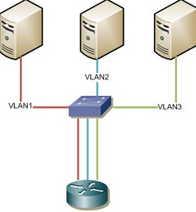
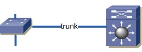

# HW 06 – Přepínání sítí, Inter-VLAN

## Inter-VLAN routing

* Po rozdělení sítě na VLAN se zmenší broadcastové domény, segmentuje se síť a ušetří se např. za hardware
* Aby mohli mezi sebou jednotlivé VLAN komunikovat, musí se mezi nimi routovat
* To se nazývá _inter-VLAN routing_ a jsou tři běžné způsoby:

## Legacy



* Jednotlivé VLAN, které chceme routovat, se vyvedou do samostatných access portů a ty se připojí k samostatným portům směrovače
* Každá VLAN je připojena jedním fyzickým rozhraním, každý port směrovače má přiřazenou jednu VLAN
* Nevýhodou je potřeba více portů (podle počtu VLAN)
* Směrovač na bázi SW je bottleneckem pro rychlé přepínače na bázi HW

## Router on a stick (využívající trunk)


* Trunk mezi směrovačem a přepínačem

``` txt
Switch(config)# interface gigabitEthernet 0/0/0
Switch(config-if)# no sh                                        // Zapnutí interface
Switch(config-if)# exi
Switch(config)# interface gigabitEthernet 0/0/0.10              // Vytvoření a zapnutí subinterface
Switch(config-subif)# encapsulation dot1Q 10                    // Subinterface 10 odpovídá VLAN 10
Switch(config-subif)# ip address 172.17.30.1 255.255.255.0
```

* Číslo subinterface a číslo VLAN se nemusí shodovat, je to ale doporučeno
* Každá VLAN má svůj subinterface
* Kromě `no shutdown` by se na "rodičovském" interface nemělo nic konfigurovat
* Řeší nedostatek fyzických rozhraní u Legacy architektury
* Stejný problém s rychlostí jako u Legacy, teoreticky ještě pomalejší

## L3 switch



* Vícevrstvý switch kromě klasického přepínání na druhé vrstvě nabízí i funkce na vyšších vrstvách
* Například umožňuje směrování, tyto switche jsou často nazývány L3 switch
* Směrování oproti routeru bývá realizováno hardwarově – rychlejší, dražší
* Mají obvykle omezenou směrovací tabulku
* Mívá pouze Ethernet porty (RJ-45/optika), žádné sériové porty apod.
* U Cisco L3 switchů se inter-VLAN nastavuje jednoduše:
  1. Zapnout routování
  2. Pro VLAN, které chceme routovat, vytvořit interface a nastavit jim IP adresu

``` txt
Switch(config)# ip routing                                  // Defaultně pouze L2 přepínání, vlastnost IP routing se musí zapnout
Switch(config)# interface vlan 10                           // Čísla VLAN se musí shodovat na obou stranách trunku
Switch(config-if)# ip address 172.17.30.1 255.255.255.0
Switch(config-if)# no sh
```

* Problém s připojením do internetu:
  * L3 switch nemá NAT server (kromě nejdražších z řady Cisco Nexus)
  * Pro připojení do internetu by se za L3 switch musel umístit router s NAT serverem
    * Pakety určené do internetu by nepatřily do žádné jeho VLAN, pro jejich odeslání na router by se nastavila defaultní routa (žolík) `ip route 0.0.0.0 0.0.0.0 ...`
