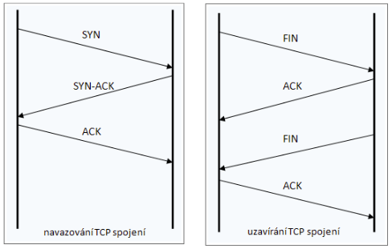
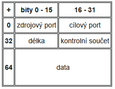

# HW 08 – Protokol TCP, UDP

* __Přepínání obvodů__ – vytvoření virtuálního obvodu, po kterém cestují pakety; v internetu se nepoužívá
* __Přepínání datagramů__ – každý paket je otagován, k cíli se může dostat různými cestami
* PDU – TCP segment, UDP datagram

## 4. Transportní vrstva

* Řeší odeslání dat ze zdroje do cíle takovým způsobem, jaký si vyžadují vyšší vrstvy
* Nejnižší vrstva, kterou se nezabývají síťové prvky, ale pouze koncová zařízení (pokud nebereme v potaz Layer 4 switching)
* Přijímá data z relační vrstvy a rozkládá je na pakety pro síťovou vrstvu
* Stará se o (bezchybný) přenos zprávy (kontrola chyb, sestavení zprávy po přenosu)

## TCP – Transmission Control Protocol

* Spolehlivý, seřazený a bezchybný přenos dat
* Doručení všech dat ve správném pořadí
* Navazuje spojení – server čeká na žádost od klienta
* Three-way handshake, detekce chyb a znovuodesílání poškozených či nedoručených paketů (potvrzení přijatých dat)
  * Zvyšuje latenci, proto aplikace nevyžadující spolehlivý přenos využívají UDP, který preferuje rychlost před spolehlivostí
* WWW, e-mail, FTP, SSH, ...

### Segmentace

* TCP dostává data z vyšších vrstev, ta rozkouskuje na menší díly a přidá k nim TCP hlavičku
* Tím vzniká TCP segment, který je následně zapouzdřen do IP datagramu (o vrstvu níž)
* Segment:
  * Zdrojový port (16 bit)
  * Cílový port (16 bit)
  * Pořadové číslo (32 bit)
  * Potvrzovací číslo – Následující pořadové číslo, které je očekáváno; zároveň potvrzuje příjem všech předchozích dat (32 bit)
  * Rezervováno, příznaky, velikost okna, kontrolní součet
  * ...
  * Data
* Multiplexování segmentů umožňuje více nezávislých TCP spojení najednou, segmenty jsou rozlišeny podle čísel portů

<table><tr><td>Well-known</td><td>0 ÷ 1023</td><td>Vyhrazené pro nejběžnější služby</td></tr><td>Registered</td><td>1024 ÷ 49151 (0xBFFF)</td><td>Určitý protokol či aplikace, IANA</td></tr><td>Dynamic (private)</td><td>49152 ÷ 65535 (2**16)</td><td>Porty pro dočasnou krátkou komunikaci</td></tr></table>

Číslo portu | Aplikace | ...
:-: | :-: | :--
20, 21 | FTP | File Transfer Protocol
22 | SSH | Secure Shell
23 | Telnet | Teletype Network
25 | SMTP | Simple Mail Transfer Protocol
53 | DNS | Domain Name System
67, 68 | DHCP | Dynamic Host Configuration Protocol
69 | TFTP | Trivial File Transfer Protocol
80 | HTTP | Hypertext Transfer Protocol
110 | POP3 | Post Office Protocol
111 | NFS | Network File System
123 | NTP | Network Time Protocol
161 | SNMP | Simple Network Management Protocol
143 | IMAP | Internet Message Access Protocol
443 | HTTPS | HTTP Secure
445 | SMB | Server Message Block

### Řízení toku

* TCP je protokol s posuvným (plovoucím) okénkem
* Je důležité předejít tomu, aby odesílatel posílal data příliš rychle a zahltil tak příjemce
* Příjemce specifikuje, kolik dat navíc ještě dokáže zpracovat
* _"Odesílatel přizpůsobí množství dat kvalitě přijímacího bufferu."_

### Navázání a ukončení spojení

__Navázání spojení__: třícestný handshake

* `klient -> server` – Příznak SYN, pořadové číslo = x (náhodné), potvrzovací číslo = 0
* `klient <- server` – Příznak SYN+ACK, číslo sekvence = y (náhodné), potvrzovací číslo = x+1
* `klient -> server` – Příznak ACK, pořadové číslo = x+1, potvrzovací číslo = y+1

__Ukončení spojení__: čtyřcestný handshake

* Klient odešle na server FIN a ten mu odpoví ACK
* Server odešle klientovi FIN a ten mu odpoví ACK

## UDP – User Datagram Protocol

* Connectionless
* Nezaručuje se doručení všech dat
* Poškozená či ztracená data se znovu neodesílají
* Nedoručuje data v pořadí – žádné pořadí
* Stejně jako TCP podporuje multiplexování datagramů
* Real-time přenos dat – VoIP, video stream, online hry, ale také DHCP, ~DNS

## TCP x UDP

* Transmission Control Protocol
  * __+__ Protokol TCP navazuje spojení a je spolehlivý. Je zajištěno správné pořadí dat, ve kterém mají být doručena. Ztracená/poškozená data jsou odeslána znovu. Na konci se provádí konečný kontrolní součet.
  * __-__ TCP neodesílá další data, dokud všechna předchozí data nejsou úplně v pořádku – blokuje frontu. Velikost hlavičky a potvrzování doručení znamená vyšší zatížení sítě.
  * __>__ HTTP, HTTPS, SSH, Telnet, SMTP, POP3, IMAP, FTP
* User Datagram Protocol
  * __+__ Rychlost a malá hlavička
  * __-__ Nezaručuje se úplné správné odeslání – ztráta, poškození, duplikace, špatné pořadí
  * __>__ Online hry, VoIP, TFTP, DHCP, SNMP
