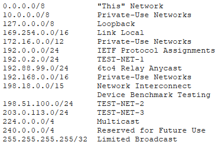
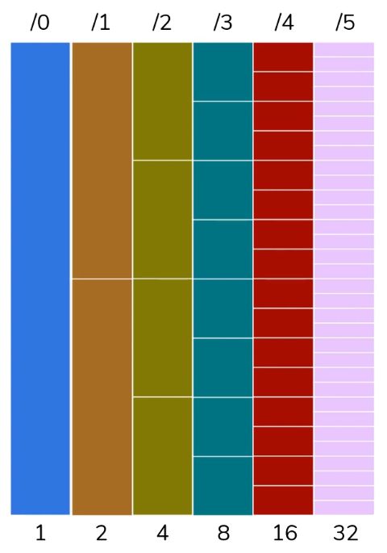
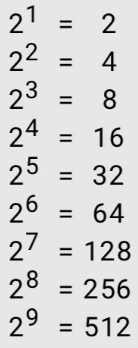

# HW 09 – Adresace v internetu IPv4, cesta datagramu sítí

## Značení portů

* Ethernet, FastEthernet, GigabitEthernet, Serial

<table>
    <tr><td>802.3i</td><td>Ethernet</td><td align="right">10 Mbit/s</td></tr>
    <tr><td>802.3u</td><td>Fast Ethernet</td><td align="right">100 Mbit/s</td></tr>
    <tr><td>802.3ab</td><td>Gigabit Ethernet</td><td align="right">1000 Mbit/s</td></tr>
</table>

* Číslování je _slot/port_ nebo _stack/slot/port_
  * Porty na běžných nemodulárních přepínačích patří do slotu 0
  * U stackovatelných přepínačů propojených speciální sběrnicí se uvádí i pořadí zařízení ve stacku (první má číslo 1)
    * Cisco přepínače většinou podporují maximálně 4 / 8 / 9 zařízení
    * Také bývá omezen maximální stack bandwidth

## MAC – Media Access Control

* Linková (spojová) vrstva ISO/OSI
* Řízení přístupu k médiu – vázané na síťovou kartu
* Šest dvouciferných hexadecimálních čísel (oddělené dvojtečkou, pomlčkou, nebo neoddělené)
* 48 bitů, kontrola pomocí komparátoru
  * Sedmý bit – 0 = unikátní (OUI enforced), 1 = lokálně spravovaná
  * Osmý bit – 0 = unicast, 1 = multicast, (FF:FF:FF:FF:FF:FF = broadcast)
  * První polovina – Organizationally Unique Identifier (OUI), výrobcům přiděluje IEEE
  * Druhá polovina – Přiděluje výrobce (náhodně)

## IPv4

* Jednoznačná identifikace – číslo sítě + číslo zařízení
* Zápis – čtyři oktety (8 bitů) v desítkové soustavě, odděleno tečkami
* ~4 miliardy adres (2**32)

### Třídy IPv4 adres

<table>
    <tr><td>Třída</td><td>Od</td><td>Do</td><td>CIDR notace</td><td>Nejvýzn. bity</td><td>Pčt. sítí</td><td>Pčt. adres v síti</td></tr>
    <tr><td>A</td><td>0.0.0.0</td><td>127.255.255.255</td><td>/8</td><td>0</td><td>2**7 (8-1)</td><td>2**24 (32-8)</td></tr>
    <tr><td>B</td><td>128.0.0.0</td><td>191.255.255.255</td><td>/16</td><td>10</td><td>2**14 (16-2)</td><td>2**16 (32-16)</td></tr>
    <tr><td>C</td><td>192.0.0.0</td><td>223.255.255.255</td><td>/24</td><td>110</td><td>2**21 (24-3)</td><td>2**8 (32-24)</td></tr>
    <tr><td>D</td><td>224.0.0.0</td><td>239.255.255.255</td><td>—</td><td>1110</td><td colspan=2>multicast</td></tr>
    <tr><td>E</td><td>240.0.0.0</td><td>255.255.255.255</td><td>—</td><td>1111</td><td colspan=2>rezervováno (výzkumné a experimentální účely)</td></tr>
</table>

### Speciální adresy

* Nejnižší adresa v síti (s nulovou adresou zařízení) slouží jako označení celé sítě
* Nejvyšší adresa v síti je broadcast
* `127.x.x.x` – localhost
* Veřejné adresy jsou celosvětově unikátní, řadí se mezi adresy tříd A, B, C s výjimkou privátních a speciálních adres
* Za jednou veřejnou adresou se může skrývat celá síť díky NAT – Network Address Translation
  * Překlad síťových adres z privátních na veřejné a vice versa
  * Řeší nedostatek IPv4 adres, chrání před útoky z internetu

Privátní adresy | Od | Do | Maska
:-: | :-: | :-: | :-:
A | 10.0.0.0 | 10.255.255.255 | 255.0.0.0
B | 172.16.0.0 | 172.31.255.255 | 255.240.0.0
C | 192.168.0.0 | 192.168.255.255 | 255.255.0.0



## Získání adresy

* IANA – Internet Assigned Numbers Authority
* IANA přiděluje intervaly IP adres jednotlivým RIR – Regional Internet Registry
* RIRem v Evropě je _RIPE NCC_, ta rozděluje adresy jednotlivým LIR – Local Internet Registry (zpravidla ISP)
* O _.cz_ domény se stará _CZ.NIC_
* DHCP – Protokol, který koncovým zařízením v síti automaticky přiřazuje IP adresu, masku, default gateway a adresu DNS serveru

## ARP – Address Resolution Protocol

* Objevování MAC adres na základě IP adres
* Situace, kdy je třeba odeslat IP datagram na adresu ležící ve stejné podsíti a odesílatel zná pouze IP adresu cíle
* Průběh:
  * ARP request – broadcast – obsahuje tázanou IP adresu + IP a MAC adresu zdroje
    * Všichni příjemci si tato data zapíší do ARP cache
  * ARP reply – tázané zařízení odesílá zpět svou IP a MAC adresu

## Vytváření podsítí

### FLSM – Fixed Length Subnet Mask



* Každé přičtení k CIDR zdvojnásobí počet sítí (ale počet zařízení se vydělí dvěma)
  * Toto platí kdekoliv – Např. jedna /22 síť obsahuje dvě /23 sítě, čtyři /24 sítě atd.
* _Jak velké podsítě musíme mít, abychom v síti /22 mohli vytvořit 100 podsítí?_
  * 2**6 = 64 – málo
  * 2**7 = 128 – dostačující
  * 22 + 7 = 29 – _Budou potřeba sítě s velikostí /29._
* _Kolik podsítí můžeme vytvořit v síti /22, aby každá měla (alespoň) 50 adres zařízení?_
  * Síť /32 nemá žádné místo pro zařízení, my potřebujeme 50, nejblíže je 64 (2**6)
  * 32 - 6 = 26 – Síť /26 má 64 adres zařízení
  * Otázka tedy zní, kolik /26 podsítí se vejde do /22 sítě
  * 26 - 22 = 4; 2**4 = 16 – _V síti /22 můžeme vytvořit 16 podsítí pro 50 zařízení._
* Podsítě mají stejnou (fixní) velikost



* Je potřeba brát v potaz adresu sítě a broadcast (síť 26 má 64 adres zařízení, použitelných je ale 62)

### VLSM – Variable Length Subnet Mask

* Variabilní velikost podsítí, lepší využití adresního prostoru

``` txt
Rozdělte síť 192.168.10.0/24 na:
  výroba    40 hostitelů
  eko       20 hostitelů
  vedení    10 hostitelů
  údržba    20 hostitelů
  tisk       4 hostitelů

Krok 1 – Zjistit velikosti jednotlivých podsítí

výroba 40 – nejbližší 64 = 2**6 –> 32-6=26 –> /26
eko    20 –           32 = 2**5 –> 32-5=27 –> /27
vedení 10 –           16 = 2**4 –> 32-4=28 –> /28
údržba 20 –           32 = 2**5 –> 32-5=27 –> /27
tisk    4 –            8 = 2**3 –> 32-3=29 –> /29

Krok 2 – Alokovat adresní bloky od největšího po nejmenší

1. výroba – /26 – +64
2. eko    – /27 – +32
3. údržba – /27 – +32
4. vedení – /28 – +16
5. tisk –   /29 – +8

+========+ 192.168.10.0/26 
| výroba |
+========+ 192.168.10.64/27
|  eko   |
+========+ 192.168.10.96/27
| údržba |
+========+ 192.168.10.128/28
| vedení |
+========+ 192.168.10.144/29
|  tisk  |
+========+ 192.168.10.152/29
|  free  |
+========+ 192.168.10.255

255-152=103 –> Největší blok ve zbylém prostoru je 64 –> /26
```

## Porty

<table>
    <tr><td>Well-known</td><td>0 ÷ 1023</td><td>Vyhrazené pro nejběžnější služby</td></tr>
    <td>Registered</td><td>1024 ÷ 49151 (0xBFFF)</td><td>Určitý protokol či aplikace, IANA</td></tr>
    <td>Dynamic (private)</td><td>49152 ÷ 65535 (2**16)</td><td>Porty pro dočasnou krátkou komunikaci</td></tr>
</table>

Číslo portu | Aplikace | ...
:-: | :-: | :--
20, 21 | FTP | File Transfer Protocol
22 | SSH | Secure Shell
23 | Telnet | Teletype Network
25 | SMTP | Simple Mail Transfer Protocol
53 | DNS | Domain Name System
67, 68 | DHCP | Dynamic Host Configuration Protocol
69 | TFTP | Trivial File Transfer Protocol
80 | HTTP | Hypertext Transfer Protocol
110 | POP3 | Post Office Protocol
111 | NFS | Network File System
123 | NTP | Network Time Protocol
161 | SNMP | Simple Network Management Protocol
143 | IMAP | Internet Message Access Protocol
443 | HTTPS | HTTP Secure
445 | SMB | Server Message Block

## Referenční model ISO/OSI

<table>
    <thead>
        <tr>
            <th colspan=2>Vrstva</th>
            <th>Protokolová datová jednotka</th>
            <th>Funkce</th>
            <th>TCP/IP</th>
        </tr>
    </thead>
    <tbody>
        <tr>
            <td><strong>7</strong></td>
            <td><strong>Aplikační</strong></td>
            <td rowspan=3>Zpráva</td>
            <td>Vrstva nejblíže k uživateli. Obsahuje jádro aplikací, které má smysl standardizovat (např. přenosové mechanismy elektronické pošty), zbylé části aplikace (UI) byly posunuty nad aplikační vrstvu. Poskytuje uživatelským programům ucelené služby.</td>
            <td rowspan=3><strong>Aplikační</strong></td>
        </tr>
        <tr>
            <td><strong>6</strong></td>
            <td><strong>Prezentační</strong></td>
            <td>Transformuje data do tvaru, který používají aplikace (šifrování, konvertování, komprimace). Zabývá se strukturou dat, nikoliv jejich významem.</td>
        </tr>
        <tr>
            <td><strong>5</strong></td>
            <td><strong>Relační</strong></td>
            <td>Udržuje relaci (session) – uchovává informace mezi jednotlivými spojeními na úrovni transportní vrstvy.</td>
        </tr>
        <tr>
            <td><strong>4</strong></td>
            <td><strong>Transportní</strong></td>
            <td>TCP segment / UDP datagram</td>
            <td>Přenos dat mezi koncovými uzly (end-to-end). Účelem je poskytnout takový přenos, který si vyžadují vyšší vrstvy. Řeší odeslání dat ze zdroje do cíle. (TCP/UDP)</td>
            <td><strong>Transportní</strong></td>
        </tr>
        <tr>
            <td><strong>3</strong></td>
            <td><strong>Síťová</strong></td>
            <td>Paket</td>
            <td>Propojuje nesousední systémy – komunikace dvou uzlů, které nejsou přímo spojeny (prostřednictvím jiných uzlů). Logická adresace – IP protokol – IP adresa. Směrování – určení cesty paketu; všechny směrovače pracují na této vrstvě.</td>
            <td><strong>Síťová</strong></td>
        </tr>
        <tr>
            <td><strong>2</strong></td>
            <td><strong>Linková</strong></td>
            <td>Rámec</td>
            <td>Přenáší data mezi dvěma přímo spojenými uzly. Uspořádání dat z fyzické vrstvy do rámců. Pracuje s rámci, hlásí chyby. Adresace MAC a LLC. Na této vrstvě fungují přepínače; propojení pouze místních zařízení. Ethernet, Wi-Fi, ZigBee.</td>
            <td rowspan=2><strong>Vrstva síťového rozhraní</strong></td>
        </tr>
        <tr>
            <td><strong>1</strong></td>
            <td><strong>Fyzická</strong></td>
            <td>Bit, symbol</td>
            <td>Přenáší data mezi zařízeními pomocí fyzického přenosového média. Převádí bity na elektrické/rádio/optické signály. Řeší fyzické poslání dat, neřeší jejich význam. Definuje např. hodnoty napětí, maximální přenosová vzdálenost, rozložení pinů u fyzických konektorů.</td>
        </tr>
    </tbody>
</table>

### PDU – Protocol Data Unit

* Datová jednotka protokolů užívaná v konkrétní vrstvě, hlavička+data (PCI+SDU)
* Nižší vrstva bere jednotku (PDU) vyšší vrstvy jako svá data (SDU) a přidává k nim vlastní hlavičku (PCI) – zapouzdření
