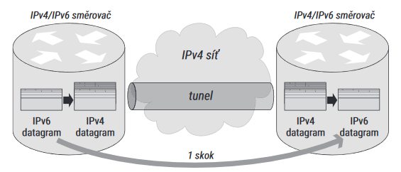
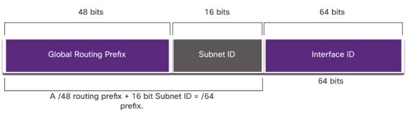
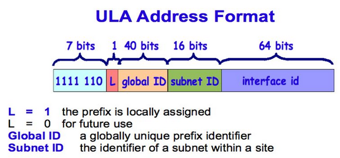

# HW 10 – Protokol IPv6

## IPv6 – Internet Protocol Version 6

* Internet Protocol je zodpovědný za směrování (routování) paketů ze zdroje do cíle
* IP adresa jednoznačně identifikuje síťové rozhraní na třetí vrstvě ISO/OSI
* IPv6 adresy se skládají z osmi skupin po čtyřech hexadecimálních číslech (0-F) oddělených dvojtečkou = __osm hextetů__
* `0123:BB99:3210:FE00:58A0:4565:98AE:1245`
* Vznikla kvůli nedostatku IPv4 adres

IPv4 | IPv6
--- | ---
4 oktety | 8 hextetů
oktet = 8 bitů | hextet = 16 bitů
desítková soustava | šestnáctková soustava
0b11111111 = 255 | 0b1111111111111111 = 65535 = 0xFFFF
4 * 8 = 32 bitů | 8 * 16 = 128 bitů
2\*\*32 = 4,29 \* 10\*\*9 | 2\*\*128 = 340 \* 10\*\*36
4 miliardy adres | 340 sextiliónů adres (dlouhá šklála)
4 billiony adres | 340 undecillionů adres (krátká škála)

## Koexistence IPv4 a IPv6 – metody přechodu

### Dual stack (dvojí zásobník)

* Zařízení má hybridní zásobník pro IPv4 a IPv6
* Zařízení musí podporovat oba dva protokoly a mít IPv4 i IPv6 adresu
* Kooperace mezi dvěma protokoly (pokud je třeba) se obvykle odehrává až v aplikační vrstvě

### Tunneling (tunelování)

* Balení jednoho protokolu do druhého
* Tunelování IPv6 datagramů pro průchod IPv4 sítí
* Tunel má dva konce, každý má IPv4 adresu
* IPv6 datagram je zabalen do IPv4 datagramu, kde adresa odesílatele je zdejší konec tunelu a adresa příjemce druhý konec tunelu
* Datagram je odeslán běžnou IPv4 sítí, na druhém konci se rozbalí a je odeslán dále po IPv6 síti



### Translation (překlad)

* Nutné pro komunikaci IPv4-only zařízení se zařízením IPv6-only (dual stack ani tunel nelze použít)
* Obecná sada pravidel, jak překládat kterou položku v hlavičce, normalizováno
* IPv6 adresy s vloženým IPv4 (IPv4-embedded)
  * Část prostoru za prefixem u adresy IPv6 je vyhrazena pro reprezentaci IPv4 adresy
  * Převod IPv4 → IPv6 snadný
  * Převod IPv6 → IPv4 složitější, využívá se dynamického mapování (podobné jako NAT u IPv4 privatních sítí)
* Ujal se přechodový mechanismus __NAT64__

### Dual-Stack Lite (DS Lite)

* Příprava na situaci, kdy ISP budou mít páteřní síť IPv6-only
* Tunelovací mechanismus, tentokrát se ale posílá IPv4 datagram IPv6 sítí

## Prefix a délka prefixu

* Zařízení umístěná v jedné (pod)síti mají ve svých IP adresách shodné nejvýznamější bity (bity vlevo)
* Velikost části, která vyjadřuje číslo sítě je definována pomocí CIDR notace počtem bitů zleva = __prefix__
* V IPv4 lze zapsat jako délku prefixu `192.168.1.1/24` nebo pomocí masky `255.255.255.0`
* V IPv6 se zapisuje pouze délka prefixu
  * Doporučená velikost pro podsítě je `64`, ~aby fungoval Neighbor Discovery Protocol
* S délkou prefixu `/64` je tedy 64 bitů z leva __Prefix__ (adresa podsítě) a zbylých 64 bitů (128-64) je __Interface ID__ (adresa konkrétního zařízení v podsíti)

## Komprimace nul

* Úvodní nuly ve skupině se dají vynechat (až na jednu)
* Skupiny nulových hextetů lze zkrátit na `::`, ale pouze jen jednou, zpravidla na delší skupinu nul
* `0123:0000:0000:0000:00ab:0000:0000:0000` lze zapsat jako:
  * `123::ab:0:0:0`
  * `123:0:0:0:ab::`

## Druhy vysílání a adres

<table><tbody>
<tr><td><strong>Unicast</strong></td><td>Individuální</td><td>Identifikuje právě jeden interface (jedno zařízení)</td></tr>
<tr><td><strong>Multicast</strong></td><td>Skupinové</td><td>Adresování skupin zařízení, data přijdou všem členům skupiny</td></tr>
<tr><td><strong>Anycast</strong></td><td>Výběrové</td><td>Adresování skupiny, data přijdou jen nejbližšímu členovi skupiny</td></tr>
</tbody></table>

* Oproti IPv4 broadcast (všesměrové vysílání) není potřeba, používají se obecnější typy multicast adres

## Unicast

prefix | význam
--: | :--
`::/0` | žolík – default route
`::/128` | nedefinovaná adresa
`::1/128` | loopback (pingem lze zjistit funkčnost IP služeb)
`64:FF9B::/96` | IPv4-embedded adress – adresy s vloženým IPv4
`2000::/3` | GUA – global unicast address – individuální globální
`FC00::/7` | ULA – unique local address – unikátní individuální lokální
`FE80::/10` | LLA – link-local address – individuální lokální linkové

### GUA – Global Unicast Address

* Podobné jako veřejné IPv4 adresy, globálně unikátní, směrovatelné
* Zatím byla definována a přiděluje se jen část z nich – prefix 0b001
* ISP dostává prefix, jehož části (delší prefix se stejným začátkem) rozděluje zákazníkům



* __Global Routing Prefix__ – Globální směrovací prefix – Síťová část adresy přidělená poskytovatelem, obvykle `/48`
* __Interface ID__ – Identifikátor rozhraní – Rozlišuje zařízení v rámci podsítě (podobné jako hostitelská část IPv4), doporučeno `64`
* __Subnet ID__ – Identifikátor podsítě – Prostor mezi nimi; čím větší, tím větší možné množství podsítí
* `2000::/3` – `2000`-`3FFF`, např.: `2001:db8:3c4d:15::baba:deda`

### ULA – Unique Local Address

* Nástupce _site local_ adres
* Adresy směrovatelné v množině spolupracujících sítí, např. společnost s více pobočkami
* Podobné jako IPv4 privátní adresy, nelze je ale použít ve veřejné síti (IPv6 nemá NAT)



* _Příznak L_ je zatím vždy `1` a proto zatím všechny ULA adresy začínají prefixem `FD00::/8` (celkem je vyhrazeno `FC00::/7`)
* 40bitový Global ID je náhodně vygenerované číslo, zbytek klasika
* např.: `fd12:3456:789a:1::1`

### LLA – Link-Local Address

* Komunikace na lince (v podsíti), linka končí routerem
* Povinná pro každé IPv6 zařízení, nesměrovatelná, nastavuje ji OS
* prefix `FE80::/10` __+__ 54 nulových bitů __+__ 64bitový identifikátor rozhraní
* např.: `fe80::714b:9770:43d4:f8b2`

## Multicast

* Použití např. real-time distribuce obrazu a zvuku
* Adresy `FF00::/8`, např.: `ff35:30:2001:718:1c01:0:0:7`
  * 8 jedniček – `FF`
  * 4 bity – příznaky
  * 4 bity – dosah, jak daleko členové od sebe mohou být; např. `0b0010` (`2`) = linka
  * 112 bitů – identifikátor skupiny
* Well-known:
  * `FF02::1` – všichni hosté na lince ~"broadcast"
  * `FF02::2` – všechny routery na lince
  * aj.
* Solicited-Node Multicast Address:
  * Používá ji Neighbor Discovery Protocol, aby zjistil, zdali je určitá adresa unikátní na lince
  * Spojení prefixu `ff02::1:ff00:0/104` s posledními 24 bity testované uni/anycast adresy
  * Např. `ff02::1:ff00:0/104` + <code>fe80::2aa:ff:fe<b>28:9c5a</b></code> = `ff02::1:ff28:9c5a`

## Zóna

* Adresy v zóně musí být unikátní
* Různé dosahy zóny, např.:
  * 2 – linka – fyzická síť (Ethernet)
  * 4 – správa – obvykle podsíť
  * 5 – místo – koncová zákaznická síť – jedna organizace, jedna lokalita
  * E – globální – celosvětový dosah
  * aj.
* Celá zóna je vždy zahrnuta do nadřazené zóny většího dosahu
* Zóny stejného dosahu se nesmí překrývat
* Jelikož adresa je unikátní jen v rámci zóny a zařízení může být ve více zónách stejného dosahu, může se stejná adresa objevit v několika zónách
* → Pro jejich odlišení zavedeny identifikátory zón (Zone ID)
* Zápis <code><i>\<address\></i>%<i>\<Zone ID\></i></code> např.: <code>fe80::714b:9770:43d4:f8b2<b>%18</b></code>
* Příkaz ve Windows `netsh interface ipv6 show interfaces`

## Použití adresy

``` txt
ping -6 ipv6.google.com
ping -6 fe80::260:97ff:fe02:6ea5%4
```

* V prohlížeči se adresa zapisuje do hranatých závorek: `http://[fe80::714b:9770:43d4:f8b2%18]/`

## Dynamické adresování

* Dynamicky se adresuje GUA a ULA (LLA generuje OS)
* Adresa = Prefix + Interface ID (síťová část + hostitelská část)
* Interface ID přiděluje OS:
  * Podle MAC adresy pomocí algoritmu EUI-64
    * Doprostřed MAC adresy vloží `FFFE` a sedmý bit zleva nastaví na jedničku (pokud není)
    * Méně bezpečné, Windows XP
  * Nebo náhodně generováno OS, tzv. Privacy Extensions (Windows 7 a výš)
* Zbývá vyřešit přidělení prefixu:
  * Stavové – DHCPv6 – zařízení odešle na obecnou adresu dotaz ohledně svých parametrů a server mu odpoví
  * Bezstavové – SLAAC – směrovače vědí vše potřebné a občas tyto informace rozešlou všem (Router advertisement), nebo si o ně zařízení zažádá (Router solicitation)

### __RS__ – Router solicitation – Výzva směrovači

* Zařízení zprávou RS hledají směrovače a žádají o informace

### __RA__ – Router advertisement – Ohlášení směrovače

* Směrovače v náhodných intervalech (každých 200 sekund ?) zasílají do všech připojených sítí informace
* Odesláno pomocí ICMPv6

### SLAAC – StateLess Address AutoConfiguration – Bezstavová konfigurace

* Přidělování adres, použití RA a RS
* Není potřeba DHCPv6 server
* Odešle prefix a délku prefixu; bránu nemusí – je to jeho zdrojová adresa
* Dříve RA zprávy neobsahovaly IPv6 adresy rekurzivních DNS serverů

### Stateless DHCPv6

* Nadstavba SLAAC
* RA obsahuje příznaky, které informují zařízení, zdali má požádat DHCPv6 server o dodatečné informace (které ve SLAAC chybí)

### Stateful DHCPv6

* DHCPv6 server přiděluje i adresu
* SLAAC ale nelze úplně vypnout, přiděluje totiž výchozí bránu

## NDP – Neighbor Discovery Protocol

* Náhrada za ARP (Address Resolution Protocol) v IPv4, kde zařízení odešle na všechny stroje v lokální síti ARP dotaz tázající se, jaké zařízení má určitou adresu (zná IP adresu a chce zjistit MAC adresu)
* Funkce NDP:
  * Hledání směrovačů a zjištění informací pro automatickou konfiguraci adresy
  * Zjišťování linkových adres uzlů ve stejné lokální síti
  * Detekce duplicitních adres
  * aj.
* Zjištění linkových adres probíhá pomocí Solicited-Node Multicast Address

### RS – Router solicitation – Výzva směrovači

* Zařízení zprávou RS hledají směrovače a žádají o informace

### RA – Router advertisement – Ohlášení směrovače

* Odeslání informací; v časových intervalech nebo jako odpověď na RS

### NS – Neighbor solicitation – Výzva sousedovi

* Určení linkové adresy souseda nebo potvrzení dosažitelnosti souseda
* Používáno DAD

### NA – Neighbor advertisement – Ohlášení souseda

* Reakce na NS

### DAD – Duplicate Address Detection – Detekce duplicitních adres

* Kontrola, zdali je IPv6 adresa na lince unikátní, před tím, než je přiřazena na fyzické rozhraní
* Využívá NS

### ICMPv6 – Internet Control Message Protocol Version 6

* ICMP je protokol k ohlašování chybových stavů, testování dosažitelnosti a výměně provozních informací
* Jeden z nejdůležitějších protokolů, zajišťuje funkčnost programů ping a traceroute
* Chybové zprávy oznamují např.
  * Chyba v hlavičce datagramu
  * Nedosažitelná adresa/port, neznámá cesta k cíli
  * Správce zakázal komunikaci
* Mezi informační zprávy patří např. výzva a odpověď na echo, ty využívá program `ping -6`
* V ICMPv4 šlo útočit na síť zahlcením cílového stroje ICMP zprávami, ICMPv6 proti tomuto implemetuje bezpečnostní opatření

## Cisco a IPv6

``` txt
Router(config)# ipv6 unicast-routing
```

* Zapne IPv6 směrování, které je defaultně vypnuto

``` txt
Router(config-if)# ipv6 address 2001:db8:1:1::baba/64
Router(config-if)# ipv6 address fe80::baba/64 link-local
```

* Nastavení IPv6 adres na interfacu
