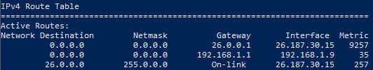
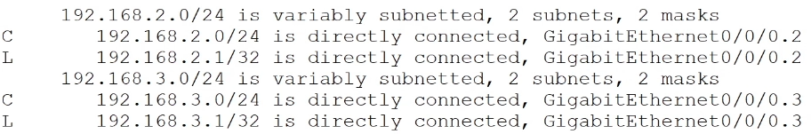
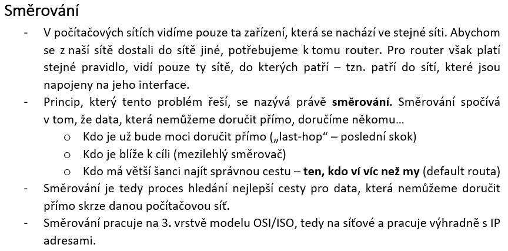

# HW 13 – Směrování, směrovací tabulky, směrovací protokoly

## Směrování

* Určení, kam se má paket dostat
* Směrovač posílá pakety do cizí sítě

### Směrovací tabulka (Routing table)



* Windows `route print`
  * Cílová adresa
  * Maska sítě
  * Brána – IP adresa směrovače (pokud není síť přímo dostupná)
  * Rozhraní, přes které se lze dostat na bránu
  * Metric je "výhodnost" cesty, preferují se nižší čísla
    * V distance-vector protokolech znamená počet skoků
* Jestliže adresa není v tabulce, použije se defaultní routa neboli žolík
  * Adresa 0.0.0.0 s maskou 0.0.0.0



* Cisco `show ip route`
  * `directly connected` – přímo připojeno – přidáno zařízením
  * `S` – statická routa, přidána uživatelem

### RIP – Routing Information Protocol

* Distance-vector
* Nejjednodušší protokol
* Výukové účely, malé sítě
* Maximálně 15 skoků (sítě s 16+ skoky jsou nedosažitelné)
* Zasílání směrovacích tabulek broadcastem
* RIPv2
  * Umožňuje práci s podsítěmi
  * Zasílání směrovacích tabulek multicastem
* RIPng (next generation)
  * Podpora IPv6

### EIGRP – Enhanced Interior Gateway Routing Protocol

* Distance-vector
* Cisco proprietární, od roku 2013 volně dostupný
* Asymetrické posílání dat

### OSPF – Open Shortest Path First

* Link-state
* Nejpoužívanější protokol

### BGP – Border Gateway Protocol

* Path-vector
* Používán ISP, páteřní sítě

### Distance-vector protokoly

* Směrovače neznají strukturu sítě za svými nejbližšími sousedy
* V pravidelných intervalech či při topologické změně si se sousedy vyměňují kompletní kopie svých směrovacích tabulek
* Na základě přijatých informací si inkrementují metriku – počet hopů k dané síti
* _Všechny informace jen svým sousedům_

### Link-state protokoly

* Směrovače se navzájem informují o svých sousedech a tyto informace si ukládají do své databáze
* Tímto způsobem si zmapují dostupnost celé sítě, poté se počítá nejkratší cesta
* _Informace o svých sousedech všem_
* Výrazně náročnější na hardware
* Lepší rychlost konvergence – Doba, za kterou bude síť plně funkční (všechny stroje budou mít vyplněné tabulky)

### Statické routy

* Přidány správcem
* Pokud se v síti něco změní, musí se routy ručně přepsat
* Pro malé sítě (u velkých sítí by byl velký počet rout, které musíme ručně nastavit)

```text
Router> en
Router# conf t
Router(config)# ip route 192.168.2.0 255.255.255.0 Serial 0/1/0
Router(config)# exi
Router# wr
```

### Dynamické routy

* Přidány směrovačem pomocí směrovacích protokolů

```text
Router> en
Router# conf t
Router(config)# router rip
Router(config-router)# network 10.1.1.0
Router(config-router)# neighbor 10.1.1.2
Router(config-router)# end
Router(config)# exi
Router# wr
```

---
---


