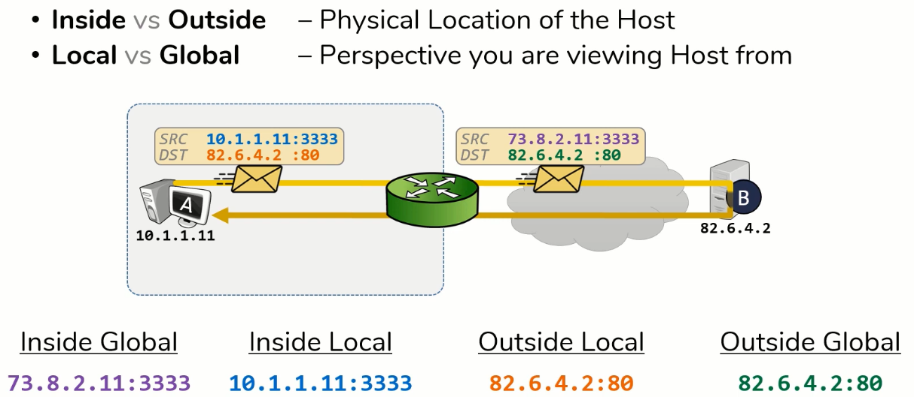

# HW 15 – DHCP, NAT, DNS

## DHCP – Dynamic Host Configuration Protocol

* Protokol, který koncovým zařízením v síti automaticky přiřazuje IP adresu, masku, default gateway a adresu DNS serveru

### Průběh komunikace

1. client → server __DISCOVERY__
    * Snaha objevit DHCP server
    * Broadcast
2. client ← server __OFFER__
    * Server rezervuje adresu a nabídne ji klientovi
    * Zašle tedy odpověď obsahující nabízenou IP adresu a svou IP adresu
3. client → server __REQUEST__
    * Klientovi může přijít víc nabídek z více serverů
    * Vybere si jednu a o tu zažádá příslušný server
4. client ← server __ACKNOWLEDGE__
    * Server posílá potrvrzení + dodatečné informace

* Každá adresa má svůj lease time ("doba pronájmu"), poté může být přiřazena jinému zařízení (u dynamické alokace)

### Nastavení rozsahu

* U domácích routerů počáteční adresa + počet klientů / poslední adresa
* U enterprise pomocí masky

``` txt
Router> en
Router# conf t
Router(config)# ip dhcp excluded-address 192.168.1.1 192.168.1.2    // Buď rozsah nebo lze napsat jen jednu
Router(config)# ip dhcp pool bazen
Router(dhcp-config)# network 192.168.1.0 255.255.255.0
Router(dhcp-config)# default-router 192.168.1.1
Router(dhcp-config)# dns-server 192.168.1.2
Router(dhcp-config)# domain-name example.com
Router(dhcp-config)# exi
Router(config)# exi
Router# wr
```

### DHCP Relay

* Používá se v případě, kdy je více sítí oddělených směrovačem a jen jedna z nich obsahuje DHCP server
* (Žádost o adresu z DHCP probíhá pomocí broadcastu, to znamená, že DHCP server musí být na stejném subnetu jako klient)
* Když je na směrovači zapnut _relay agent_, přeposílá DHCP broadcast dotazy ze sítí bez DHCP na DHCP server
* Relay agent k dotazu přidá adresu a masku sítě, aby DHCP server věděl, z jakého rozsahu má přidělovat adresu
* `Router(config-if)# ip helper-address 172.16.1.2` – Relay agent musí znát adresu DHCP serveru

## Dynamické adresování v IPv6

* Dynamicky se adresuje GUA a ULA (LLA generuje OS)
* Adresa = Prefix + Interface ID (síťová část + hostitelská část)
* Interface ID přiděluje OS:
  * Podle MAC adresy pomocí algoritmu EUI-64
    * Doprostřed MAC adresy vloží `FFFE` a sedmý bit zleva nastaví na jedničku (pokud není)
    * Méně bezpečné, Windows XP
  * Nebo náhodně generováno OS, tzv. Privacy Extensions (Windows 7 a výš)
* Zbývá vyřešit přidělení prefixu:
  * Stavové – DHCPv6 – zařízení odešle na obecnou adresu dotaz ohledně svých parametrů a server mu odpoví
  * Bezstavové – SLAAC – směrovače vedí vše potřebné a občas tyto informace rozešlou všem (Router advertisement), nebo si o ně zařízení zažádá (Router solicitation)

### __RS__ – Router solicitation – Výzva směrovači

* Zařízení zprávou RS hledají směrovače a žádají o informace

### __RA__ – Router advertisement – Ohlášení směrovače

* Směrovače v náhodných intervalech (každých 200 sekund ?) zasílají do všech připojených sítí informace
* Odesláno pomocí ICMPv6

### __SLAAC__ – StateLess Address AutoConfiguration – Bezstavová konfigurace

* Přidělování adres, použití RA a RS
* Není potřeba DHCPv6 server
* Odešle prefix a délku prefixu; bránu nemusí – je to jeho zdrojová adresa
* Dříve RA zprávy neobsahovaly IPv6 adresy rekurzivních DNS serverů

### __Stateless DHCPv6__

* Nadstavba SLAAC
* RA obsahuje příznaky, které informují zařízení, zdali má požádat DHCPv6 server o dodatečné informace (které ve SLAAC chybí)

### __Stateful DHCPv6__

* DHCPv6 server přiděluje i adresu
* SLAAC ale nelze úplně vypnout, přiděluje totiž výchozí bránu

## NAT – Network Address Translation

* Mapování adresových prostorů, systém překládání síťových adres
* Většinou se používá pro přístup více zařízení z privátní sítě do internetu za pomoci jedné nebo více veřejných adres
* Obousměrný překlad, výchozí směr ven (privátní → veřejná)
* __Důvody a výhody použití__:
  * Nedostatek IPv4 adres
  * Ochrana před útoky z internetu
* NAT se v IPv6 nepoužívá (dostatek adres) (NAT64 je algoritmus pro překlad mezi IPv4 a IPv6 adresami)

Privátní adresy | Od | Do | Maska
:-: | :-: | :-: | :-:
A | 10.0.0.0 | 10.255.255.255 | 255.0.0.0
B | 172.16.0.0 | 172.31.255.255 | 255.240.0.0
C | 192.168.0.0 | 192.168.255.255 | 255.255.0.0

### Port forwarding

* "Díra do NAT"
* Umožňuje aby se přes určitý port dalo dostat z internetu do privátní sítě

<table>
    <tr><td>Well-known</td><td>0 ÷ 1023</td><td>Vyhrazené pro nejběžnější služby</td></tr>
    <td>Registered</td><td>1024 ÷ 49151 (0xBFFF)</td><td>Určitý protokol či aplikace, IANA</td></tr>
    <td>Dynamic (private)</td><td>49152 ÷ 65535 (2**16)</td><td>Porty pro dočasnou krátkou komunikaci</td></tr>
</table>

Číslo portu | Aplikace | ...
:-: | :-: | :--
20, 21 | FTP | File Transfer Protocol
22 | SSH | Secure Shell
23 | Telnet | Teletype Network
25 | SMTP | Simple Mail Transfer Protocol
53 | DNS | Domain Name System
67, 68 | DHCP | Dynamic Host Configuration Protocol
69 | TFTP | Trivial File Transfer Protocol
80 | HTTP | Hypertext Transfer Protocol
110 | POP3 | Post Office Protocol
111 | NFS | Network File System
123 | NTP | Network Time Protocol
161 | SNMP | Simple Network Management Protocol
143 | IMAP | Internet Message Access Protocol
443 | HTTPS | HTTP Secure
445 | SMB | Server Message Block

### Typy adres v NAT

* __Inside Local__ – Privátní adresy konfigurované na stanicích vnitřní sítě
* __Inside Global__ – Veřejné adresy, pod nimiž jsou stanice na vnitřní síti vidět z vnější sítě (např. dynamicky alokovány z poolu veřejných adres)
* __Outside Local__ – Privátní adresy stanic ve vnější síti, jak se jeví ve vnitřní síti
* __Outside Global__ – Veřejné adresy konfigurované na stanicích vnější sítě



### Druhy NAT

* __Statická NAT__ – Adresy ručně přiděleny (nastaveny) správcem. Každá _inside local_ má svou _inside global_
* __Dynamická NAT__ – Zařízení, na kterém běží NAT, pro _inside local_ vybírá dočasnou _inside global_ z poolu
* __Port Address Translation__ (PAT, NAT overload):
  * Více _inside local_ adres se mapuje na jednu _inside global_ adresu
  * Rozšíření překladové tabulky o porty – zařízení jsou odlišena pomocí dynamicky přidělovaných portů

``` txt
== Statická NAT =================================================================
Router(config)# ip nat inside source static 192.168.1.3 89.24.220.3

Router(config)# interface fastEthernet 0/0
Router(config-if)# ip nat inside

Router(config)# interface fastEthernet 0/1
Router(config-if)# ip nat outside

== Dynamická NAT ================================================================
Router(config)# interface fastEthernet 0/0
Router(config-if)# ip nat inside

Router(config)# interface fastEthernet 0/1
Router(config-if)# ip nat outside

Router(config)# access-list 1 permit 192.168.1.0 0.0.0.255
Router(config)# ip nat pool bazen 89.24.220.3 89.24.220.6 netmask 255.255.255.0
Router(config)# ip nat inside source list 1 pool bazen

== PAT ==========================================================================
Router(config)# interface fastEthernet 0/0
Router(config-if)# ip nat inside

Router(config)# interface fastEthernet 0/1
Router(config-if)# ip nat outside

Router(config)# access-list 1 permit 192.168.1.0 0.0.0.255
Router(config)# ip nat pool bazen 89.24.220.3 89.24.220.3 netmask 255.255.255.0     // Jedna adresa zapsaná pomocí rozsahu
Router(config)# ip nat inside source list 1 pool bazen overload
```

## FQDN – Fully Qualified Domain Name

* Plně kvalifikované doménové jméno specifikující přesnou lokaci ve stromové struktuře DNS
* Zápis reprezentuje hierarchii ve stromě odspodu nahoru (až k TLD top-level domain (cz, com, ...)), jednotlivé názvy domén odděleny tečkou
* Nad TLD se nachází DNS root, ten nemá název, správně by tedy měla být za TLD ještě tečka `host.example.com.`
* Nejnižší doména je jméno stroje, používají se aliasy (`www.pslib.cz.` → `hermes.pslib.cz.` (_pslib_ je SLD second-level domain))

## DNS – Domain Name System

* Přiřazuje k IP adrese doménové jméno
* Pro překlad adresy se požádá DNS server (nejspíše ten, který nám byl přiřazen DHCP serverem)
  * Pokud server tuto adresu zná, tak odpoví
  * Pokud ne, obrátí se na kořenový DNS server

### Kořenový DNS server

* 13 na světě
* Zná servery, které mají na starost TLD (např. server, který má na starost cz domény)

### Odpověď

* Neautoritativní odpověď – Přišla z DNS cache serveru
* Autoritativní odpověď – Získána bez jakéhokoliv prostředníka

### Překlad

* Při překladu FQDN → IP address, se systém před požádáním DNS serveru dívá do vlastní cache
* `C:\Windows\System32\drivers\etc` soubor `hosts`
* `/etc` soubor `hosts`
