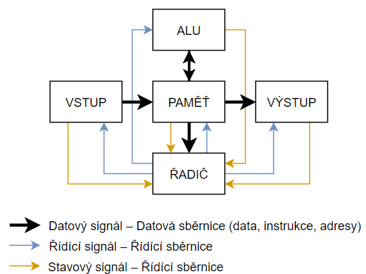
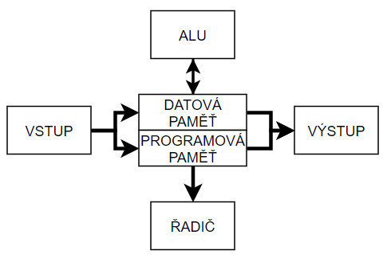
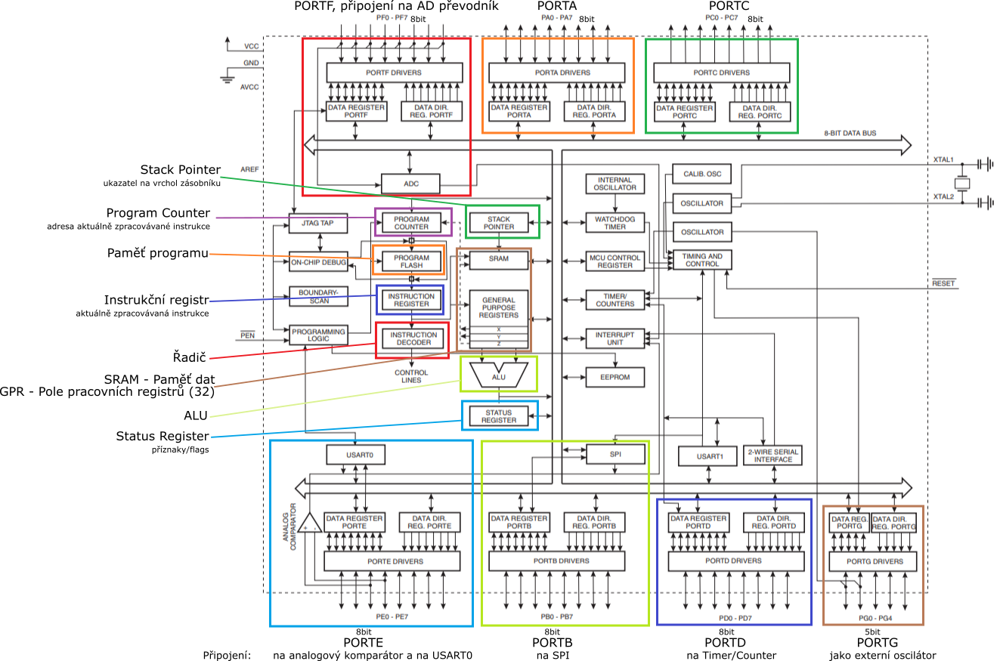
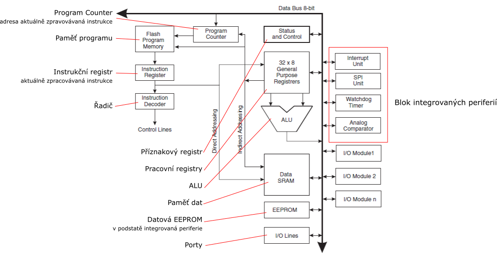

# HW 16 – Mikrokontroléry (mcu) – základní pojmy

## Mikrokontrolér

* Elektronický integrovaný obvod
* Má integorvaný řadič, ALU a paměť
  * Řadič je v nákresech označen jako _INSTRUCTION DECODER_, jednou z jeho hlavních úloh je dekódování instrukcí
* Se svým okolím komunikuje pomocí univerzálních obousměrných vodičů sdružených do portů
* Obsahuje integrované periferie z důvodu většího programátorského pohodlí
  * Čítač/časovač
  * AD převodník
  * Komunikační periferie
* Použití – Elektronická zařízení s digitálním řízením
* Od PC se liší architekturou, fyzickou velikostí, energetickou náročností a výpočetním výkonem

## Von Neumannova architektura

* Architektura výpočetního systému, který je programován obsahem v paměti
* Nezávislá na typu řešené úlohy
* Paměť rozdělena na buňky stejné velikosti přístupné pomocí adres
  * RAM – přístup ke všem buňkám trvá stejnou dobu
* Instrukce se provádí v pořadí, v jakém jsou uloženy v paměti
  * Pořadí lze měnit pomocí instrukcí – (ne)podmíněné větvení
* __+__ Levnější výroba, rozdělení paměti pro data a kód si určuje programátor
* __-__ Možnost nechtěného přepsaní programu, jedna datová sběrnice – Neumannův bottleneck

## Harvardská architektura

* Rozdělení paměti na samostatnou _datovou_ a _programovou (instrukční)_
* Tyto dvě paměti mohou být vyrobeny odlišnými technologiemi
  * ATmega64 – SRAM pro data a nevolatilní Flash pro program
* Pokud je každá paměť připojena samostatnou sběrnicí, lze využít zřetězení
  * ATmega64 – 8bitová sběrnice pro data, 16bitová pro program
  * Single Level Pipelining – Zatímco je jedna instrukce zpracována, druhá je předběžně načtena z paměti programu

## Hlavní vlastnosti ATmega64

* Dokumentace strana 1
* Harvardská RISC architektura
  * Procesor s jednodušší instrukční řadou a jednodušším řadičem – rychlejší provádění instrukcí, složitější instrukce nahrazeny několika jendoduššími (pipelining)
  * Reduced Instruction Set Computer – jednoduchá a vysoce optimalizovaná sada instrukcí
  * _130 Powerful Instructions_ – Pro RISC relativně hodně (existují RISC procesory s pár desítkami instrukcí), u CISC je ale 130 instrukcí málo
  * _Most Single Clock Cycle Execution_ – Většina instrukcí se provede v jednom instrukčním cyklu
  * Většina instrukcí má stejnou délku (v binárním zápisu) – V paměti zabírají stejně místa
  * _32 x 8 General Purpose Working Registers_ – 32 osmibitových registrů – Velký počet pracovních registrů
  * Load/Store architektura – S operační pamětí pracují pouze instrukce pro čtení a zápis do paměti; Všechny aritmeticko-logické operace pracují pouze s registry (žádná ALU operace nemůže sahat přímo do paměti, nejdříve se pomocí operací přesunu musí hodnota nahrát do registru)
  * Malý počet způsobů adresace paměti (co může být operandem u instrukcí) – registr, konstanta, registr x/y/z (indirect – to, co je uvnitř registru, se použije jako adresa do paměti), displacement (adresa v x/y/z je modifikována – práce se strukturou/polem); ALU pracuje jen s registry a konstantami
* 8bit
  * Osmibitová datová sběrnice
  * Osmibitová šířka registrů
  * Osmibitový implicitní datový typ pro ALU
* Hardwarová násobička
* 64 KB Flash – velikost paměti programu
* 4 KB SRAM – velikost datové paměti (cache)
* 2 KB EEPROM – velikost datové paměti (firmware) – nevolatilní, lze elektricky vymazat
* Čítače, časovače
* _Byte-oriented Two-wire Serial Interface_ = I2C
* 2x USART
* SPI
* 53 vstupně-výstupních pinů

## Příznaky Status

* __`I`__ – Globální povolení přerušení
* __`T`__ – Jednobitová "proměnná", BST a BLD
* __`H`__ – Half carry – přechod do vyššího řádu mezi nibbly
* __`S`__ – N ⊕ V
* __`V`__ – oVerflow – aritmetické přetečení nebo přetečení znaménka
* __`N`__ – Negative – záporný výsledek
* __`Z`__ – Zero – nulový výsledek
* __`C`__ – Carry – přenos do vyššího řádu
