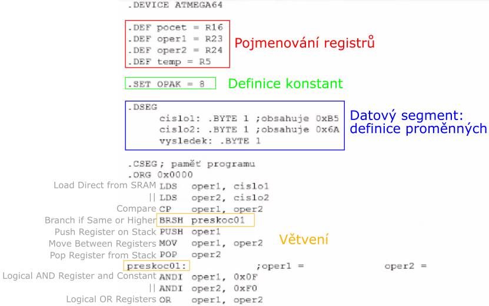

# HW 17 – Instrukční soubor mcu

## Druhy instrukcí

* (Nadpisy 395–397)

1. Aritmetické a logické intrukce
    * Operace s registry – sčítání, odčítání, násobení, AND, OR ...
2. Instrukce pro podmíněné a nepodmíněné větvění
    * Skoky, porovnání, větvení na základě příznaků
3. Instrukce přesunu (spíše kopírování)
    * Načtení dat z registru/SRAM/PM, push/pop na zásobníku, Post-Increment/Pre-Decrement/Displacement
4. Bitově orientované instrukce
    * Bitové posuny a rotace, nastavení příznaků
5. Řídící instrukce (a zbytek)
    * NOP, SLEEP, ...

## Struktura instrukce v paměti

1. Operační znak (operační kód) – Jaká instrukce se bude provádět
2. Operand(y) (argumenty) – registry nebo konstanty
3. Adresační režim (u instrukcí přesunu)
    * Přímá adresace
    * Nepřímá adresace – registry X, Y, Z; Post-Increment / Pre-Decrement / Displacement

* Vedlejším efektem u instrukcí (nejčastěji aritmetických) jsou příznaky v registru Status

## Příznaky Status

* __`I`__ – Globální povolení přerušení
* __`T`__ – Jednobitová "proměnná", BST a BLD
* __`H`__ – Half carry – přechod do vyššího řádu mezi nibbly
* __`S`__ – N ⊕ V
* __`V`__ – oVerflow – aritmetické přetečení nebo přetečení znaménka
* __`N`__ – Negative – záporný výsledek
* __`Z`__ – Zero – nulový výsledek
* __`C`__ – Carry – přenos do vyššího řádu

## CISC x RISC

* RISC – Procesor s jednodušší instrukční řadou a jednodušším řadičem – rychlejší provádění instrukcí, složitější instrukce nahrazeny několika jendoduššími (pipelining)
* ATmega64 je RISC – Reduced Instruction Set Computer, protože
  * _130 Powerful Instructions_ – Pro RISC relativně hodně (existují RISC procesory s pár desítkami instrukcí), u CISC je ale 130 instrukcí málo
  * _Most Single Clock Cycle Execution_ – Většina instrukcí se provede v jednom instrukčním cyklu
  * Většina instrukcí má stejnou délku (v binárním zápisu) – V paměti zabírají stejně místa
  * _32 x 8 General Purpose Working Registers_ – 32 pracovních registrů – Velký počet pracovních registrů
  * Load/Store architektura – S operační pamětí pracují pouze instrukce pro čtení a zápis do paměti; Všechny aritmeticko-logické operace pracují pouze s registry (žádná ALU operace nemůže sahat přímo do paměti, nejdříve se pomocí operací přesunu musí hodnota nahrát do registru)
  * Malý počet způsobů adresace paměti (co může být operandem u instrukcí) – registr, konstanta, registr x/y/z (indirect – to, co je uvnitř registru, se použije jako adresa do paměti), displacement (adresa v x/y/z je modifikována – práce se strukturou/polem); ALU pracuje jen s registry a konstantami
* CISC – Complex Instruction Set Computer
  * Provedení instrukcí trvá různou dobu
  * Variabilní délka instrukce (základní instrukce jsou krátké)
  * Jedna instrukce dokáže provádět komplexní operace – rozkládá se na posloupnost mikroinstrukcí
  * Malý počet pracovních registrů (ALU operace mohou sahat přímo do paměti)
  * Velký počet instrukcí a adresačních režimů

## Doba provedení instrukce

1. Načtení operačního znaku z paměti
2. Dekódování
3. Načtení hodnot operandů
4. Provedení operace (execute)
5. Write/Store – Výsledek uložen do paměti/registru

## Zdrojový kód v asm

