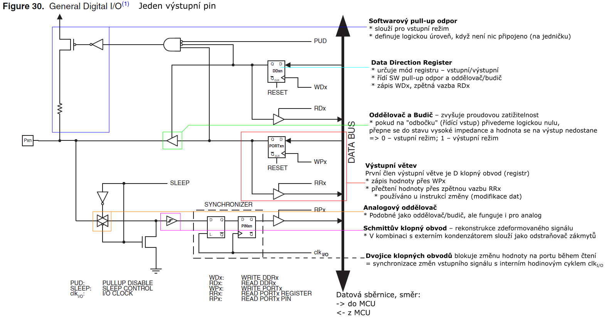

# HW 18 – Paralelní porty mcu

* Popis paralelních portů mikrokontrolérů řady Atmel AVR. Obvodový popis portu, elektrické vlastnosti. Příklady instrukcí pro práci s porty
* Dokumentace strana 1, 3, 67, 325, 395

## Porty

* ATmega64 má 53 programovatelných vstupně-výstupních pinů
* PORTA – PORTF 8bit; PORTG 5bit
* Všechny porty jsou __obousměrné__ a __digitální__ (obousměrnost není současná, buď směr jeden nebo druhý)
* Po resetu je v _DATA REGISTER_ a _DATA DIRECTION_ nastavena logická nula – vstupní režim
  * Výhodou "nuly" je velký vstupní odpor, protože působí proti přechodovým jevům při zapnutí napájení (překmity napěťové špičky a jiné nežádoucí efekty)
* Některé porty lze přepnout do analogového režimu v případě, že piny lze nastavit jako vstup pro integrovaný AD převodník nebo analogový komparátor
* Některé porty mají alternativní funkce pro připojení integrovaných periferií
  * PORTA
  * PORTB – SPI
  * PORTC
  * PORTD – Vstup a výstup pro čítače/časovače (výstup PWM, vstup interních pulzů), USART1, I2C
  * PORTE – USART0, analogový komparátor
  * PORTF – Vstup pro AD převodník
  * PORTG – Externí vstup časování

## Popis portu

### Elektrické vlastnosti

<table><tbody>
    <tr><td>DC Current per I/O Pin</td><td colspan=2>40 mA</td><td>pin by měl krátkodobě vydržet proud 40 mA (maximální)</td></tr>
    <tr><td>Output Low Voltage</td><td>20 mA (5V) / 10 mA (3V)</td><td>MAX 0,7 / 0,5 V *</td><td rowspan=2>hodnota pro dlouhodobé zatížení na pin, směr proudu (znaménko) se mění podle logické nuly/jedničky (pracovní)</td></tr>
    <tr><td>Output High Voltage</td><td>-20 mA (5V) / -10 mA (3V)</td><td>MIN 4,2 / 2,2 V **</td></tr>
    <tr><td>Input Low Voltage except XTAL1 and RESET pins</td><td colspan=2>< 0,2 Vcc</td><td>do 20 % Vcc se interpretuje jako logická nula</td></tr>
    <tr><td>Input High Voltage except XTAL1 and RESET pins</td><td colspan=2>> 0,6 Vcc</td><td>nad 60 % Vcc se interpretuje jako logická jednička (0,2–0,6 je zakázané pásmo)</td></tr>
</tbody></table>

* \* Pokud je pin v logické nule, napětí nepřekročí tuto hodnotu
* \*\* Pokud máme napájecí napětí 5V (3V) a pin není zatížen více jak 20 mA (10 mA), tak se zaručuje,  že výstupní napětí na pinu nepoklesne pod tuto hodnotu
* Pro některé porty nebo piny je ještě definovaný součtový limit dlouhodobé velikosti proudu (uvedeno pod tabulkou strana 326) (celkový limit na všechny piny 400 mA + limity pro konkrétní porty/piny dohromady)

## Příklady instrukcí pro práci s porty

* `IN` a `OUT` – čtení a zápis na portu, operandy jsou port a registr
* `SBI` a `CBI` – nastavení bitu (pinu) na portu (S=1; C=0), operandy port a bit
* `SBIC` a `SBIS` – skok, pokud je bit na portu v určitém stavu, operandy port a bit
