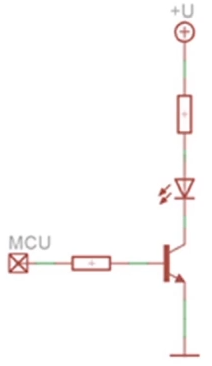

# HW 19 – Připojování externích periferií k mcu

## Periferie

* Vstupní – tlačítko, klávesnice
* Výstupní – LED, displej
* Při připojování periferií je nutné dbát na elektrické charakteristiky pinů (proud 40 mA maximálně a 20 mA dlouhodobě)
* Pull-up/down odpor v obvodu definuje logickou hodnotu, pokud není definována žádným zařízením

## Tlačítka

### Přímé zapojení tlačítka

* Tlačítko vede do MCU, jeden konec vede na zem, druhý konec přes pull-up odpor na kladné napětí
* Napětí definuje logickou hodnotu, když tlačítko není stisknuté
  * Místo kladného napětí můžeme použít interní pull-up odpor
* Při absenci externího rezistoru by stisknutí tlačítka zkratovalo obvod, typicky se používá 5 nebo 10 KΩ
* Výhody:
  * Jednoduché zapojení
  * Snadná dektekce, přečtením pinu zjistíme hodnotu tlačítka
  * Snadné rozlišení více stisknutých tlačítek
* Nevýhody:
  * Obsazenost I/O pinů (všechna ostatní zapojení se snaží šetřit počet pinů)

### Zapojení s multiplexorem

* Počet tlačítek = 2 ** Počet adresních bitů
* Výhody:
  * Menší obsazenost I/O pinů (1 + Počet adresních bitů)
  * Stisknutí se projevuje u všech tlačítek (narozdíl od prioritního dekodéru)
* Nevýhody:
  * Potřeba externí součástky
  * Počet tlačítek omezen počtem vstupů na MUX
  * Nelze číst více tlačítek najednou
* Na adresu lze přívést čítač pro ještě menší obsazenost pinů

### Zapojení s prioritním dekodérem

* Adresa stisknutého tlačítka s nejvyšší prioritou
* Počet tlačítek = 2 ** Počet adresních bitů – Výstupem dekodéru je "adresa" (pořadí) tlačítka
* Nelze detekovat více stisknutých tlačítek najednou

### Zapojení s posuvným registrem PISO

* Na paralelní vstup jsou připojena tlačítka

1. Na pinu _sp_ se nastaví parallel a pošle se jeden pulz na _clk_, tím se stav všech tlačítek zapíše do posuvného registru
2. Na pinu _sp_ se nastaví serial a na _clk_ se pošle tolik pulzů, kolik je tlačítek; po každém pulzu se čte datový vstup (hodnoty se "vytáhnou" z PISO do MCU)

* Výhody:
  * Konstatní počet pinů (3)
  * Detekce více stisknutých tlačítek současně
* Nevýhody:
  * Sériové čtení – pomalejší, rychlý stisk nemusí být zachycen
  * Počet tlačítek omezen velikostí registru, rostoucí počet tlačítek zpomaluje čtení

### Maticové zapojení – Klávesnice

* Vrchní čtyři vstupy, spodní čtyři výstupy
* Na jeden z výstupů se nastaví nula a přečtou se hodnoty na vstupech
* Na vstupech, kde je nula, je tlačítko stisknuto – kontroluje se jeden sloupec, podle toho, na jakém výstupu je nula
* (Poté se nula přesune na další výstup a kontroluje se další sloupec)
* Výhody:
  * Hodně tlačítek s větší rychlostí čtení než PISO
  * Střední obsazenost pinů – Počet tlačítek = Vstupy * Výstupy
* Nevýhody:
  * Detekce a rozlišení více tlačítek je složitější
    * Může vziknout "falešné stisknuté tlačítko", řeší se přes diody

## LED

### Přímé připojení na pin

* Jak vypočítat odpor:
  * Známe proud procházející diodou (typicky 20 mA – úbytek 2 V zjistíme z charakteristiky)
  * Vezmeme celkové napětí (5 V), odečteme úbytek (2 V) a vydělíme proudem (20 mA)
  * (5-2)/(20*10**-3) = 150 Ω
* Výhody:
  * Jednoduché
* Nevýhody:
  * Počet obsazených pinů
  * Proudová náročnost – Může být problém u součtového limitu

### Připojení přes tranzistor

* Menší proudové zatížení, stále stejná obsazenost pinů
* Můžeme spínat jiné napětí, než které je na výstupních pinech MCU

## Displeje

1. Přímé zapojení
    * Velká obsazenost I/O pinů (8 na každý displej)
2. Zapojení přes dekodér
    * Poloviční obsazenost pinů
    * Omezený počet zobrazení, nevyužitá desetinná tečka
3. Zapojení na společnou sběrnici
    * 
    * V jeden moment svítí pouze jeden displej
    * Hodnota je vysílána na všechny displeje a odpovídá právě rozvícenému displeji
    * Sekvenčně se pomocí budičů přepíná, který displej svítí – obnovovací frekvence
    * Počet pinů = Počet displejů (budičů) + Počet segmentů (lze redukovat dekodérem)
    * Nevýhoda – MCU musí neustále nastavovat a přepínat hodnoty
    * Hodnoty určené pro jednotlivé displeje lze ukládat do záchytných registrů (hodnota se zapíše na společnou sběrnici a na příslušný _LATCH_ se pošle zápisový pulz)
    * 
    * Pokud chceme opravdu ušetřit piny, můžeme použít sériové posuvné registry SIPO (pouze dva obsazené piny)

## Inteligetní displeje

* Jedná se o maticové displeje
* Vlastní řadič, do kterého se z MCU posílají příkazy

### Alfanumerický displej

* Nemůžeme pracovat s jednotlivými body
* Pracuje se s vnitřní ASCII tabulkou, která je nahraná v řadiči
* LCD 1602, lze definovat vlastní znaky

### Grafický displej

* Lze adresovat přímo jednotlivé body
* LCD 12864

1. Monochromatické
    * Jedna LEDka na bod
2. Barevné
    * Tři LEDky na bod
    * Barvu reprezentuje více bitů

---
---

## Zákmity a jejich odstranění

* Způsobeny mechanickými nedokonalostmi tlačítek
* Změna stavu na opačnou hodnotu je doprovázena vícenásobnými přechody

1. Schmittův klopný obvod + kapacitor
2. RS klopný obvod
3. Monostabilní klopný obvod (NE555)
4. Softwarové řešení
5. ...
