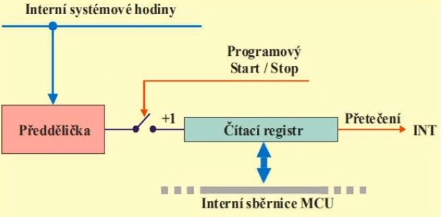
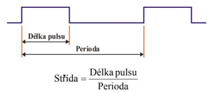
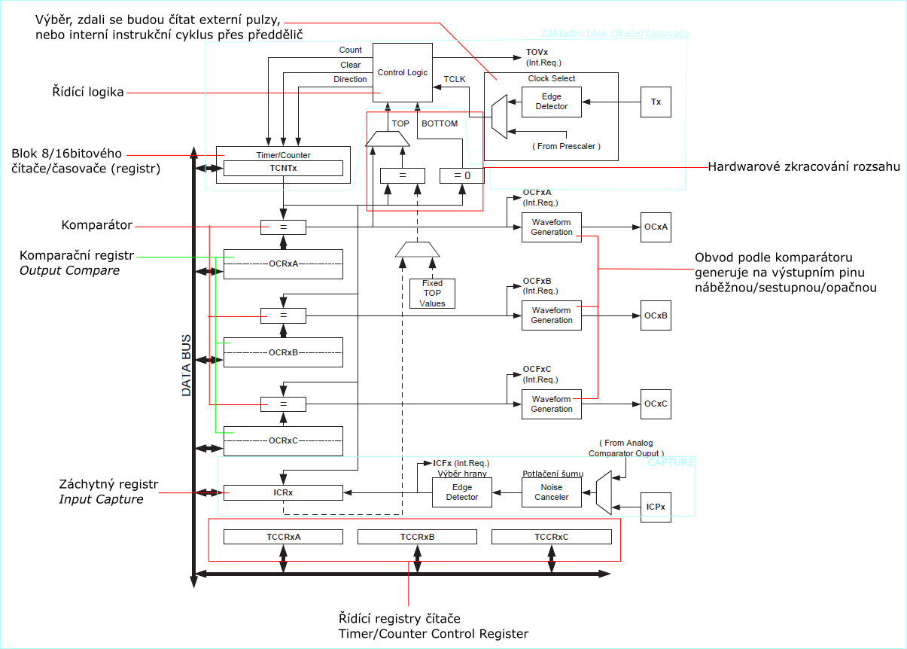

# HW 20 – Čítačové podsystémy mcu

``` txt
– Two 8-bit Timer/Counters with Separate Prescalers and Compare Modes
– Two Expanded 16-bit Timer/Counters with Separate Prescaler, Compare Mode, and Capture Mode
– Real Time Counter with Separate Oscillator
– Two 8-bit PWM Channels
– 6 PWM Channels with Programmable Resolution from 1 to 16 Bits
– Programmable Watchdog Timer with On-chip Oscillator
```

## Čítač/časovač

* Čítač/časovač je v podstatě registr, hodnotu si pamatuje
* Obousměrná šipka s datovou sběrnicí – mohu číst i zapisovat
* Tři řídící vstupy Count, Clear, Direction
* Count
  * Hodinový signál
  * Když zde přivedeme pulz, obsah se zvýší/sníží o jedničku
* Clear
  * Nastavení do výchozí hodnoty, nulování
* Direction
  * Nepovinný, jeho přítomnost znamená up/down counter
  * Přepnutí čítání nahoru/dolu
* Fyzicky mezi čítačem a časovačem není rozdíl
* Režim čítače
  * Vstup je nastaven na externí pin (_Edge Detector_, _Tx_)
  * Vstupní signál nemusí být periodický (může)
* Režim časovače
  * Vstup je nastaven na předdělič (_Prescaler_), připojeno typicky na frekvenci instrukčního cyklu
  * Hodinový signál je periodický se známou frekvencí
  * Pokud známe frekvenci, jsme schopni z rozsahu čítače vypočítat časový interval
* Časovač je čítač, jehož vstupní signál má známou frekvenci



### COMPARE

* Časovač je doplněn komparátorem a komparačním registrem
* Ná základě shody čítacího a komparačního registru můžeme měnit hodnotu na výstupním pinu
  * Na pinu lze nastavit náběžnou/sestupnou hranu nebo opačnou hodnotu
* _OCRxA_ umožňuje hardwarové zkracování rozsahu

### CAPTURE

* "Opak compare"
* Vstupem je změna hodnoty na pinu, na jejíž základě se hodnota čítače uloží do záchytného registru
* Zjištění přesného času určité události (pomocí HW; u SW je zpoždění)
* Kromě změny hodnoty na I/O pinu může být capture vyvolán také analogovým komparátorem

### PWM



* Pro generaci úplné pulzně šířkové modulace (proměnná perioda) jsou potřeba komparátory dva
* Jeden komparátor+registr generuje periodu
* Druhý komparátor+registr generuje šířku pulzu
* Na ATmega64 se pro úplné PWM používá OCRxA pro nastavení periody a OCRxB/C pro nastavení šířky pulzu

### Popis



## Dohlížecí časovač WDT – Watchdog Timer

* Časovač, který má nezávislý vstup hodinového signálu
* Pokud tento časovač přeteče, restartuje se MCU
* Proto ho MCU pravidelně softwarově resetuje
* Pokud se program někde zasekne, je bezpečnější celou aplikaci restartovat
  * Program se zasekne, WDT přeteče (nestihne být resetován), MCU se restartuje
* Pojistka v případě, že nastane nečekaná situace
* V konfiguračním registru bude uveden důvod restartu, na který můžeme nějak reagovat

## Další využití čítačů/časovačů v MCU

* Některé typy AD převodu jsou založeny na měření času
* Generování přenosové rychlosti (USART, SPI, I2C)
* PWRT – Power-Up Timer – Zpoždění napájení při zapnutí, aby nepoškodilo MCU (při zapnutí nemusí být napětí okamžitě v ideální hodnotě)
* OST – Oscillator Start-up Timer – Zpoždění nestabilní frekvence krystalu definované v počtu taktů oscilátoru (krystal okamžitě nezačne generovat optimální signál)
