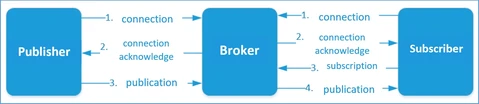

# HW 21 – Internet věcí

## Internet věcí

* Síť založená na standardizovaných komunikačních protokolech, která propojuje jednoznačně adresovatelné zařízení (věci) a umožňuje sdílení dat a informací, jejichž analýzou lze docílit vyšší přidané hodnoty
* Cílem je sběr, uložení a analýza dat/informací/znalostí a následné sdílení výsledků
* Na jedné straně jsou zařízení odesílající a přijímací data, na straně druhé je firemní/uživatelská aplikace nebo cloudová služba
* Hlavní dvě skupiny: spotřebitelský internet věcí (Consumer IoT) a průmyslový internet věcí (Industrial IoT)

### 1. Spotřebitelský internet věcí

* Zaměření na spotřebitele (uživatele) a jeho zážitek/pohodlí
* Chytrá zařízení (pračky, televize, osvětlení, teploměry, kamery, ...) a nositelná elektronika
* Chytrá domácnost – dálkové ovládání spotřebičů, detekce otevření dveří, monitorování spotřeby, ...
* Platby za zboží pomocí NFC

### 2. Průmyslový internet věcí

* Automatizace
  * Diagnostika a monitorování stavu (pří)strojů, upozornění na případné závady
  * Zabezpeční prostor proti neoprávněnému vstupu
  * Detekce nebezpečných látek
* Doprava
  * Autonomní vozidla
  * Sledování a lokalizace zásilek
  * Kontrola kvality přepravy (vibrace, nárazy, otevření)
* Energie
  * Monitorování a řízení spotřeby energie

### 3. Zdravotnictví

* Sledování stavu pacientů

### 4. Chytrá města

* Monitorování parkovacích míst
* Monitorování stavu dopravy
* Inteligentní osvětlení
* Zvýšení bezpečnosti

## Architektura

* __Hardware__ – Koncová zařízení generující data, přenosová infrastruktura, datová úložiště
* __Middleware__ – Softwarová mezivrstva
  * Poskytuje aplikacím jednotné rozhraní
  * Propojuje jednotlivé prvky IoT a sbírá/ukládá/sdílí data mezi jednotlivými systémy
* __Software__ – Cloud, analýza a zpracování dat
* __Fog computing__ – Lokální zpracování dat, decentralizované, p2p

## Rozsah

### WPAN – Wireless Personal Area Network

* Malá vzdálenost, 10 metrů
* Nositelná elektronika, tachometr na kole, ...
* IEEE 802.15:
  * Bluetooth
  * ZigBee

### WLAN – Wireless Local Area Network

* Lokální bezdrátová síť – chytrá domácnost nebo firma
* Uživatel nebo firma si sám síť provozuje
* IEEE 802.11

### LPWAN – Low Power Wide Area Network

* Uživatel není provozovatelem, "pronajímá" si infrastrukturu
* Celoplošné sítě pro zařízení s malou energetickou náročností, dosah v desítkách kilometrů, 3 zástupci:

#### LoRaWAN – Long Range Wide Area Network

* Rádiová komunikace – přenos malého množství dat na velkou vzdálenost
* Nízká náročnost na energii, baterie mohou vydržet až deset let
* Rychlost v řádech stovek až desítek tisíců bitů za sekundu (bit/s)
* Bezlicenční pásmo 868 MHz, neziskovka LoRa Alliance
* Obousměrná komunikace

#### Sigfox

* Bezlicenční pásmo 868 MHz
* Žádné složité adresy, pouze komunikační čip a 32bitové Sigfox ID
* Rychlost pouze 100 bit/s a další omezení kvůli nízké spotřebě (až 15 let bez výměny)
* Spíše pro jednousměrnou komunikaci, nefunguje za pohybu (nevhodné pro mobilní aplikace)

#### NB-IoT – NarrowBand Internet of Things

* V ČR spravují mobilní operátoři, vyhradí část LTE pásma čistě pro IoT (využívá se stávající architektura)
* Náročnější na spotřebu energie, rychlost až 0,2 Mbit/s
* Zařízení musí mít SIM kartu

## Komunikační protokol MQTT – Message Queuing Telemetry Transport

* Otevřený protokol pro Industrial IoT
* Většinou používá TCP
* Asynchronní komunikace, kompaktní zprávy, QoS

* Návrhový vzor publisher subscriber
* Jeden cetrální bod se stará o výměnu zpráv – MQTT Broker (např. Mosquitto)
* Zprávy jsou tříděny do témat (topic)
* Zařízení posílá brokeru data v daném tématu (publish) nebo odebírá určité téma (subscribe) a přijímá patřičná data od brokeru
* Jedno zařízení může najednou být v některých tématech publisher a v jiných subscriber
* Témata jsou hierarchická a oddělená lomítky ("house/bedroom/lights")
