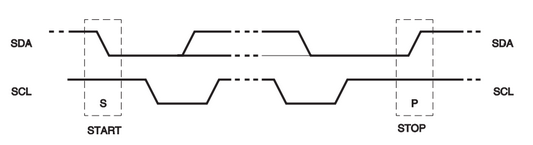
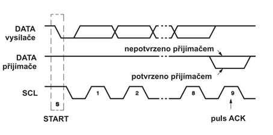
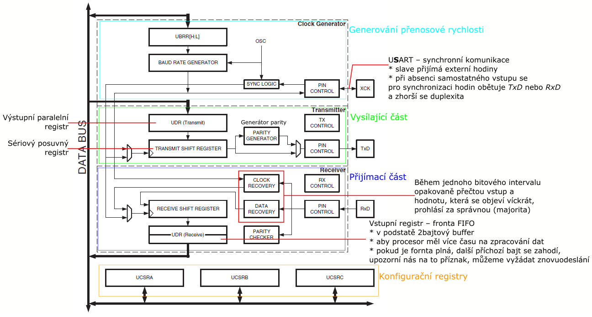

# HW 24 – Sériová rozhraní mcu

## Sériová rozhraní

* Sériová komunikační rozhraní se v mikroprocesorové technice používají ke dvěma účelům:

1. Komunikace mezi jednotlivými MCU moduly
    * Délka vedení v řádu jednotek až stovek metrů
    * Fyzická vrstva tedy řeší i problémy odolnosti proti rušení apod.
    * UART, RS485, CAN, často i Ethernet
2. Komunikace mezi integrovanými obvody (popř. mezi MCU moduly na krátkou vzdálenost)
    * Délka vedení nepřesahuje jednotky metrů
    * Microwire, SPI, I2C, ...

## Parametry

* Vzdálenost
* Komunikační rychlost (ve vztahu ke vzdálenosti)
* Počet zařízení, které spolu na sběrnici mohou komunikovat
* Řízení – P2P point-to-point / singlemaster / multimaster
  * USART – point-to-point
  * SPI, RS422, 1Wire – singlemaster
  * I2C, CAN, ~RS485 – multimaster
* Arbitrace u multimasteru (řešení, když vysílá více zařízení)
  * RS485 – round-robin – pověření / časový multiplex – bezkolizní
  * I2C, CAN – kolizní, řešeno přes dominantní úroveň
* Adresace – netřeba / v rámci dat / hardwarová
  * USART – netřeba
  * I2C – v rámci dat
  * SPI – hardwarová
* Zabezpečení (špatný přenos bitu)
  * SPI, I2C – žádné na úrovni protokolu
  * RS422/485, USART – volitelný paritní bit (sudá/lichá parita jedniček ve slově)
  * 1Wire – 8bit CRC
  * CAN – 15bit CRC
* Odolnost proti rušení
  * RS422/485, CAN – diferenciální vedení
* Duplexita – simplex / half-duplex / full-duplex

## SPI – Serial Peripheral Interface

* Určeno pro připojení vnějších pamětí, AD převodníků a dalších obvodů k MCU; popř. vzájemná komunikace MCU
* Komunikace ATmega64 s periferiemi nebo jinými AVR zařízeními
* Řízení je singlemaster – dva nebo více obvodů, jeden je master (obvykle procesor) a ostatní slave
* Jednotlivé obvody propojeny čtyřmi vodiči:

1. MOSI – Master Out Slave In (u mastera datový výstup u slave datový vstup)
2. MISO – Master In Slave Out
3. SCK – Hodinový signál (master výstup, slave vstup)
4. SS – Slave Select
    * Každý slave má vstup SS
    * Pokud je v neaktivní úrovni, je rozhraní neaktivní a výstup MISO ve vysokoimpedančním stavu
    * Pro každý vstup SS má master samostatný vývod
    * Pokud je masterem MCU, SS bývají vyvedeny na některý z jeho portů (ATmega64 PORTB)

* Komunikace vždy mezi masterem a jedním z obvodů slave
* Oba obvody mají posuvné registry, které se posouvají podle hodin generovaných masterem
* Microwire je jednodušší rozhraní podobné SPI

SPI | Serial Peripheral Interface
--: | :-:
Vzdálenost | 3 m
Frekvence | CK/2 (ATmega64)
Počet zařízení | Podle počtu vývodů na masteru
Řízení | Singlemaster
Adresace | Hardwarová
Zabezpečení | —
Duplexita | Full duplex

## I2C – Inter-Integrated Circuit (TWI – Two-Wire Interface)

* Uvedeno firmou Philips, obvody s tímto rozhraním se připojují k MCU, které jsou vybaveny příslušným řadičem
* Multimaster
* Každá stanice má určenou adresu o délce 7 bitů, která slouží k jejímu výběru i arbitraci (možnost 10bitové adresy)
* Jednotlivé stanice jsou propojeny jedním datovým vodičem SDA a jedním hodinovým vodičem SCL
  * V klidovém stavu jsou vodiče v úrovni H
  * Při přenosu jsou na SDA vysílány jednotlivé bity s tím, že logická hodnota SDA se může změnit, pouze pokud je SCL v úrovni L
  * Toto pravidlo je porušeno ve dvou případech: vysílání podmínek START a STOP – zahájení arbitrace a ukončení přenosu
* Každá stanice si vnitřním časovačem synchronizuje GHS měřením trvání úrovně H na SCL
  * To umožňuje některé ze stanic zpomalit přenos



* Každému přenosu předchází podmínka START, potom 7bitová adresa a jeden bit R/W (určení směru, následuje bit ACK určený k potvrzení přijímací stanicí)
* Poté jsou přenášena data, každý byte je následován jedním bitem ACK
  * Pokud vysílající stanice nedostane potvrzení příjmu, ukončí vysílání podmínkou STOP
* Po ukončení přenosu je vyslána podmínka STOP
* Vysílající stanice porovnává vysílané bity se skutečnou hodnotou SDA
  * Pokud se liší, musí vysílání okamžitě ukončit
  * ⇒ Řešení arbitrace pomocí detekce kolize



I2C | Inter-Integrated Circuit
--: | :-:
Vzdálenost | Pár metrů
Rychlost | 400 Kbit/s
Počet zařízení | ~128 (u 7bitových adres)
Řízení | Multimaster
Arbitrace | Detekce kolizí
Adresace | V rámci dat
Zabezpečení | —
Duplexita | Half duplex

## USART – Universal Synchronous and Asynchronous Receiver and Transmitter

* ATmega64 má USART0 (PORTE) a USART1
* Podporuje synchronní a asynchronní ("UART") režim
* Point-to-point; převážně mezi dvěma MCU
* Full-duplex

### USART na ATmega64



* Horní část _Clock Generator_ obsahuje synchronizační logiku pro externí vstupní pulz (clock slave) a _Baud Rate Generator_ dělící frekvenci mikrokontroléru na frekvenci vhodnou pro USART
* Čtyři režimy, nastavení v konfiguračních registrech
  1. Normální asynchronní
  2. Asynchronní s dvojnásobnou rychlostí
  3. Synchronní – master
  4. Synchronní – slave
* Asynchronní režim s dvojnásobnou rychlostí:
  * Frekvence asynchronní komunikace je 2x rychlejší (_Baud Rate Generator_ dělen 8 místo 16)
  * V _Receiveru_ stihnou _Clock Recovery_ a _Data Recovery_ přečíst hodnotu 2x méně (8x místo 16x)
* Synchronní režim:
  * Pin _XCK_ slouží jako clock master nebo clock slave, v asynchronním režimu se nepoužívá
  * U zařízení bez speciálního pinu pro hodiny se pro synchronní USART komunikaci musí obětovat jeden z pinů transmitter/receiver, tím se zhorší duplexita
* USART podporuje všech třicet kombinací formátu rámce:
  * 1 startovní bit
  * 5/6/7/8/9 datových bitů – začíná se od nejméně významného bitu
  * Žádný/lichý/sudý paritní bit
  * 1/2 stop bity
* Formát rámce také nastaven v konfiguračních registrech (nepřenastavovat během komunikace)

USART | Universal Synchronous and Asynchronous Receiver and Transmitter
--: | :-:
Vzdálenost | Klidně i stovky metrů (převod na RSxxx, kvalita kabelu, počet baudů)
Frekvence | Uvedena v baudech (až megabaudech; bit/s), ostatní rychlosti odvozeny dělením; v praxi desítky/stovky Kbit/s
Počet zařízení | 2
Řízení | Point-to-Point
Adresace | Netřeba
Zabezpečení | Volitelný paritní bit
Duplexita | Full duplex

---
---

``` txt
I2C má start a stop condition, nezáleží na časování, důležitá je změna hodnoty; acknowledge – potvrzuje přijatá data

1Wire může sloužit zároveň pro napájení (dioda + kapacitor), možno připojovat zařízení dynamicky (single button) 
– podpora pro dynamické zjištění připojených stanic pomocí binárního vyhledávacího stromu

CAN zprávy neobsahují příjemce a odesílatele, ale pouze identifikátor obsahu zprávy, rámec přijmou všichni, podle identifikátoru se 
rozhodnou, zdali zprávu přijmou (popřípadě přijmutí potvrdí), receive error counter, transmit error counter
```
