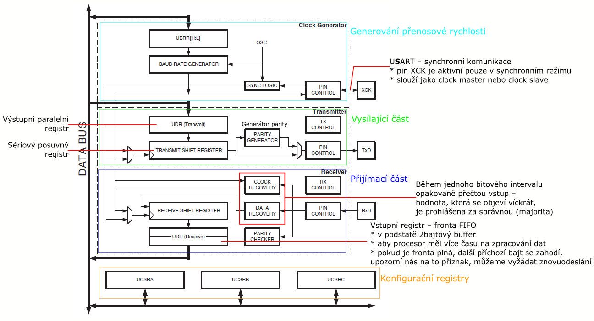

# HW 24 – Sériová rozhraní mcu

* Popis sériových sběrnic USART, RS422/485, SPI/Microwire, I2C, 1Wire, CAN. Popis sériového portu Atmel AVR.
* Z šesti sběrnic vybrat ~3, dopručeno USART, I2C
* Dokumentace strana 171

## Parametry

* Vzdálenost
* Komunikační rychlost (ve vztahu ke vzdálenosti)
* Počet zařízení, které spolu na sběrnici mohou komunikovat
* P2P point-to-point / singlemaster / multimaster
  * USART – point-to-point
  * SPI/Microwire, RS422, 1Wire – singlemaster
  * I2C, CAN, ~RS485 – multimaster
* Arbitrace u multimasteru (řešení, když vysílá více zařízení)
  * RS485 – round-robin – pověření / časový multiplex – bezkolizní
  * I2C, CAN – kolizní, řešeno přes dominantní úroveň
* Adresace – netřeba / rámci dat / hardwarová
  * SPI/Microwire – hardwarová
* Zabezpečení (špatný přenos bitu)
  * SPI/Microwire, I2C – žádné na úrovni protokolu
  * RS422/485 – volitelný paritní bit (sudá/lichá parita jedniček ve slově)
  * 1Wire – 8bit CRC
  * CAN – 15bit CRC
* Odolnost proti rušení
  * RS422/485, CAN – diferenciální vedení
* Duplexita – simplex / half-duplex / full-duplex

``` txt
I2C má start a stop condition, nezáleží na časování, důležitá je změna hodnoty (???), acknowledge – potvrzuje přijatá data

1Wire může sloužit zároveň pro napájení (dioda + kapacitor), možno připojovat zařízení dynamicky (single button) – podpora pro dynamické zjištění připojených stanic pomocí binárního vyhledávacího stromu

CAN zprávy neobsahují příjemce a odesílatele, ale pouze identifikátor obsahu zprávy, rámec přijmou všichni, podle identifikátoru se rozhodnou, zdali zprávu přijmou (popřípadě přijmutí potvrdí), receive error counter, transmit error counter
```

// TODO

## Integrovaný řadič sériové linky ATmega64


