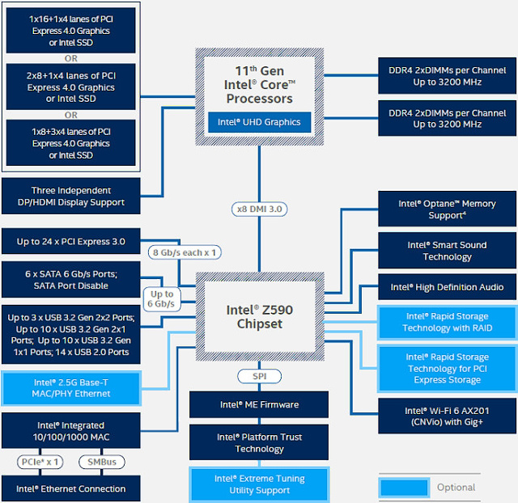
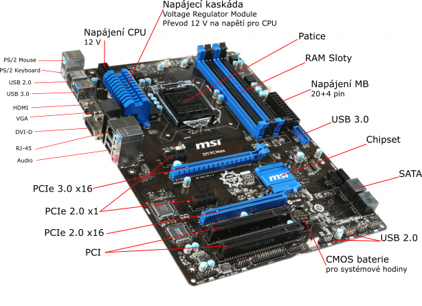

# HW 26 – Základní desky

## Základní deska (Motherboard)

* Umožňuje komunikaci mezi ostatními komponentami
* Distribuuje el. napětí poskytované zdrojem (Power Supply Unit)
* Připojení komponent pomocí sběrnic, síťová a zvuková karta jsou dnes již integrovány
* Chipset, BIOS
* Mohou podporovat SLI/CrossFire

### Patice (Socket)

* Propojení CPU a Motherboard bez nutnosti pájení
* __PGA__ – Pin Grid Array – pro PGA procesory s piny na spodní straně, které se do patice zapojí "through hole"
  * AMD – AM4
* __LGA__ – Land Grid Array – pro LGA procesory s ploškami na spodní straně, které se spojí s piny na patici "surface-mount"
  * Intel – LGA 1200
  * AMD používá LGA u Threadripper (sTRX4) a EPYC (SP3)

### Chipset

* Sada integrovaných obvodů starajících se o komunikaci mezi CPU, pamětí a periferiemi
* Integrované přímo na základní desce, ovlivňuje výkon celého PC

#### Northbridge

* Připojen přímo k CPU přes front-side bus
* Zajišťuje komunikaci mezi CPU, operační pamětí a hlavními vysokorychlostními přídavnými sběrnicemi (PCIe, dříve AGP/PCI)
* Zároveň spojuje CPU a Southbridge

#### Southbridge

* Audio, ethernet, storage (USB, SATA), BIOS, pomalejší přídavné PCIe atd.
* Dříve propojen s Northbridge přes PCI interface

#### Současnost

* Většina funkcí Northbridge je integrována do samotného CPU
* Zbytek je integrován do jedné části, kterou výrobci MB obecně nazývají Chipset

## Formát

* Specifikace rozložení základní desky a zdroje
* ATX – Advanced Technology eXtended
  * Vyvinul Intel jako nástupce formátu AT
  * Velikostně EATX > ATX > microATX
* Dále je rozšířený formát Mini-ITX od VIA Technologies (menší než microATX)
* BTX – Balanced Technology eXtended
  * Pokus Intelu o nástupce ATX, příliš se neuchytil
  * Lepší chlazení/airflow

## RAM Slot

* DIMM – Dual In-line Memory Module
  * SO-DIMM – Small Outline DIMM – verze pro notebook
  * Předchůdcem byl SIMM, kde se z obou stran jednalo o stejný kontakt
  * DIMM má z každé strany samostatný kontakt tzn. dvojnásobný počet vývodů na stejném prostoru oproti SIMM
* DDR1–4
* Většina desek má barevně rozlišené sloty pro zapojení do dual channel

## BIOS – Basic Input/Output System

* Předinstalovaný firmware na desce v EEPROM nebo flash
* Při zapnutí PC probíhá POST (power-on self-test) inicializující a testující připojené komponenty
* Poté se spouští zavaděč, jehož cílem je aktivace jádra operačního systému
* V prostředí BIOSu lze nastavit boot priority, ventilátory, overclocking, ...

## UEFI – Unified Extensible Firmware Interface

* Dokáže zavádět z disků větších než 2,2 TB – oddíl GPT
* Nabízí BIOS Legacy Mode pro zavádění z MBR oddílů
* Secure Boot – kontrola malware
* GUI, lze ovládat myší

## Sběrnice (bus)

### ISA – Industry Standard Architecture

* 80. léta, základní desky v této době nedisponovaly mnoha rozhraními, proto se téměř vše zapojovalo do ISA slotů
* Parallel Half-duplex – Max 16 MB/s

### PCI – Peripheral Component Interconnect

* Parallel Half-duplex – Max 533 MB/s

### AGP – Accelerated Graphics Port

* Parallel Half-duplex – Max 2133 MB/s
* __+__ Oproti PCI měl slot dedikovaný kanál pro propojení s CPU a nespoléhalo se na PCI sběrnici
* __-__ Nižší kompatibilita mezi jednotlivými verzemi

### PCIe – PCI Express

* Serial Full-duplex
* Velikosti x1, (x2), x4, x8, x16, do větších lze zapojit menší
  * U open ended konektorů lze do menších zapojit větší
* Verze 1.0-5.0, zpětná kompatibilita

PCIe | x1 | x16
--- | --: | --:
1.0 | 250 MB/s | 4 GB/s
5.0 | 4 GB/s | 64 GB/s

* Základní rychlost je 250 MB/s, zdvojnásobuje se s každou novou verzí nebo větší velikostí
* Síťové, zvukové, střihové, televizní, USB, AIC SSD, ... karty

### SATA – Serial Advanced Technology Attachment

* Nástupce PATA
* Serial Half-duplex – Max 600 MB/s
* HDD, SSD, optické mechaniky, ...

### Chipset sběrnice

* Intel pro komunikaci CPU-Chipset používá proprietární sběrnici DMI – Direct Media Interface
  * V minulosti Front Side Bus nebo Quick Path Interconnect
* AMD používá PCIe

### USB – Universal Serial Bus

* Náhrada za Serial port, Parallel port, PS/2, Gameport atd.
* Základní pin out: Země, Data+, Data-, 5 V
* Plug and Play – Automatická konfigurace při připojení
* USB 2.0 – 53 MB/s; USB 3.0 – 524 MB/s; USB4 – 4,8 GB/s
* Typ A, B, C – od USB 3.2 pouze typ C

### FireWire

* Navržen společností Apple
* Dnes se běžně vyskytuje pouze u digitálních videokamer
* O něco nižší rychlost než USB 3.0

### ThunderBolt

* Připojení přes USB-C (v minulosti Mini DisplayPort)
* Spojuje PCIe a DisplayPort do jednoho sériového rozhraní, zároveň poskytuje napájení
* Rychlost jako USB4, drahé
* RAID úložiště, externí grafiky, ...
