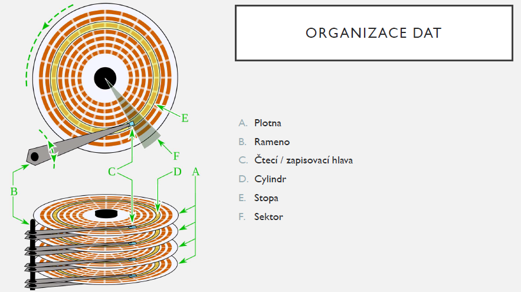
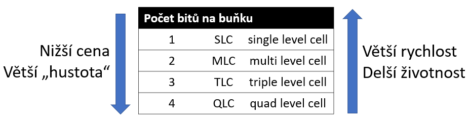

# HW 28 – Zařízení pro ukládání dat

## HDD – Hard Disk Drive

* Nevolatilní, pro ukládání a čtení dat se využívá magnetické indukce
  * Mikroskopická kovová zrnka na plotnách jsou uspořádána do skupin, které mají jeden ze dvou směrů orientace (reprezentující jedničku nebo nulu)

* Různé technologie pro zápis dat s cílem zvýšení hustoty dat:

### PMR – Perpendicular Magnetic Recording

* Kolmý magnetický záznam, oproti podélnému až třikrát větší hustota

### SMR – Shingled Magnetic Recording

* Stopy se částečně překrývají
* Větší hustota, složitější zápis

### HAMR – Heat-Assisted Magnetic Recording

* Seagate
* Každá zapisovací hlava má laserovou diodu umožňující zahřátí materiálu
* Zahřátím se mění magnetické vlastnosti materiálu a lze zapisovat do mnohem menších oblastí

### MAMR – Microwave-Assisted Magnetic Recording

* Western Digital
* Podobný princip jako HAMR, ale k zahřátí se používá magnetických mikrovln
* Na papíře ve všem lepší než HAMR

### Parametry HDD

* SMART – Self-Monitoring, Analysis, and Reporting Technology
  * Monitoruje určité hodnoty na disku a umožňuje předběžně reagovat na jeho selhání
* Formát – 3,5" PC, 2,5" ntb
* Rozhraní – PATA/IDE, SCSI, SAS, SATA, (USB u extreních disků)
* Kapacita – 8 TB
* Rychlost otáčení ploten – 7200 rpm
* Velikost bufferu – 256 MB
* Rychlost čtení/zápis – 190 MB/s

## SSD – Solid State Drive

* Nevolatilní, využívá se paměti NAND flash realizované pomocí MOSFETů
* WRITE – Na elektrony se aplikuje napětí a tím se přesunou do hradla tranzistoru
* READ – Tím se mění odpor a lze ho změřit posláním proudu skrz zřídlo a výpusť
* ERASE – Pro vymazání jsou elektrony přesunuty pryč z hradla
* Opakované write/erase operace vedou k opetřebení materiálu a selhání buňky

* Vylepšená paměť V-NAND (3D NAND) skládá jednotlivé plochy NAND buněk vertikálně na sebe
* Alternativou k NAND flash je 3D Xpoint – lepší parametry ale vyšší cena (Intel Optane)

### Parametry SSD

* TRIM
  * Před zápisem nových dat je nutné stará data smazat (narozdíl od HDD), OS ale při smazání souboru maže pouze metadata
  * Příkazem TRIM operační systém informuje SSD, která data již nejsou potřeba
  * Operace TRIM je prováděna, když se na SSD neočekává žádná další operace
* Formát
  * mSATA – Starý formát, lze nalézt v noteboocích
  * __M.2__ – Next Generation Form Factor
    * Náhrada za mSATA pro připojování SSD, wi-fi adaptérů atd.
    * Nejčastější velikost 2280 (22x80 mm)
  * __2,5"__ – Stejná velikost jako ntb HDD
  * 3,5" – Enterprise
  * AIC – Add-in-Card – zapojeno přímo do PCIe slotu
* Rozhraní
  * __SATA__
    * Dostupné ve formátech mSATA / 2,5" / M.2 (B&M klíčování)
  * __PCIe NVMe__ – Non Volatile Memory Express – standard pro připojení SSD skrz PCIe
    * Dostupné ve formátech M.2 (M klíčování) / AIC / 2,5" (U.2 – preferováno na serverech)
  * SAS – Výhradně na serverech
  * USB – Pro externí SSD
* Typ paměti – SLC, MLC, TLC, QLC, (PLC)
* Kapacita – 2 TB
* Rychlost čtení/zápis – 3,4/2,9 GBps

## SSD vs HDD

* __+__ SSD má rychlejší čtení a zápis, je mechanicky odolné (žádné pohyblivé části) a má tichý provoz. Dosahuje nižších teplot než HDD, jeho fyzická velikost je menší a také je úspornější.
* __-__ SSD má vyšší cenu za byte a omezený počet přepisů s tím, že záchrana dat je velmi složitá.
* __+__ HDD má nižší cenu za byte a má velkou životnost co se týče přepisů. Obnovitelnost dat oproti SSD je snazší.
* __-__ HDD má mechanické části náchylné na požkození, může být hlučné a oproti SSD má nižší přenosové rychlosti a větší spotřebu.

## Optická média

* Paměťové médium, ke čtení a zápisu se používá paprsek laseru
* U optických disků se data zaznamenávají často na hliník ve formě prohlubní a výstupků
  * Změna mezi prohlubeň/výstupek znamená 1, oblast beze změny znamená 0
  * Při čtení je disk osvícen laserem odrážejícím se na fotodiodu, která data převádí na el. signál

### CD – Compact Disc

* Phillips a Sony
* Původní záměr – digitální audio
* 700 MB
* CD-ROM, CD-R, CD-RW

### DVD – Digital Versatile (Video) Disc

* Větší kapacita oproti CD díky kratší vlnové délce laseru
* 4,7 GB – základní jednostranné jednovrstvé
* 17 GB – oboustranné dvouvrstvé (8,5 GB na každé straně)
* Nástupcem měl být HD DVD, ten ale neuspěl proti Blu-ray

### BD – Blu-ray Disc

* Sony
* Jméno podle modrého laseru umožňujícího větší hustotu dat
* Formát BDXL umožňuje kapacitu až 128 GB

## Rozhraní

### PATA – Parallel Advanced Technology Attachment

* Také známé jako IDE – Integrated Drive Electronics
* Před příchodem SATA se jednalo o standard pro připojení disků, mechanik apod.
* Pomocí jumperů se na disku dala určit jeho role – Master/Slave/Cable Select
  * U kabelů s třemi konektory je master ten vzdálenější od MB (ten na druhém konci kabelu)
* 40pinové konektory, ale 80žilové kabely ("kšandy") – každý druhý vodič je země, aby se eliminovaly přeslechy
* Maximální rychlost 133 MB/s
* Napájení – 4pinový Molex konektor

### SATA – Serial Advanced Technology Attachment

* Nástupce PATA
* Serial Half-duplex – Max 600 MB/s
* Napájení – 15pinový SATA power konektor

### SCSI – Small Computer System Interface

* První člen rodiny SCSI byl Parallel SCSI
* Použití především na serverech
* Lze připojit několik zařízení na jeden kanál, celá kaskáda musí být zakončena tzv. terminátorem

#### SAS – Serial Attached SCSI

* Sériová sběrnice, lze na ní připojit SATA zařízení
