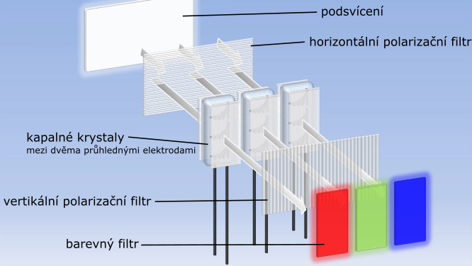

# HW 30 – Výstupní zařízení PC

## LCD – Liquid Crystal Display

* Kapalný krystal je stav hmoty, kdy jsou její vlastnosti v přechodu mezi kapalným a pevným skupenstvím
* Tyto krystaly tvoří mřížku subpixelů
  * Každý pixel je tvořen třemi subpixely – RGB
* Plocha krystalů je podsvícena výbojkou a uzavřena mezi průhledné elektrody, na které je přiváděno napětí
* Velikost napětí způsobuje natočení krystalů a to určuje propustnost světla (jas)
* Paprsek nejdříve prochází horizontálním polarizačním filtrem, poté je ohýbán krystaly, prochází vertikálním polarizačním filtrem a nakonec barevným filtrem

* Různé typy panelů podle uspořádání krystalů:
* TN – Twisted Nematic
  * Nejstarší LCD technologie
  * Špatné horizontální a obzvlášť vertikální pozorovací úhly
  * Horší barvy
  * Rychlá odezva a vysoké frekvence – herní displeje
  * Nízká cena – budget displeje
* IPS – In-Plane Switching
  * Nejlepší pozorovací úhly a barvy
  * Dražší
* VA – Vertical Alignment
  * Nejlepší kontrast
  * Nejhorší odezva

## LED-backlit LCD

* Potenciální nástupce LCD, využívá podobné techniky
* Místo výbojky je displej podsvícen LED maticí
* Edge LED
  * LED jsou umístěny na okrajích obrazovky, obrazovku osvěcují pomocí tenké rozptylovací vrstvy
  * Levnější, méně kvalitní, ale umožňuje fyzicky tenčí displeje
* Direct LED
  * LED jsou umístěné po celé ploše přímo za LCD panelem
  * Dražší, kvalitnější, možnost lokální regulace LED
* LED-backlit displeje mají nižší spotřebu díky absenci výbojky. Jelikož zde není stále svítící podklad, umožňují lepší kontrast a černou barvu. Jsou ale dražší na výrobu.

## OLED – Organic Light Emitting Diode

* Energie je na světlo převedena pomocí organické sloučeniny
* Není potřeba podsvícení a není potřeba kapalných krystalů
* __+__ Displej může být tenký a má dobré pozorovací úhly
* __+__ Možnost vypnutí specifických OLEDek (dobrý kontrast a černá barva), lze vyrobit průsvitné displeje
* __-__ Vysoká cena
* __-__ Opotřebení organického materiálu vede k vyblednutí barev nebo vypalování obsahu

## MicroLED

* Reaguje na nedostatky OLED
* Namísto organických se používají "klasické" LEDky s velikostí 100 µm a menší
* __+__ Kontrast, životnost, velmi rychlá odezva
* __-__ Vysoké výrobní náklady

## Parametry displejů

* Úhlopříčka – 24"
* Poměr stran a rozlišení
* Obnovovací frekvence – 60 Hz
* Doba odezvy – 4 ms
* Typ panelu – TN/IPS/VA
* Konektivita – VGA/DVI/HDMI/DP
* Další parametry – zaoblení, držák VESA, lesklý/matný povrch

## Jehličkové tiskárny

* Tisk je složen z bodů tvořených jehlami
* Barevná páska naplněná inkoustem zabarví jehličky a ty se obtisknou na papír
* Jehličky jsou vystřelovány z tiskové hlavy pomocí elektromagnetu
* Několikavrstevní papír umožňuje tisknout několik kopií najednou
* Pohyb zleva doprava ve sloupcích
* Pro tisk nenáročný na kvalitu (výpisy, ...)
* Výhody:
  * Levný tisk
  * Jednoduchost
* Nevýhody:
  * Nízká kvalita tisku
  * Hlučnost
  * Pomalý tisk
  * Omezený výběr barev

## Tepelné tiskárny

* Tepelně citlivý papír projede pod tepelnou tiskovou hlavou a tím zčerná
* Účtenky
* Tiskárna má malé rozměry a tisk je rychlý. Vyžaduje se ale speciální papír a tisk po čase bledne a mizí (obzvlášť na slunci).

## Inkoustové tiskárny

* Tisková hlava vystřikuje mikroskopickými otvory inkoust na papír
* CMYK – Cyan (tyrkysová), Magenta (purpurová), Yellow, Key/blacK
* Výhody:
  * Nízká pořizovací cena
  * Kvalita srovnatelná s laserovou, pro profi foto tisk se používá inkoust
  * Kompaktnější než laserová
* Nevýhody:
  * Drahé cartrige
  * Nutnost pravidelného tisku, jinak hrozí zaschnutí trysek
  * Vytištěný dokument je méně odolný (rozpití, rozmazání)
* Novinkou na trhu jsou inkoustové tiskárny s tankovým systémem, které mají vyšší pořizovací cenu ale nižší cenu za stránku

## Laserové tiskárny

* Selenový válec je ozářen laserem v místech kde má být obraz, zde se změní jeho náboj
* Na tato místa je pak nanesen toner (barevný prášek)
* Při dalším otočení válce se toner přenese na papír
* Zažehlovací válec prášek vypálí
* Výhody:
  * Kvalita tisku
  * Rychlost tisku
  * Cena za stránku
* Nevýhody:
  * Vyšší pořizovací cena
  * Fyzicky větší než inkoustová

## LED tiskárny

* Stejný princip jako laserový tisk, válec je ale osvětlen LEDkami
* Méně pohyblivých částí, menší opotřebení

## Parametry tiskáren

* Druh tisku
* Pořizovací cena
* Cena za stránku
* Konektivita (Wi-Fi, NFC)
* Kvalita DPI
* Rychlost (stránka za minutu)
