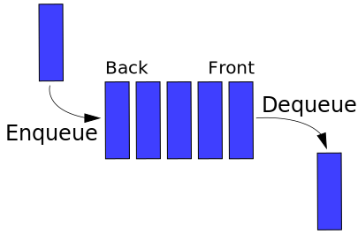

# SW 03 – Strukturované datové typy

## Strukturované datové typy

* Objekty skládající se z několika komponent (členů)
* Homogenní – komponenty jsou stejného typu NEBO heterogenní – komponenty různého typu

## Výčtový typ

* Konečná množina hodnot a jejich identifikátorů

``` csharp
enum BeerType
{
    Nealkoholické, Nízkoalkoholické, Stolní, Výčepní, Ležák, Plné, Silné
}
```

* Hodnota je obvykle celočíselná konstanta; pokud je neurčíme, C# je očísluje od nuly

## Struktura

* Lze chápat jako uživatelsky definovaný hodnotový typ / odlehčenou třídu
* Je to hodnotový datový typ, nepodporuje dědičnost
* Může mít konstruktor, atributy, metody, vlastnosti, ...

``` csharp
struct Beer
{
    string nazev;
    BeerType typ;

    public Beer(string nazev, BeerType typ)
    {
        this.nazev = nazev;
        this.typ = typ;
    }
}
// ...
Beer plzen = new Beer("Pilsner Urquell", BeerType.Ležák);
```

## Objekt

* neboli instance
* V podstatě místo v paměti alokované a nakonfigurované třídou / strukturou
* Program může vytvořit několik objektů stejné třídy / struktury
* Může být uložen v proměnné / kolekci
* V C# je třída _Object_ nejvyšší základní třída

## Pole

* Množina proměnných stejného datového typu = homogenní strukturovaný datový typ
* S polem se zachází jako s celkem, k jednotlivým proměnným se přistupuje přes index. V C# se indexuje od nuly.

``` csharp
int[] pole = new int[početPrvků];
int[] pole = new int[] { 1, 2, 3, 4, 5, 6 };
int[,] pole = new int[,] { { 1, 2 }, { 3, 4 }, { 5, 6 } }; // Vícerozměrné (3x2 int[3,2])

// Vícerozměrné nepravidelné "zubaté" pole:
int[][] pole;
pole = new int[2];
pole[0] = new int[3];   // [0][0] [0][1] [0][2]
pole[1] = new int[2];   // [1][0] [1][1]
```

* `pole.Length` – celkový počet prvků ve všech dimenzích
* `pole.GetLength(int x)` – celkový počet prvků v dimezi _x_
* `foreach`, `Array.Copy()`, `Array.Clear()`, `Array.Find()`, `Array.IndexOf()`, `Array.Sort()`, `Array.Reverse()`

## Kolekce + Generické kolekce

* Kolekce jsou standardní datové struktury doplňující pole

Předdefinované třídy kolekcí:

__System.Collections__:

* Nespecifikovaný datový typ, kolekce mohou obsahovat různé datové typy
* Prvky získané z kolekce jsou typu object, pro uložení do proměnné jiného typu je potřeba přetypovat

### __ArrayList__

* Pole implementující rozhraní _IList_, jehož velikost se dynamicky zvětšuje dle potřeby

### __Hashtable__

* Negenerický Dictionary
* Klíč + Hodnota – Klíč je unikátní a neměnný

``` csharp
Hashtable openWith = new Hashtable();
openWith.Add("txt", "notepad.exe");
openWith.Add("txt", "winword.exe"); // Nelze, klíč musí být unikátní
```

### __Queue__

* Fronta, FIFO – First In First Out (kdo přijde jako první je vyřešen jako první)
* Enqueue, Dequeue, Peek (na prvního ve frontě)



### __Stack__

* Zásobník, LIFO – Last In First Out (kdo přijde jako poslední je vyřešen jako první)
* Push, Pop, Peek (na vrchol zásobníku, poslední přidaný)


__System.Collections.Generic__:

* Datový typ se specifikuje ve chvíli vytvoření instance
* Generický typ slouží jako zástupce pro budoucí datový typ

### __Dictionary<TKey,TValue>__

* Generický Hashtable

### __List\<T>__

* Generický ArrayList

### __Queue\<T>__

* Generická Queue

### __SortedList<TKey,TValue>__

* Generická kolekce Klíč + Hodnota
* V defaultu prvky automaticky řazeny podle Klíče vzestupně

### __Stack\<T>__

* Generický Stack
