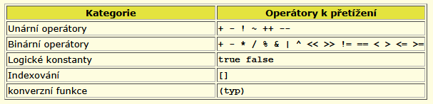

# SW 06 – Objektové programování II

## Zapouzdření (Encapsulation)

* = Zabalení dat a metod a restrikce přístupu k nim. Používá se pro skrytí dat ve třídě.
* `private` – Ke členům třídy mají přístup třídy, které z ní dědí a jsou v ní "nested" (`public class A { public class B : A { } }`)
* `private protected` – Ke členům třídy mají přístup třídy, které z ní dědí a nachází se ve stejném sestavení (stejné dll/exe)
* `protected` – Ke členům třídy mají přístup třídy, které z ní dědí
* `internal` – Ke členům třídy mají přístup všechny třídy ve stejném sestavení
* `protected internal` – Ke členům třídy mají přístup všechny třídy ve stejném sestavení nebo třídy, které z ní dědí
* `public` – Ke členům třídy mají přístup všechny třídy

## Dědičnost (Inheritance)

* Tvoření nových datových struktur na základě starých
* Dědící třída používá (dědí), rozšiřuje nebo modifikuje chování rodičovské třídy
* V C# lze mít pouze jednoho rodiče (single inheritance only)
* Konstruktory a destruktory se nedědí, každá třída si musí definovat svůj vlastní (spuštění původního pomocí `: base()`)
* Podporuje koncept znovupoužitelnosti, méně redundantního kódu
* Rodič = super/base/parent class; Potomek = sub/derived/extended/child class
* Ze `sealed` třídy nelze dědit
  * Modifikátor také lze použít na přepsané (override) metody, aby již nešly přepisovat v dalších potomcích

## Polymorfismus (Polymorphism) + přepsání a překrytí

* Podstatou jsou metody, které mají všichni potomci definované se stejnou hlavičkou, ale jiným tělem (jiná implementace "stejných" metod)

``` csharp
class A
{
    public void SomeMethod()
    {
        WriteLine("A - Some Method");
    }

    public virtual void AnotherMethod()
    {
        WriteLine("A - Another Method");
    }
}

class B : A
{
    public new void SomeMethod()            // Překrytí
    {
        WriteLine("B - Some Method");
    }

    public override void AnotherMethod()    // Přepsání
    {
        WriteLine("B - Another Method");
    }
}

// Main:
A a = new A();
a.SomeMethod();         // A - Some Method
a.AnotherMethod();      // A - Another Method

A ab = new B();
ab.SomeMethod();        // A - Some Method
ab.AnotherMethod();     // B - Another Method

B b = new B();
b.SomeMethod();         // B - Some Method
b.AnotherMethod();      // B - Another Method
```

[Jak funguje A ab = new B();](https://stackoverflow.com/questions/33131610/base-class-new-derived-class-how-does-this-work)

* __Přepsání = `override`__ (přepsaná metoda musí být `virtual`)
* __Překrytí = `new`__

## Přetížení

* Lze definovat metody se stejným jménem a jinými vstupními parametry
* Přetížené metody se musí lišit v počtu nebo typu parametrů (jiné pořadí nestačí)
* Destruktor nelze přetížit (nesmí mít parametry)

``` csharp
static int PlusMethod(int x, int y)
{
    return x + y;
}

static double PlusMethod(double x, double y)
{
    return x + y;
}

static int PlusMethod(int x, int y, int z)
{
    return x + y + z;
}

// (Main:) Jakou metodu volat se rozhoduje podle počtu a typu vstupních parametrů
var a = PlusMethod(1, 2);   // 3
var b = PlusMethod(1.5, 2); // 3.5
var c = PlusMethod(1, 2, 3);// 6
```

### Přetížení operátoru

* Definice operátoru je vždy veřejná a statická
* Následuje navrátový typ, obecné může být libovolný
* Klíčové slovo `operator` znamená, že chceme přetížit operátor
* Unární operátor – definujeme jeden parametr; Binární operátor – dva parametry
* Je vhodné, aby první parametr byl stejný typ jako třída, jejíž operátor přetěžujeme

``` csharp
class OperOver
{
    public string text;

    public OperOver(string text)
    {
        this.text = text;
    }
    
    public static OperOver operator +(OperOver t1, OperOver t2)
    {
        return new OperOver(t1.text + " plus " + t2.text);
    }
}

static void Main(string[] args)
{
    OperOver a = new OperOver("A");
    OperOver b = new OperOver("B");
    WriteLine((a + b).text);    // "A plus B"

    a += b;
    WriteLine(a.text);          // "A plus B"

    OperOver c = a + b;
    WriteLine(c.text);          // "A plus B plus B"
}
```



## Metoda s proměnným počtem parametrů

* Klíčové slovo `params` před posledním z parametrů. Typ tohoto parametru musí být pole.

``` csharp
public void SomeMethod(params object[] p) { } // Proměnný počet parametrů
```
