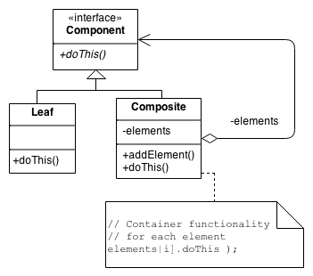

# SW 9 – Návrhové vzory II

## Návrhový vzor

* Popis/šablona pro řešení (častého) problému
* Svou aplikací zjednodušují daný problém
* Ověřená funkčnost = menší šance udělat chybu
* Kód je zpřehledněn a svým způsobem i standardizován

NV | — | —
:-: | :-: | :-:
__Vytvářející__ vzory | Mechanismy pro tvorbu objektů | Tovární metoda, Singleton, Bazén
__Strukturální__ vzory | Uspořádání objektů do efektivních struktur | Proxy, Adaptér, Fasáda, Muší váha, Composite
Vzory __chování__ | Interakce a responzibilita objektů | Command, Iterátor, Null, Služebník, State, Šablonová metoda

__Strukturální vzory__ (Structural patterns):

## Zástupce (Proxy)

* Umožňuje řídit přístup k celému/částečnému rozhraní objektu přes jiný zastupující objekt

### Vzdálený zástupce (Remote proxy)

* Zastupuje objekt umístěný někde jinde
* Zařizuje (serverovou) komunikaci se vzdáleným objektem
* Měl by být připraven i na selhání spojení (vyhodit odpovídající výjimku)

### Virtuální zástupce (Virtual proxy)

* Také zastupuje jiný objekt
* Vytvoření objektu se nechává na poslední chvíli (objekt ani být vytvořen nemusí) a chování objektu se předstírá
* Použití: lazy loading obrázků/dat z databáze

### Ochranný zástupce (Protection proxy)

* Zakrývá identitu zastupovaného objektu
* Nabízí jen podmnožinu metod zastupovaného objektu, lze implementovat kontrolu přístupových práv
* Implementace skrytím za rozhraní nebo za proxy třídu spravující instanci objektu

``` csharp
public class Zastupce
{
    private Zastupovany z;
    public void Metoda() => z.Metoda();
}
```

### Chytrý odkaz (Smart reference)

* Návrhový vzor spadající pod zástupce
* Doplnění komunikace s objektem o další akce, typicky kvůli zrychlení a zefektivnění aplikace
* Virtuální zástupce je také chytrý odkaz – rozhoduje, kdy přistoupí k originálnímu objektu a kdy načte hodnoty z cache / metadata

## Adaptér (Adapter / Wrapper)

* Převede zastaralé / nehodící se / chybné rozhraní třídy na rozhraní, které klient očekává
* Zabezpečuje spolupráci tříd a usnadňuje implementaci nových
* Může celou třídu zabalit do nové (object adaper), nebo z ní dědit (class adapter)

## Fasáda (Facade)

* Zjednodušuje komunikaci mezi uživatelem a systémem
* Vytvoření jednotného rozhraní pro celou logickou skupinu tříd, které se tak sdruží do subsystému
* Zabalí komplikovaný subsystém do jednoduššího uceleného rozhraní

## Muší váha (Flyweight)

* Objekt rozdělen na dvě části
* Spočívá ve sdílení prstředků, jedna část je pro všechny instance společná
* Ušetření paměťové náročnosti
* Např. jednotky v RTS hrách

## Composite

* Doporučené řešení situace, kdy se pracuje se stromovou strukturou např. rekurzivně zanořené navigační menu
* Jednoduché a z nich složené (kompozitní) objekty – lze k nim přistupovat jednotným způsobem, implementují stejné rozhraní
* (Funkce použitá na kontejner by se měla aplikovat na všechny prvky v něm)


