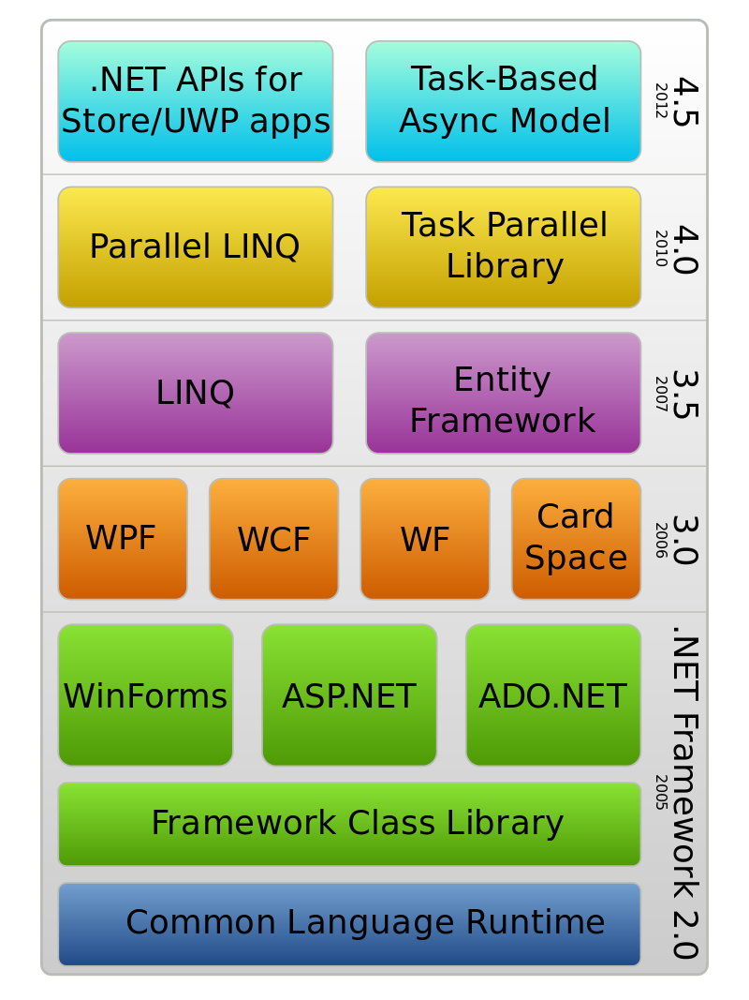
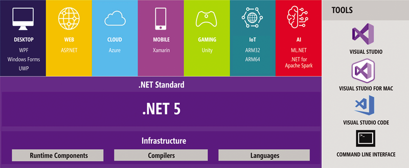

# SW 11 – Architektury .NET

## .NET

* `.NET Framework` je framework od společnosti Microsoft
* Framework = Softwarová struktura, která slouží jako podpora při vývoji sw produktů
  * první: `.NET Framework 1.0` (2002)
  * poslední: `.NET Framework 4.8` (2019)



* Duchovním nástupcem je framework `.NET Core`, později přejmenován pouze na `.NET`
  * první: `.NET Core 1.0` (2016)
  * poslední: `.NET 5` (2020)
  * preview: `.NET 6` (2021)
* Verze 4 byla vynechána, aby se `.NET 4` nepletl s `.NET Framework 4`



### Podporované jazyky

* C#
* F#
* C++/CLI
* VB .NET
* [...](https://en.wikipedia.org/wiki/List_of_CLI_languages)

## Prostředky architektury .NET pro cílové platformy

### Common Language Infrastructure (CLI)

* Standardizovaná specifikace popisující vlastnosti kódu a runtime prostředí
* Vysoké jazyky mohou běžet na různých počítačových platformách bez nutnosti jejich modifikace
* .NET jazyky jsou sestaveny do platformě nezávislého mezijazyka Common Intermediate Language (CIL, ~nejnižší člověkem čitelný kód)
* Common Language Runtime (CLR) poté převádí CIL na machine-readable kód
* Toto je pouze specifikace, nikoliv implementace!

### Common Language Runtime (CLR)

* Společné virtuální prostředí pro běh aplikací
* Převádí CIL na strojový kód, který je proveden na CPU počítače
* Další operace:
  * Správa paměti
  * Type safety (kontrola datových typů, nelze např. sečíst int a string)
  * Řešení výjimek
  * Garbage collection
  * Vláknová bezpečnost

### Framework Class Library (FCL)

* Organizovaná hierarchie jmenných prostorů
* Poskytuje kolekci tříd, rozhraní a typů (většinou `System.*` nebo `Microsoft.*`)
* Ty poskytují operace jako čtení/zápis souborů, lokalizace, komunikace po síti, využití více vláken, reflexe (zjištění informací o objektech za běhu)
* Dále zahrnuje např. knihovny pro <span>ASP.NET</span>, WPF, LINQ, ...

#### LINQ (Language Integrated Query)

* Přidává .NET jazykům schopnost dotazování nad kolekcemi
  * pole, enumerable třídy, XML dokumenty, relační databáze, ...
* Lze zapisovat pomocí lambda operátorů

``` csharp
List<string> list2 = (from x in list where x[0] == 'a' select x).ToList();
List<string> list2 = list.Where(x => x[0] == 'a').ToList();

.Where()
.Count()
.Any()
.SingleOrDefault()
```

## MVVM (Model View ViewModel)

* Mimo rodinu .NET také znám jako Model View Binder
* Softwarová architektura (lze považovat za návrhový vzor)
* Oddělení GUI (View) od logiky aplikace (Model)
* __ViewModel__ se stará o převedení dat z Modelu do podoby prezentovatelné ve View, používá logiku svou a modelu
  * Nemá odkaz na View, neví o něm (narozdíl od Presenteru v MVP), objevuje se v něm redundantní kód (boilerplate)
* __View__ neobsahuje žádný logický kód, s ViewModelem komunikuje pomocí bindingu
  * Bežným jazykem je XAML (eXtensible Application Markup Language)

## Binding

* Vytvoření vazby mezi vlastnostmi poskytovatele (ViewModel) a konzumenta (View)
* Data jsou synchronizována
* Poskytovatel při změně upozorní všechny konzumenty (WPF/UWP – `INotifyPropertyChanged`)
* Existuje také obousměrný Binding: `{Binding Foo, Mode TwoWay}`

### Command (příkaz)

* Událost připravena na pozdější použití zapozdřena do objektu
* Metoda, respektive delegát, který je v commandu uchován, je volán, pokud nastane nějaká událost ve View
* WPF/UWP – `ICommand(Execute, CanExecute)`

``` csharp
class MainViewModel : INotifyPropertyChanged
{
    // Data na straně poskytovatele
    private string imagePath;
    public string ImagePath { get => imagePath; set { imagePath = value; NotifyPropertyChanged(); } }

    // Commandy
    public RelayCommand LoadImageCommand { get; set; }
    
    // Konstruktor
    public MainViewModel()
    {
        LoadImageCommand = new RelayCommand(() => { LoadImage(); }, () => true);
    }

    // NotifyPropertyChanged essentials
    public event PropertyChangedEventHandler PropertyChanged;
    private void NotifyPropertyChanged([CallerMemberName] String propertyName = "")
    {
        PropertyChanged?.Invoke(this, new PropertyChangedEventArgs(propertyName));
    }
}
```

``` xml
<Window xmlns:viewmodels="clr-namespace:ImageEditor.ViewModels">

    <Window.DataContext><viewmodels:MainViewModel></viewmodels:MainViewModel></Window.DataContext>

    <Image Source="{Binding ImagePath}"></Image>
    <Button Content="Otevřít ..." Command="{Binding LoadImageCommand}"></Button>

</Window>
```

### Converter

* Metoda, která modifikuje binding data – Přetypování svázaných dat na jiný datový typ
* Většinou převod klasických typů (bool, int, ...) na typy View (barva, obrázek, ...)
* Bohužel je nutné převádět například i bool na viditelnost prvku, ta totiž místo boolu přijímá `enum Visibility`:

``` csharp
class BoolToVisibility : IValueConverter // WPF/UWP konvertory musí mít toto rozhraní
{
    public object Convert(object value, Type targetType, object parameter, string language)
    {
        var v = (bool)value;
        return (v) ? Visibility.Visible : Visibility.Collapsed;
    }

    // Podpora obousměrného převodu
    public object ConvertBack(object value, Type targetType, object parameter, string language)
    {
        throw new NotImplementedException();
    }
}
```

``` xml
<Window xmlns:converters="clr-namespace:ImageEditor.Converters">

    <Window.Resources>
        <converters:BoolToVisibility x:Key="bool2visible"></converters:BoolToVisibility>
    </Window.Resources>
    
    <Button Visibility="{Binding Foo, Converter={StaticResource bool2visible}}"></Button>

</Window>
```

## Observer (pozorovatel)

* Návrhový vzor, závislost _1 : 0..N_ mezi poskytovatelem a konzumenty
* Při změně poskytovatele jsou upozorněni všichni konzumenti a mohou na změnu reagovat
* Příkladem tohoto NV je právě binding
  * Žádný nebo několik prvků ve View jsou pozorovatelé jedné vlastnosti ve ViewModel
  * Změna této vlastnosti upozorní pozorovatele, ti zavolají její getter a podle něj se aktualizují

## Událostmi řízené programování (event-driven)

* Obecnější pojem označující typ asynchronního programování, je základním principem tvorby GUI aplikací
* Tok programu je řízen událostmi, které jsou obvykle spuštěny určitou uživatelskou akcí
* Základní princip – V programu běží smyčka kontrolující nastání událostí a volající patřičné metody

``` csharp
private void ButtonClick(object sender, EventArgs e)
{
    ((Button)sender).Text = "Clicked";
}
```

* `sender` – komponenta, od které přišla událost
  * Typ je `object`, je tedy potřeba přetypovat nebo dotázat se na konkrétnější typ operátorem `is`
* `e` – obsahuje data o události
