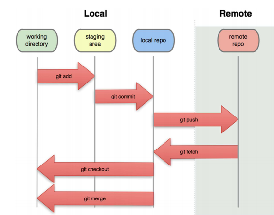
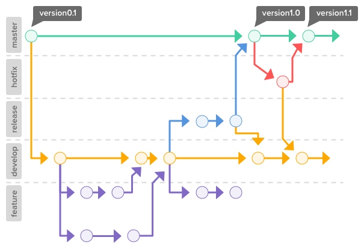

# SW 12 – Verzovací systémy

## Verzování (version control)

* Obecně správa změn v počítačových souborech (program, dokument, konfigurace, ...)
* Zachování historie celého projektu, možnost vrátit se ke starší verzi
* Evidence změn (kdo, kdy, co a jak změnil)
* Umožňuje spolupráci více osob na jednom projektu

## Verzovací systémy

### Centralizované

* Historie změn uložena na serveru
* Pro ukládání a analýzu změn je potřeba komunikace se serverem (online)
* CVS, Apache Subversion

### Distribuované (Decentralizované)

* Každý může mít historii změn uloženou lokálně (_.git_ adresář) – lze pracovat offline
* Umožňuje práci na různých větvích
* Git, Mercurial, Bazaar

## Git

* __Git__ – Distribuovaný verzovací systém
* __GitHub__ – Poskytovatel služby Git na webu (mnoho alternativ – GitLab, BitBucket, [...](https://www.guru99.com/github-alternative.html))
* Git byl vytvořen v roce 2005 Linusem Torvaldsem pro vývoj jádra Linuxu
* Git při commitu neukládá seznam změn ale vytvoří tzv. snapshot:
  * Snímek všech nových a změněných souborů a odkazy na tyto soubory
  * Pokud se nějaký soubor nezměnil, Git ho znovu neukládá, ale použije odkaz na identitcký soubor z předchozí verze

## Repozitář

* Datové úložiště verzovacího systému pro daný projekt
* __Lokální__ – offline, v úložišti uživatele
* __Vzdálený__ – online, nahraný na GitHub



## Commit

* Uložení změn, příkaz `git commit` uloží změny lokálně
* Myšlenka: Mělo by se jednat o specifické a související změny (přidání jedné nové funkce, oprava chyby)

## Větev (branch)

* Posloupnost commitů daného projektu
* Projekt může mít neomezený počet větví, lze je později spojovat dohromady (merge)
* Myšlenka: Hlavní větev (_master_ nebo _main_) je část kódu připravená ke zveřejnění
  * Testování nových funkcí by se mělo odehrávat v jiné větvi
* Pro spojení dvou větví se používá merge, může dojít ke kolizím (conflict), ty je nutno vyřešit



## Příkazy

``` bash
git init
```

* Vytvoří v aktuální složce lokální repozitář

``` bash
git add .
```

* Přidá vybrané soubory (`.` = všechno) do tzv. staging area = prostor mezi (ne)změněnými soubory a commitem
* Nejsou zahrnuty položky definované v souboru _.gitignore_

``` bash
git commit -m "název commitu"
```

* Vytvoří lokální commit ze souborů ve staging area

``` bash
git remote add origin https://github.com/RDMCz/MZRepo.git
```

* Přidá k lokálnímu repozitáři odkaz na repozitář vzdálený, lokálně pojmenovaný _origin_

``` bash
git push origin main
```

* Nahraje lokální stav do vzdáleného repozitáře _origin_ do větve _main_
* Parametr `-u` nastaví část `origin main` jako výchozí a v budoucnu už stačí psát jen `git push` / `git pull` / ...

``` bash
git fetch # Stáhne ze vzdáleného repozitáře všechna data navíc oproti lokálnímu, nesloučí je (merge)
git merge
git pull  # fetch + merge
git clone
git branch
```

## Funkce GitHubu

* __Fork__ je vytvoření samostatné kopie repozitáře pro vlastní potřebu
* __Pull request__ je žádost o merge; na webu lze diskutovat o změnách, které merge přinese
* __Markdown__ (přípona .md) je formát souboru pro psaní formátovaného textu
  * Soubor _<span>README.md</span>_ umístěný v kořeni repozitáře je zobrazen na webu pod seznamem souborů
