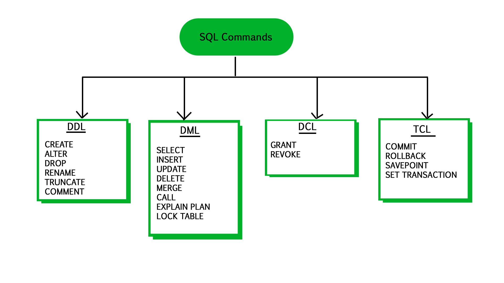

# SW 15 – Jazyk SQL

## Dialekt

* SQL databáze jsou poskytovány mnoha firmami a občas mají mírné odlišnosti v zápisu dotazů = SQL Dialekty
* Rozdíly v syntaxi, case sensitive, jednoduché/dvojité uvozovky, jiné názvy příkazů, podpora příkazů, ...
* MySQL, MS SQL, Oracle, PostgreSQL, SQLite, ...

## SQL Standard

* SQL je ANSI/ISO standard, i přes různé dialekty by vždy měl podporovat hlavní příkazy (SELECT, UPDATE, DELETE, INSERT, WHERE)
* SQL = Structured Query Language (Jazyk Strukturovaných Dotazů)
* První standard _SQL-86_, nejnovější _SQL:2019_

## DML (Data Manipulation Language)

* Jazyk (podjazyk SQL) pro vkládání, mazání a upravování dat v databázi

``` sql
-- Vložení záznamu (jednoho či více)
INSERT INTO sousedstvo (čp, jméno, věk) VALUES (179, "ludvik", 57);

-- Úprava existujících dat v tabulce
UPDATE sousedstvo SET jméno = "Ludvík" WHERE čp = 179;

-- Smazání dat v tabulce
DELETE FROM sousedstvo WHERE věk = 57 AND jméno = "Ludvík";
```

## DDL (Data Definition Language)

* Syntax v SQL pro tvorbu a úpravu databázových objektů, hlavně tabulek

``` sql
-- Vytvoření nové databáze/tabulky
-- CREATE TABLE [table name] ( [column definitions comma-separated] ) [table parameters]
-- Column definition: [column name] [data type] {NULL | NOT NULL} {column options}
-- VARCHAR(50) = string maximálně 50 znaků
CREATE TABLE employees (
    id          INTEGER         PRIMARY KEY,
    name        VARCHAR(50)     not null,
    birthday    DATE            not null
);

-- Vymazání databáze/tabulky
DROP TABLE employees;

-- Úprava sloupců
ALTER TABLE employees ADD salary INTEGER;
ALTER TABLE employees DROP COLUMN salary;

-- Přejmenování tabulky
ALTER TABLE employees RENAME TO zaměstnanci;

-- Vymazat všechna data, ponechat tabulku
TRUNCATE TABLE employees;
```

## DCL (Data Control Language)

* Podjazyk SQL k nastavování přístupových práv (Autorizace)
* `GRANT` – Dát uživateli práva na určité operace s tabulkou
* `REVOKE` – Odebrat tato práva

``` sql
GRANT SELECT, INSERT, UPDATE, DELETE ON employees TO PUBLIC;
REVOKE ALL ON employees FROM username;
```

## TCL (Transaction Control Language)

* Správa transakcí v databázi – správa změn způsobených DML/DDL příkazy

``` sql
BEGIN TRANSACTION; 
COMMIT; -- Učiní DML změny permanentní 
SAVEPOINT savename;
ROLLBACK TO savename;
```

## Insert

* Příkaz přidá nový záznam do tabulky
* Vloží do vybraných sloupců určené hodnoty, bez vybrání sloupců se vkládá celý záznam
* (Počet sloupců a hodnot musí být stejný)
* Lze přidat několik záznamů najednou (import zálohy)

``` sql
-- Vložit více záznamů
INSERT INTO animalsounds (animal, sound) VALUES ("Cat", "Meow"), ("Dog", "Woof"), ("Cow", "Moo");

-- Kopírování pomocí INSERT: table1 → table2
INSERT INTO table2 SELECT * FROM table1 (WHERE condition);

-- Jiná forma zápisu: INSERT SET
INSERT INTO animalsounds SET animal="Pig", sound="Squeal";
```

## Update

* Příkaz pro modifikování existujícího záznamu v tabulce
* Lze použít na celý sloupec nebo upřesnit podmínkou `WHERE`

name | salary
:-: | :-:
Rudolf | 0
Hektor | 0

``` sql
UPDATE employees SET salary = 15000;
```

name | salary
:-: | :-:
Rudolf | 15000
Hektor | 15000

``` sql
UPDATE employees SET salary = 37000 WHERE name = "Hektor";
```

name | salary
:-: | :-:
Rudolf | 15000
Hektor | 37000

---
---


