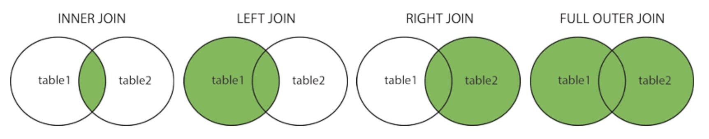

# SW 16 – Výběr dat v SQL

## SELECT

* Příkaz `SELECT` se v SQL používá k získání jakýchkoliv informací z databáze
* Vrací množinu záznamů z jedné nebo více tabulek

``` sql
SELECT seznam sloupců -- * = všechny, jinak odděleno čárkami
FROM seznam tabulek 
WHERE restrikce
GROUP BY seskupit dle
HAVING restrikce
ORDER BY dle čeho řadit;
```

``` sql
SELECT * FROM Customers;
```

CustomerID (PK) | Name | BirthYear | Country
:-: | :-: | :-: | :-:
1 | Valterri | 1989 | Finland
2 | Arno | 1768 | France
3 | Carlos | 1975 | Spain
4 | Ezio | 1459 | Italy
5 | Ariana | 1999 | Italy

## Projekce

* Určení dat, které se mají vybrat – výběr konkrétních sloupců

``` sql
SELECT Name, Country FROM Customers LIMIT 3;
SELECT TOP 3 Name, Country FROM Customers; -- jiný dialekt
```

Name | Country
:-: | :-:
Valterri | Finland
Arno | France
Carlos | Spain

## Restrikce

* Výběr (omezování) řádků při výběru dat z tabulky
* Podmínky, které musí být splněny, aby byl řádek zahrnut v návratovém řetězci SELECTu
* Logické výrazy; spojky `AND`, `OR`, `NOT`; závorky

``` sql
SELECT * FROM Customers WHERE CustomerID > 1 AND CustomerID <= 3;
SELECT * FROM Customers WHERE CustomerID IN(2,3);
```

CustomerID (PK) | Name | BirthYear | Country
:-: | :-: | :-: | :-:
2 | Arno | 1768 | France
3 | Carlos | 1975 | Spain

``` sql
SELECT * FROM Customers WHERE Country = "Italy";
```

CustomerID (PK) | Name | BirthYear | Country
:-: | :-: | :-: | :-:
4 | Ezio | 1459 | Italy
5 | Ariana | 1999 | Italy

* Operátor `LIKE` porovnává řetězce, podporuje jednoduché výrazy (~regex)
  * `%` – Libovolný počet znaků
  * `_` – Libovolný znak

    ``` sql
    SELECT * FROM Customers WHERE Country LIKE "F%";
    ```

    CustomerID (PK) | Name | BirthYear | Country
    :-: | :-: | :-: | :-:
    1 | Valterri | 1989 | Finland
    2 | Arno | 1768 | France

    ``` sql
    SELECT * FROM Customers WHERE Country LIKE "__a__";
    ```

    CustomerID (PK) | Name | BirthYear | Country
    :-: | :-: | :-: | :-:
    3 | Carlos | 1975 | Spain
    4 | Ezio | 1459 | Italy
    5 | Ariana | 1999 | Italy

## Agregace

* Agregační funkce slouží k provádění matematických operací s vybranými daty a vrací výsledky daných operací
* `MIN` – minimální hodnota
* `MAX` – maximální hodnota
* `AVG` – průměrná hodnota
* `SUM` – suma
* `COUNT` – počet
* `ROUND` – zaokrouhlení

``` sql
SELECT MIN(BirthYear) AS Oldest FROM Customers;
```

Oldest |
:-: |
1459 |

``` sql
SELECT * FROM Customers WHERE BirthYear = (SELECT MIN(BirthYear) FROM Customers);
```

CustomerID (PK) | Name | BirthYear | Country
:-: | :-: | :-: | :-:
4 | Ezio | 1459 | Italy

``` sql
SELECT COUNT(CustomerID) FROM Customers; -- 5
SELECT AVG(BirthYear) FROM Customers; -- 1838
```

## Seskupení

* Provádí se podle hodnot určitých sloupců
* Když se objeví více řádků, které se v určitém sloupci shodují, databázový systém na ně bude pohlížet jako na jeden řádek

``` sql
SELECT Country, COUNT(CustomerID) -- Běžně vybíráme to, podle čeho se bude seskupovat + agregační fce
FROM Customers
GROUP BY Country
ORDER BY COUNT(CustomerID) DESC; -- Seřadit dle ..., DESC = sestupně
```

Country | COUNT(CustomerID)
:-: | :-:
Italy | 2
Findland | 1
France | 1
Spain | 1

### HAVING

* `HAVING` byl přidán do SQL, protože `WHERE` nelze použít s agregačními funkcemi
* Dá se chápat jako druhý `WHERE`, píše se za `GROUP BY`

``` sql
SELECT Country, COUNT(CustomerID)
FROM Customers
GROUP BY Country
HAVING COUNT(CustomerID) > 1;
```

Country | COUNT(CustomerID)
:-: | :-:
Italy | 2

## Spojování tabulek

* Podstata relačních databází spočívá v rozdělení informací do několika navzájem propojených tabulek (přes klíče PK–FK)
* Pomocí příkazu `JOIN` lze spojit dvě tabulky do jedné
* `INNER JOIN` – vrací řádky, kde se klíče shodují v obou tabulkách
* `LEFT (OUTER) JOIN` – vrací všechny řádky z levé tabulky, ke každému z nich přiřadí shodující se řádek z pravé tabulky nebo NULL (pokud neexistuje pravá vazba)
* `RIGHT (OUTER) JOIN` – ~obrácený LEFT JOIN
* `FULL (OUTER) JOIN` – vrací řádky z obou tabulek, doplňuje NULL při neexistující vazbě.

``` sql
SELECT * FROM Orders;
```

OrderID (PK) | CustomerID (FK)
:-: | :-:
101 | NULL (např. neregistrovaný zákazník)
102 | 2
103 | 4
104 | 4

``` sql
SELECT * FROM Customers INNER/LEFT/RIGHT/OUTER JOIN Orders ON Customers.CustomerID = Orders.CustomerID;
```

### INNER JOIN

CustomerID | Name | BirthYear | Country | OrderID
:-: | :-: | :-: | :-: | :-:
2 | Arno | 1768 | France | 102
4 | Ezio | 1459 | Italy | 103
4 | Ezio | 1459 | Italy | 104

### LEFT JOIN

CustomerID | Name | BirthYear | Country | OrderID
:-: | :-: | :-: | :-: | :-:
1 | Valterri | 1989 | Finland |
2 | Arno | 1768 | France | 102
3 | Carlos | 1975 | Spain |
4 | Ezio | 1459 | Italy | 103
4 | Ezio | 1459 | Italy | 104
5 | Ariana | 1999 | Italy |

### RIGHT JOIN

OrderID | CustomerID | Name | BirthYear | Country
:-: | :-: | :-: | :-: | :-:
101 | | | |
102 | 2 | Arno | 1768 | France
103 | 4 | Ezio | 1459 | Italy
104 | 4 | Ezio | 1459 | Italy

### FULL OUTER JOIN

CustomerID | Name | BirthYear | Country | OrderID
:-: | :-: | :-: | :-: | :-:
1 | Valterri | 1989 | Finland |
2 | Arno | 1768 | France | 102
3 | Carlos | 1975 | Spain |
4 | Ezio | 1459 | Italy | 103
4 | Ezio | 1459 | Italy | 104
5 | Ariana | 1999 | Italy |
 | | | | | 101

## UNION

* Propojuje dvě množiny výsledků dotazů a odstraňuje duplicity
* `UNION ALL` duplicity neodstraňuje
* Každý propojený `SELECT` musí vracet stejný počet sloupců (ideálně i stejný název a datový typ)

``` sql
SELECT sloupce FROM tabulka1
UNION (ALL)
SELECT sloupce FROM tabulka2;
```

---
---


