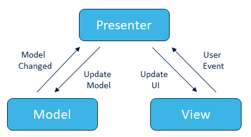
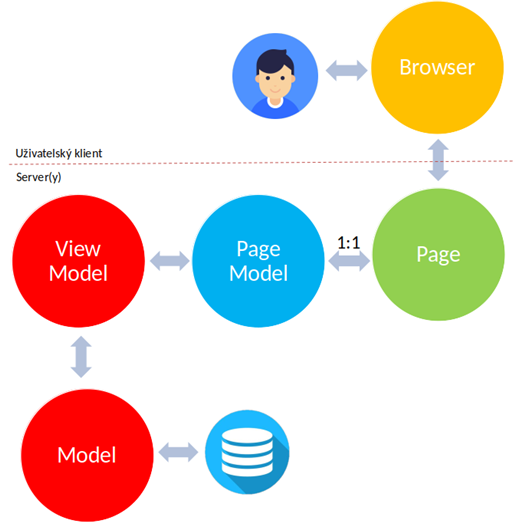

# SW 19 – Frameworky architektury MVC

## MVC – Model-View-Controller

* Architektonický vzor
* Populární zejména na webu – <span>ASP.NET</span> MVC, Laravel, Ruby on Rails, Django, ...
* Odděluje logiku od výstupu

### Model

* Logika aplikace (výpočty, databázové dotazy, ...)
* Přijímá a vydává data, neví odkud data přišla a jak bude jeho výstup formátován
* V ORM (Objetově-Relační Mapování) modely korespondují přímo s databázovými tabulkami. Nebo lze použít např. principu manažerů (AccountManager, ItemManager, ...)

### View

* Zobrazuje výstup uživateli; neví odkud data přišla, stará se jen o jejich zobrazení
* Měl by obsahovat minimum logiky

### Controller

* Propojuje Model a View
* Přijímá vstup od uživatele a převádí ho na příkazy pro Model/View
* Jeho metodám, které se dají volat (skrz REST nebo routování) se říká _akce_

``` csharp
[Route("[controller]")]
[ApiController]
public class AccountController : ControllerBase
{
    [HttpPost("login")]
    public async Task<IActionResult> Login([FromBody] UserIM userData) { /* ... */ }
}
```


### Výhody

* Díky oddělení logiky od výstupu je aplikace jednoduše udržovatelná a rozšiřitelná
* Menší tendence pro špagetový kód
* Frontend vývojáři teoreticky nemusí vědět, jak funguje backend, a obráceně

### Nevýhody

* Přísné worflow
  * Každý request je routován přes kontroler do modelu, který pak renderuje view
  * Tento proces je vyžadován i při menších změnách ve vizuální části
  * Při více těchto requestech může být pomalé a časově náročné

## MVP – Model-View-Presenter

* Odvozen od MVC; MVC/MVP může být chápáno a implementováno různě
* PHP Nette Framework, Android aplikace
* __Model__ – rozhraní poskytující data, která mají být zobrazena
* __View__ – pasivní rozhraní zobrazující data z modelu; nasměrovává uživatelovy příkazy (události) do presenteru, aby s daty manipuloval
* __Presenter__ – pracuje s modelem i view, podle dat získaných z modelu formátuje view (model mu hlásí změny opět událostmi)
* Oproti MVC má každé view svého presentera, v presenterovi se nachází více logiky
  * Controllery v MVC se dělí spíše podle toho, s jakými daty manipulují, a tak view pracují s více controllery, které na ně nejsou tak vázané (a mohou pracovat s více view)
* Výhoda – kompletní separace model a view, presenter je middle man
* Nevýhoda – hodně kódu pro propojení view + presenter; presenter je příliš vázaný na dané view



## MVVM (Model-View-ViewModel)

* Také znám jako Model View Binder
* __ViewModel__ se stará o převedení dat z Modelu do podoby prezentovatelné ve View, používá svojí logiku a logiku modelu
  * Nemá odkaz na View, neví o něm (narozdíl od Presenteru v MVP), objevuje se v něm redundantní kód (boilerplate)
* __View__ neobsahuje žádný logický kód, s ViewModelem komunikuje pomocí bindingu

### Binding

* Vytvoření vazby mezi vlastnostmi poskytovatele (ViewModel) a konzumenta (View)
* Data jsou synchronizována
* Poskytovatel při změně upozorní všechny konzumenty (existuje i obousměrný binding)
* WPF, UWP, Xamarin

## PageModel

* Další modifikace MVC
* _Controller (Presenter)+View_ nahrazeno 1:1 entitou _Page+PageModel_
* __Model__ – data a stav aplikace
* __Page__ – šablona dané stránky
* __PageModel__ – datová a aplikační logika pro danou stránku
* Data připravená pro danou stránku mohou být upřesněna ve __ViewModelu__



``` razor
@page
@model IndexModel
@{
    ViewData["Title"] = "Home page";
}

<h4>Uživatelé</h4>

<table class="table table-sm">
    <tbody>
        @foreach (var e in Model.GetUsers()) {
            <tr>
                <td>@e.username</td>
            </tr>
        }
    </tbody>
</table>
```

``` csharp
public class IndexModel : PageModel
{
    private IModel s;

    public IndexModel(IModel s)
    {
        this.s = s;
    }
    
    public List<User> GetUsers() => s.GetUsers();
}

// Startup.cs:
services.AddScoped<IModel, Model>();
```

## Webové aplikace klient-server

* Aplikace běží na serveru a zobrazuje si ji klient
* Komunikace přes protokol HTTP (Hypertext Transfer Protocol; port 80; přenos HTML/XML/... souborů)
* Komunikace Request → Response
* Server si nic "nepamatuje", jeho "paměť" je dosažena např. pomocí cookies nebo sessions
* __Request__ – Klient žádá o určitá data
* __Response__ – Server je poskytuje a/nebo vrací zprávu, např.:
  * __`200`__ – OK
  * `201` – Created
  * `400` – Bad Request
  * `401` – Unauthorized
  * `403` – Forbidden
  * __`404`__ – Not Found
  * `408` – Request Timeout
  * __`500`__ – Internal Server Error
  * `503` – Service Unavailable

__Remote Procedure Calls (RPC)__:

* Aplikace poskytuje libovolně pojmenované funkce, které klient volá a předává jim parametry​
* Dnes se běžně nepoužívá

``` rpc
POST /sayHello HTTP/1.1
HOST: api.example.com
Content-Type: application/json

{"name": "Racey McRacerson"}
```

__Representational State Transfer (REST)__:

* URL (Uniform Resource Locator) reprezentuje přímý přístup k datům
* `http://www.server.cz/knihy` vrací seznam knih
* `http://www.server.cz/knihy/4` vrací knihu s ID == 4
* REST metody:
  * `GET` – získat
  * `POST` – vytvořit
  * `DELETE` – smazat
  * `PUT` – klient zasílá data, která aktualizují celou entitu
  * `PATCH` – aktualizuje pouze část entity

__Multi Page Application (MPA)__:

* Tradiční, běží převážně na serveru
* Aplikace se skládá z více stránek, při každé změně je vyrenderována celá webová stránka
* __+__ Snadnější údržba, přehlednější členění kódu; __-__ Časově náročnější kódování
* Velké projekty (e-shopy), vysoké nároky na bezpečnost

__Single Page Application (SPA)__:

* "Moderní", běží převážně u klienta v browseru
* Jedna stránka, jejíž jednotlivé komponenty jsou nahrazovány/aktualizovány prostřednictvím client-based skriptů (JavaScript, AJAX)
* __+__ Úspornější přenos dat; __-__ Složitější kód
* Menší projekty, menší nároky na bezpečnost
