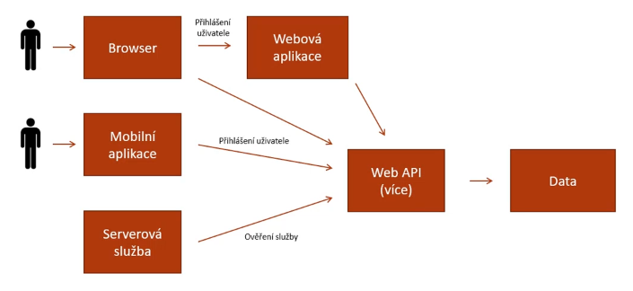
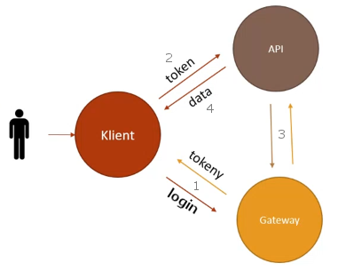
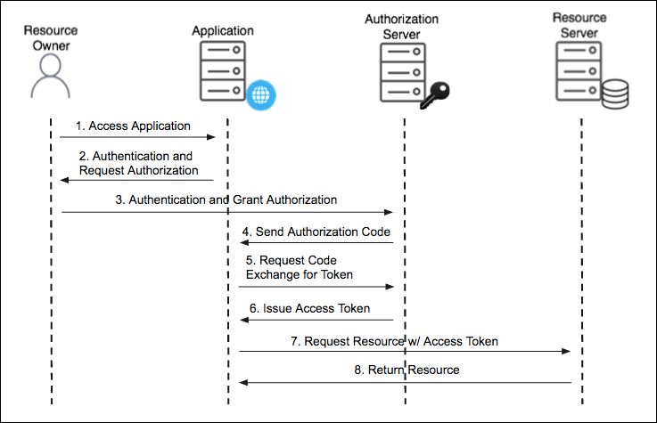
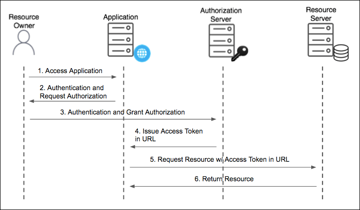
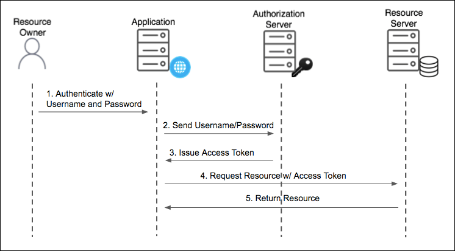
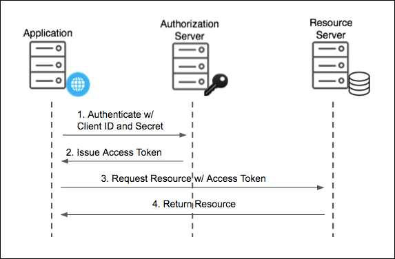
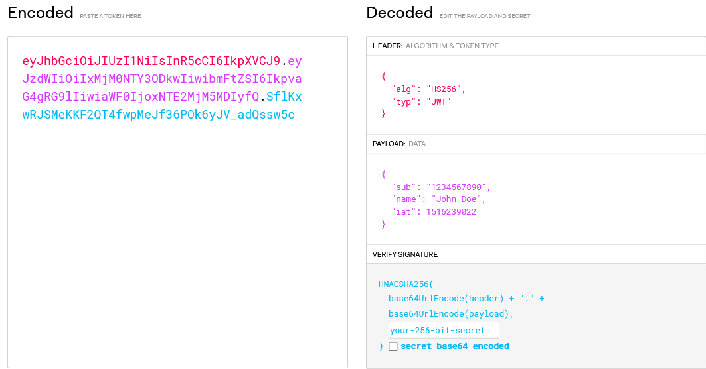

# SW 20 – Ověřování identity v prostředí internetu

## Schéma "moderní" webové aplikace



* Základem jsou data, která čteme nebo upravujeme
* K datům přistupuje webová služba (API, ...)
* K API přistupuje více klientů, může se jednat o:
  * Webové aplikace – <span>ASP.NET</span>, PHP, ...
  * Browser aplikace – JavaScript, WebAssembly, ...
  * Mobilní aplikace – Xamarin, React Native, ...
  * Desktopová aplikace
  * Jiná serverová služba využívající naše data
* Cílem je tyto všechny přístupy sjednotit, aby pro ně existoval společný způsob přihlášení
* Nutnost zabezpečení

## Způsoby ověření uživatele

* __0__ Neověřujeme
* __1__ Username/E-mail + Heslo
  * 1 unikátní údaj + 1 tajný údaj
  * Pouze unikátní username/e-mail nestačí, snadno prozraditelné
  * Pouze heslo nestačí, muselo by být unikátní
  * Míra bezpečnosti závisí na síle hesla
* Prolomení hesla: bruteforce (hrubou silou) nebo social engineering (sociální inženýrství)
* Posledním trendem na poli hesel je passphrase
  * Místo složitých hesel s náhodnými speciálními znaky se doporučuje dlouhé zapamatovatelnejší heslo v podobě "fráze"
  * Proto není vhodné u hesla nastavovat maximální počet znaků
* __2__ Dvoufázové ověření (e-mail, SMS, Authenticator)
* __3__ Biometrické ověření (otisk prstu, sken rohovky, ...)
  * Doplňující údaj, používat ho jako jediný údaj je nevhodné
  * Např. unikátní otisk prstu se přepočítá na hash, který unikátní již být nemusí; také můžeme o prst přijít
* __Komunikace musí být šifrovaná__ + protokol HTTPS s ověřením certifikátu na obou stranách

## OAuth2

* Přihlášení přes aplikaci třetí strany, které obě strany důvěřují
* Např. Google, Microsoft, Facebook, GitHub, Steam, ...
* Normalizováno
* Role:
  * __User__ – uživatel snažící se přistoupit k nějakému zdroji dat (k Resource)
  * __Resource__ – chráněná data uložená na serveru
  * __Resource Owner__ – uživatel vlastnící nějaká data, může k nim dát přístup jinému uživateli
  * __Client__ – aplikace skrz kterou User k datům přistupuje
  * __Resource Server__ – server, na kterém jsou data uložena
  * __Authorization Server__ – po úspěšné autentifikaci předává klientovi access token
* __Token__ – náhodný kód identifikující oprávnění klienta
* __Scope__ – část dat, ke kterým lze přistoupit

### Scénář



1. Uživatel žádá Gateway, že chce skrz Klienta přistoupit k API; přihlásí se a dostane token, který určuje jeho práva při práci s API
2. Uživatel/Klient žádá API o data a přikládá token
3. API se ptá Gatewaye, zdali Uživatel může k daným datům přistoupit
4. Pokud Gateway potvrzuje, API posílá daná data Klientovi/Uživateli

### Registrace naší aplikace na autorizačním serveru třetí strany

* Je nutno dodat:
  * Jméno a stránku aplikace
  * Callback URL, kam bude uživatel přesměrován
  * Client ID – identifikuje klienta
  * Client Secret – prokazuje identitu uživatele

### Authorization Grant

* Je použit klientem pro získání tokenu; několik druhů:
* __Authorization Code__
  * Krátkodobý autorizační kód, za který uživatel dostane token
  * Nejběžnější, pro server-side aplikace

  

* __Implicit__
  * Zjednodušený mechanismus, optimalizováno pro prohlížečové klienty (JavaScript)

  

* __Resource Owner Password Credentials__
  * Token vyměněn přímo za ID a heslo
  * Používat pouze pokud je vysoká důvěra mezi klientem a poskytovatelem dat
  * Většinou u mobilních a desktop aplikací

  

* __Client Credentials__
  * Pro API bez kontextu uživatele

  

### Refresh Token

* Pro obnovení platnosti tokenu

``` txt
+--------+                                           +---------------+
|        |--(A)------- Authorization Grant --------->|               |
|        |                                           |               |
|        |<-(B)----------- Access Token -------------|               |
|        |               & Refresh Token             |               |
|        |                                           |               |
|        |                            +----------+   |               |
|        |--(C)---- Access Token ---->|          |   |               |
|        |                            |          |   |               |
|        |<-(D)- Protected Resource --| Resource |   | Authorization |
| Client |                            |  Server  |   |     Server    |
|        |--(E)---- Access Token ---->|          |   |               |
|        |                            |          |   |               |
|        |<-(F)- Invalid Token Error -|          |   |               |
|        |                            +----------+   |               |
|        |                                           |               |
|        |--(G)----------- Refresh Token ----------->|               |
|        |                                           |               |
|        |<-(H)----------- Access Token -------------|               |
+--------+           & Optional Refresh Token        +---------------+ 
```

### Použití access tokenu

``` javascript
axios.get(
    "example.com/data",
    {"Authorization": "Bearer" + accessToken}
);
```

### OpenID

* Nadstavba nad OAuth2
* Token vydaný OAuth2 je náhodný řetězec, neobsahuje žádné informace; autorizován je klient
* OpenID do tokenu zakóduje navíc informace o uživateli
* Dnes obvykle JWT – _JSON (JavaScript Object Notation) Web Token_, uvnitř něj je mimo jiné zakódováno:
  * sub – subject – ID uživatele
  * iss – issuer – kdo vydal token
  * aud – audience – klient, kterému byl token poskytnut
  

---
---

``` txt
+--------+                               +---------------+
|        |--(A)- Authorization Request ->|   Resource    |
|        |                               |     Owner     |
|        |<-(B)-- Authorization Grant ---|   (Uživatel)  |
|        |                               +---------------+
|        |
|        |                               +---------------+
|        |--(C)-- Authorization Grant -->| Authorization |
| Client |                               |     Server    |
|        |<-(D)----- Access Token -------|   (Ověření)   |
|Aplikace|                               +---------------+
|        |
|        |                               +---------------+
|        |--(E)----- Access Token ------>|    Resource   |
|        |                               |     Server    |
|        |<-(F)--- Protected Resource ---|     (Data)    |
+--------+                               +---------------+
```
