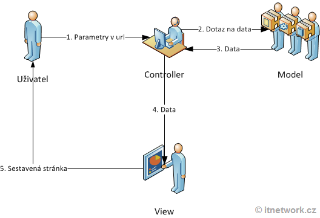

# SW 21 – Návrh webové aplikace <span>ASP.NET</span>

## <span>ASP.NET</span>

* Active Server Pages
* Postaven na .NET Frameworku od společnosti Microsoft (framework = softwarová struktura sloužící jako podpora při vývoji sw produktů)
* Běží na serveru a umožňuje vytvářet dynamické webové stránky
* <span>ASP.NET</span> 1.0 (2002) - <span>ASP.NET</span> 4.8 (2019)
* <span>ASP.NET</span> Core 1.0 (2016) - <span>ASP.NET</span> Core 5.0 (2020)
* Verze Core může běžet i na macOS a Linuxu
* V rámci frameworku <span>ASP.NET</span> je implementováno několik stylů tvorby aplikací
* Jazyky C#, F#, <span>VB.NET</span>

## Razor Pages

* Jednoduchý princip
* Nestandardní
* Stránka (Page) samotná je šablonou pro vyrenderování
* Stránky mají speciální syntax "razor", v podstatě HTML a uvnitř něj kusy C# kódu
* PageModel, který je za každou stránkou a připravuje data pro její zobrazení
* PageModel je třída, do níž jsou připojené obecné služby (přístup k databázi, session, cookie, ...)
  * Tyto služby se předávají přes Dependency Injection (základní princip Razor Pages)
  * Tyto obecné třídy jsou nadeklarovány ve Startupu do Dependency kontejneru

``` razor
@page
@model IndexModel
@{
    ViewData["Title"] = "Home page";
}

<h4>Uživatelé</h4>

<table class="table table-sm">
    <tbody>
        @foreach (var e in Model.GetUsers()) {
            <tr>
                <td>@e.username</td>
            </tr>
        }
    </tbody>
</table>
```

``` csharp
public class IndexModel : PageModel
{
    private IModel s;

    public IndexModel(IModel s) // V konstruktoru probíhá Dependency Injection
    {
        this.s = s;
    }
    
    public List<User> GetUsers() => s.GetUsers();

    public void OnGet(string text, int a)
    {
        // Zde lze předat parametry přes adresu – https://localhost:44363/?a=3&text=Hello
    }
}

// Startup.cs:
services.AddScoped<IModel, Model>();
```

### RazorPages Formulář

``` razor
<form method="post">
    <div asp-validation-summary="ModelOnly"></div>
    <div>
        <label asp-for="Input.UserName">UserName:</label>
        <input asp-for="Input.UserName" />
    </div>
    <button type="submit">Search</button>
</form>
```

``` csharp
public class UserSearchModel : PageModel
{
    public class InputModel
    {
        [Required] public string UserName { get; set; }
    }

    [BindProperty] public InputModel Input { get; set; }

    public UserSearchModel()
    {
        Input = new InputModel();
    }

    public IActionResult OnPost()
    {
        if (ModelState.IsValid)
        {
            // search(Input.UserName);
            // ...
        }
    }
}
```

* Díky anotaci `[BindProperty]` lze vlastnost Input použít přímo ve View, po odeslání formuláře se hodnoty do této vlastnosti zapíší

## Startup.cs

* Klíčový soubor frameworku, probíhá v něm veškerá konfgurace

``` csharp
public class Startup
{
    public IConfiguration Configuration { get; } // Umožňuje práci s JSON konfigurací (appsettings.json)
    public Startup(IConfiguration configuration) => Configuration = configuration;
    
    public void ConfigureServices(IServiceCollection services)
    {
        // Konfigurace služeb:

        // Připojení:
        // * Databáze
        // * Kontrolérů
        // * Autorizace, Autentifikace, Identity
        // * Cors – seznam aplikací, které můžou přistoupit k našemu API
        // * Razor Pages:
        services.AddRazorPages();
        // * Dependency Injection:
        services.AddScoped<IModel, Model>(); // Při požádání o IModel poskytne Model
        // -- AddSingleton – platný po celé spuštění aplikace
        // -- AddScoped – platný po celý request
        // -- AddTransient – každý controller a služba dostanou novou instanci
    }
    
    public void Configure(IApplicationBuilder app, IWebHostEnvironment env)
    {
        // Konfigurace aplikace:
        app.UseHttpsRedirection();
        app.UseStaticFiles();
        app.UseRouting();
        app.UseAuthorization();
        // atd.
    }
}
```

## Služba

* Pomocné shromaždiště kódu
* Lze připojit do naší aplikace a využivat jejích prostředků

## Databáze

* Ukládání permanentních dat (uživatelé, ...)
* Je několik způsobů připojení databáze do <span>ASP.NET</span> aplikace
  * Vytvořená jako objekt přímo v hierarchii projektu
  * Přes connection string v appsettings.json
  * aj.

``` json
{
    "ConnectionStrings": {
        "DefaultConnection": "<Connection string>"
    }
}
```

``` csharp
public class ApplicationDbContext : IdentityDbContext<ApplicationUser, ApplicationRole, Guid>
{
    public DbSet<Item> Items { get; set; }

    protected override void OnModelCreating(ModelBuilder builder)
    {
        base.OnModelCreating(builder);
    }
}

// Startup.cs:
string connectionString = Configuration.GetConnectionString("DefaultConnection");
services.AddDbContext<ApplicationDbContext>(options => options.UseSqlServer(connectionString));
```

* Velkou roli hraje Entity Framework

## Entity Framework

* Běží na .NET
* "Nadstavba" nad <span>ADO</span>.NET (ActiveX Data Objects) – množina tříd nabízející služby k práci s databází
* Generuje SQL dotazy pro konkrétní databázi (MySQL, Microsoft SQL Server, SQLite, PostgreSQL, ...)
* Příkazy v sytaxy LINQ překládá do konkrétního SQL, tento dotaz odešle a přijdou mu data, která přeloží zpět do C#
* = ORM – Objektově relační mapování – Konverze dat mezi relační databází a OOP jazykem
* Ne všechny SQL příkazy musí být podporovány (kvůli SQL dialektům)
  * Umí obsluhovat podmnožinu, kterou mají všechny databáze společné
  * Nezná speciální funkce a složitější příkazy

## Identity

* Sada balíčků, hotové řešení umožňující přihlašování uživatelů
* Rozšiřuje databázi; potřebuje Entity Framework, "staví na něm" (ukládání loginu, hesla, tokenu, ...)
* Poskytuje služby `UserManager<TUSer>`, `RoleManager<TRole>`,  ...
* Rozšiřuje původní DbContext o několik dalších tabulek – Users, Roles, ...
* Umožňuje scaffoldovat (generovat) stránky pro identitu

## MVC

* Starší klasičtější architektura
* Populární, kromě _<span>ASP.NET</span> MVC_ také Laravel, Ruby on Rails, Django, ...
* Odděluje logiku od výstupu
* Vhodné pro složitější aplikace, Razor Pages pro začátečnické práce

### Model

* Logika aplikace (výpočty, databázové dotazy, ...)
* Přijímá a vydává data, neví odkud data přišla a jak bude jeho výstup formátován
* V ORM modely korespondují přímo s databázovými tabulkami. Nebo lze použít např. principu manažerů (AccountManager, ItemManager, ...)

### View

* Zobrazuje výstup uživateli; neví odkud data přišla, stará se jen o jejich zobrazení
* Měl by obsahovat minimum logiky

### Controller

* Propojuje Model a View
* Přijímá vstup od uživatele a převádí ho na příkazy pro Model/View
* Jeho metodám, které se dají volat (skrz REST nebo routování) se říká _akce_

``` csharp
[Route("[controller]")]
[ApiController]
public class AccountController : ControllerBase
{
    [HttpPost("login")]
    public async Task<IActionResult> Login([FromBody] UserIM userData) { /* ... */ }
}
```



### Výhody

* Díky oddělení logiky od výstupu je aplikace jednoduše udržovatelná a rozšiřitelná
* Menší tendence pro špagetový kód
* Frontend vývojáři teoreticky nemusí vědět, jak funguje backend, a obráceně

### Nevýhody

* Přísné worflow
  * Každý request je routován přes kontroler do modelu, který pak renderuje view
  * Tento proces je vyžadován i při menších změnách ve vizuální části
  * Při více těchto requestech může být pomalé a časově náročné

## Blazor

* Framework pro psaní webových aplikací pomocí C# a HTML
* Client-side, WebAssembly
* ~Alternativa JavaScriptu
* Na backend navázáno přímo – komunikace přes TCP, ne HTTP => velmi rychlá reakce na události
