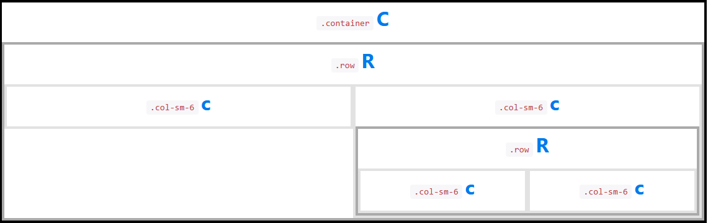
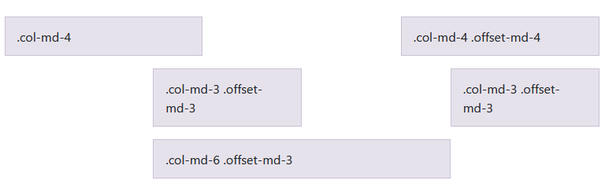

# SW 24 – Prostředky pro návrh webových aplikací II

## Písmo

* Správné stylování písma je důležité, aby se dal obsah webu číst komfortně
* Dříve bylo menší, zvětšovalo se společně s rozlišením displejů
* Pomocí CSS lze nastavit:
  * __`font-family:`__ seznam fontů oddělených čárkou, prohlížeč vybere první, který je k dispozici; jako poslední písmo se tedy doporučuje použít nějaké obecné
  * __`font-size:`__ _`15px;`_ / _`large;`_ / _`150%;`_
  * __`font-style:`__ _`normal;`_ / _`oblique;`_ nakloněný normal / _`italic;`_ speciálně vytvořený typ kurzíva
  * __`font-weight:`__ _`normal;`_ / _`bold;`_ / _`bolder;`_ / _`lighter;`_ / _`100;`_-_`900;`_
  * __`font:`__ lze nastavit více parametrů najednou, např. _`15px Arial, sans-serif;`_
* Také by se měl brát ohled na řádkování a šířku řádku
* Na web se více hodí bezpatkové písmo, na papír eventuálně patkové

### Kde vzít písma

* Prohlížeč normálně pracuje s fonty nainstalovanými v počítači
* Fonty lze do PC doinstalovat nebo použít font z internetu např. Google Fonts
* Také existují ikonové fonty, místo písmen jsou zde ikonky
  * Mají i definované slitky, `<span class="material-icons-outlined">settings</span>` by se tedy mělo vykreslit jako ikonka ozubeného kola (settings)

## CSS – Cascading Style Sheets

* Style sheet language pro popis způsobu zobrazení elementů na stránkách napsaných v HTML (také XHTML, XML, SVG)
* Navržen pro oddělení prezentace (vizuálu – barvy, layout, fonty) od obsahu
* Více stránek může čerpat z jednoho .css souboru – zbavení se redundance + soubor zůstance v cache = rychlejší načítání
* Podpora Media Queries – jiné zobrazení na PC / Mobilu / vytisknuté / přečteno čtečkou / ...
* Priorita:
  1. Inline (uvnitř html elementu) `<p style="color: red">Červený text</p>`
  2. Externí a interní (v hlavičce html) `<head><style>p {color: red;}</style></head>`
  3. Browser default

``` css
/* selektor { vlastnost: hodnota; (= deklarace) } */
p { font-size: 12px; }
```

### Selektory

* `*` – vybere všechny elementy
* `p` – vybere všechny elemety `<p>`
* `p, div` – vybere všechny elemety `<p>` a `<div>`
* `.class` – vybere elementy s `class="class"`
* `p.class` – vybere všechny elemety `<p>` s `class="class"`
* `#id` – vybere elementy s id="id"

### Vlastnosti

* CSS obsahuje přes několik stovek různých vlastností
* K názvu vlastnosti se přiřazuje hodnota
* __`color:`__
* __`display:`__ _`block;`_ / _`inline-block;`_ / _`inline;`_ / _`none;`_
* __`width:`__, __`height:`__, __`max-width:`__, __`min-height:`__, ...
* __`margin:`__
* __`padding:`__
* __`border:`__
* __`font:`__
* __`position:`__ _`static;`_ / _`relative;`_ / _`absolute;`_ / _`fixed;`_ / _`sticky;`_

### Jednotky

* Absolutní
  * `cm`, `mm`, `in`
  * `px` – ~pixel – ve skutečnosti relativní k velikosti displeje, u vysokých rozlišení zabírá 1px více pixelů zařízení
  * `pt` – point
  * ~Velikost písma by se měla nastavovat v pointech, nikoli v pixelech
* Relativní
  * `em` – relativní k velikosti písma elementu
  * `rem` – relativní k velikosti písma root elementu (prvek hmtl)
  * `%` – relativní k rodiči
  * `vw` – 1% šířky viewportu
  * `vh` – 1% výšky viewportu

## Media query

* Umožňuje přizpůsobit vykreslení a stylování webu na základě _media-feature_ a _media-type_
* __Media feature__ – upřesňuje charakteristiku softwaru, zařízení a prostředí; např.:
  * `aspect-ratio`
  * `orientation`
  * `resolution`
  * `prefers-color-scheme` – zdali uživatel preferuje light/dark theme
  * Píše se do závorek, za dvojtečku se píší hodnoty a popř. jednotky
* __Media type__:
  * `all`
  * `print`
  * `screen`
  * `speech`
* Při definici lze použít logické operátory
  * `and`
  * `not`
  * `only` – kvůli starším prohlížečům
  * `,` – kombinace více médií do stejných pravidel

``` css
@media screen and (min-width: 30em) and (orientation: landscape)
{ 
    /* Zde se aplikují pravidla */
}
```

## CSS Frameworky

* Framework = Softwarová struktura, která slouží jako podpora při vývoji sw produktů
* Umožňují jednodušší použití jazyka CSS pro návrh webu
* Usnadňují mj. stylování prvků a responzivní pozicování, mohou přidávat nové komponenty
* Nejčastěji se řeší pozicování, mohou obsahovat i JavaScript funkcionalitu
* Existují také verze pro stylování e-mailů (např. Gmail má vlastní DOM blokující grid, flex apod.)
* Nejznámější frameworky:
  * Bootstrap
  * Foundation
  * Bulma
  * Semantic

### Komponenty

* Button
* Card
* Carousel
* Collapse
* Dropdown
* Input
* Modal
* Navbar, Tab, Tabbar
* Progress Bar
* Range
* Switch, Checkbox, Radio Button
* Tooltip

## Pozicování prvků v Bootstrap

* Container
  * Základní element Bootstrap
  * Povinnost pro vytvoření Grid
  * `container` – fixní šířka, `container-fluid` – zabírá celou šířku obrazovky
* Spacing Utilities
  * `class="mt-5"` – margin-top: 5
  * `class="pb-5"` – padding-bottom: 5
  * `class="sticky-top"`
  * `class="fixed-bottom"`
* Flex
  * Implementace Flexboxu pomocí tříd
  * U prvků ve flexboxu lze určovat směr, pořadí, zarovnání, mezery mezi nimi, zalomení na nový řádek ...
  * `<div class="d-flex"><div class="p-2">Flex item</div></div>`
* Grid
  * Do Containeru lze vkládat řádky a do nich sloupce
  * Systém dvanácti sloupců, různé velikosti – `sm`, `md`, `lg`, `xl` určené maximální šířkou Containeru
  * Řádky uvnitř sloupců:
    
  * Column offset:
    
